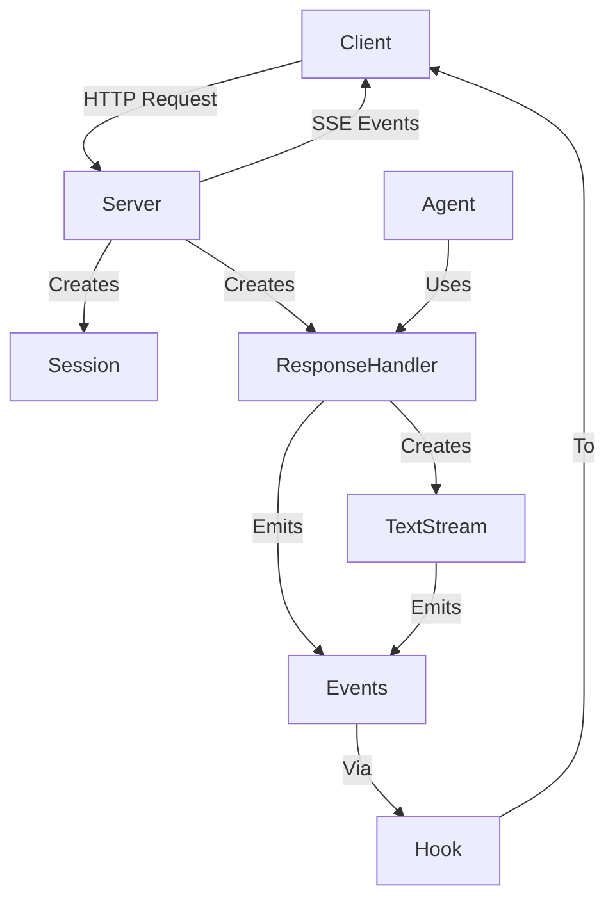

# Sentient Agent Framework

<p align="center">
  
</p>

<p align="center">
  <a href="https://www.npmjs.com/package/sentient-agent-framework">
    
  </a>
  <a href="https://www.npmjs.com/package/sentient-agent-framework">
    
  </a>
  <a href="https://github.com/sentient-agi/sentient-agent-framework/blob/main/LICENSE">
    
  </a>
</p>

<p align="center">
  <a href="https://sentient.xyz/" target="_blank">
    
  </a>
  <a href="https://x.com/SentientAGI">
    
  </a>
  <a href="https://discord.gg/sentientfoundation">
    
  </a>
  <a href="https://huggingface.co/Sentientagi">
    
  </a>
</p>

> [!WARNING]
> **This TypeScript package is currently in beta and will likely change. It is not yet ready for production use.**

## Overview

The Sentient Agent Framework is a TypeScript implementation of the Sentient Agent Framework for building agents that serve Sentient Chat events. It provides a client-server architecture for interacting with the Sentient platform's API, similar to how streaming inference works.

In addition to supporting OpenAI API compatible agents, Sentient Chat supports a custom, open source event system for agent responses. These events can be rendered in Sentient Chat to provide a richer user experience. This is particularly useful for streaming responses from an AI agent, when you might want to show the agent's work while the response is being generated, rather than having the user wait for the final response.

## Installation

```bash
# Using npm
npm install sentient-agent-framework

# Using yarn
yarn add sentient-agent-framework

# Using pnpm (recommended)
pnpm add sentient-agent-framework
```

## Usage

The framework can be used in various environments:

### 1. Next.js / Vercel Environment

```typescript
// pages/api/agent.ts
import { AbstractAgent, DefaultServer } from 'sentient-agent-framework';

class MyAgent extends AbstractAgent {
  constructor() {
    super('My Agent');
  }

  async assist(session, query, responseHandler) {
    // Emit a text block
    await responseHandler.emitTextBlock('THINKING', 'Processing your query...');
    
    // Create a text stream for the final response
    const stream = responseHandler.createTextStream('RESPONSE');
    
    // Stream the response in chunks
    await stream.emitChunk('Hello, ');
    await stream.emitChunk('world!');
    
    // Complete the stream
    await stream.complete();
    
    // Complete the response
    await responseHandler.complete();
  }
}

// Create the agent and server
const agent = new MyAgent();
const server = new DefaultServer(agent);

// Export the handler for Next.js API routes
export default async function handler(req, res) {
  return server.handleRequest(req, res);
}
```

### 2. Express Server

```typescript
// server.js
import express from 'express';
import { AbstractAgent, DefaultServer } from 'sentient-agent-framework';

class MyAgent extends AbstractAgent {
  constructor() {
    super('My Agent');
  }

  async assist(session, query, responseHandler) {
    // Implementation as above
  }
}

// Create Express app
const app = express();
app.use(express.json());

// Create the agent and server
const agent = new MyAgent();
const server = new DefaultServer(agent);

// Mount the server at /assist endpoint
app.use('/assist', (req, res) => server.handleRequest(req, res));

// Start the server
app.listen(3000, () => {
  console.log('Server running on http://localhost:3000');
});
```

### 3. Fastify Server

```typescript
// server.js
import Fastify from 'fastify';
import { AbstractAgent, DefaultServer } from 'sentient-agent-framework';

class MyAgent extends AbstractAgent {
  constructor() {
    super('My Agent');
  }

  async assist(session, query, responseHandler) {
    // Implementation as above
  }
}

// Create Fastify app
const fastify = Fastify({
  logger: true
});

// Register JSON parser
fastify.register(require('@fastify/formbody'));

// Create the agent and server
const agent = new MyAgent();
const server = new DefaultServer(agent);

// Add route for the agent
fastify.post('/assist', async (request, reply) => {
  return server.handleRequest(request.raw, reply.raw);
});

// Start the server
fastify.listen({ port: 3000 }, (err) => {
  if (err) {
    fastify.log.error(err);
    process.exit(1);
  }
});
```

### 4. Client Usage

```typescript
import { SentientAgentClient } from 'sentient-agent-framework';

async function main() {
  // Create a client
  const client = new SentientAgentClient();
  
  // Query an agent
  for await (const event of client.queryAgent('What is the weather today?', 'http://localhost:3000/assist')) {
    // Process events based on their type
    switch (event.content_type) {
      case 'atomic.textblock':
        console.log(`${event.event_name}: ${event.content}`);
        break;
      case 'chunked.text':
        process.stdout.write(event.content);
        break;
      case 'atomic.json':
        console.log(`${event.event_name}: ${JSON.stringify(event.content)}`);
        break;
      case 'atomic.error':
        console.error(`Error: ${event.content.error_message}`);
        break;
      case 'atomic.done':
        console.log('\nDone!');
        break;
    }
  }
}

main().catch(console.error);
## Testing with the CLI

The framework includes a CLI client for testing agents. To use it:

1. Start the example server:
```bash
# Install dependencies if you haven't already
pnpm install

# Start the example server
pnpm run example-server
```

2. In another terminal, run the CLI client:
```bash
pnpm run cli
```

3. Enter the URL of the server (e.g., `http://localhost:3000`) and start chatting with the agent.
   - The CLI will automatically append "/assist" to the URL if it's not already included

The CLI client will display the events received from the agent, including:
- Text blocks
- JSON documents
- Streaming text
- Error messages
```

## Event Types

The framework supports several event types:

1. **TextBlockEvent**: For sending complete text messages
2. **DocumentEvent**: For sending JSON data
3. **TextChunkEvent**: For streaming text in chunks
4. **ErrorEvent**: For sending error messages
5. **DoneEvent**: For signaling the end of a response

## Architecture

The framework follows a client-server architecture:



## Documentation

- [Interface Documentation](./src/interface/README.md)
- [Implementation Documentation](./src/implementation/README.md)

## Publishing to npm

To publish this package to npm:

1. Ensure all tests pass:
```bash
pnpm run test
```

2. Build the package:
```bash
pnpm run build
```

3. Update the version in package.json following semantic versioning:
```bash
# For patch releases (bug fixes)
pnpm version patch

# For minor releases (new features, backward compatible)
pnpm version minor

# For major releases (breaking changes)
pnpm version major
```

4. Publish to npm:
```bash
pnpm publish
```

5. Create a GitHub release with release notes.

## Contributing

Contributions are welcome! Please feel free to submit a Pull Request.

1. Fork the repository
2. Create your feature branch (`git checkout -b feature/amazing-feature`)
3. Commit your changes (`git commit -m 'Add some amazing feature'`)
4. Push to the branch (`git push origin feature/amazing-feature`)
5. Open a Pull Request

## License

This project is licensed under the MIT License - see the LICENSE file for details.