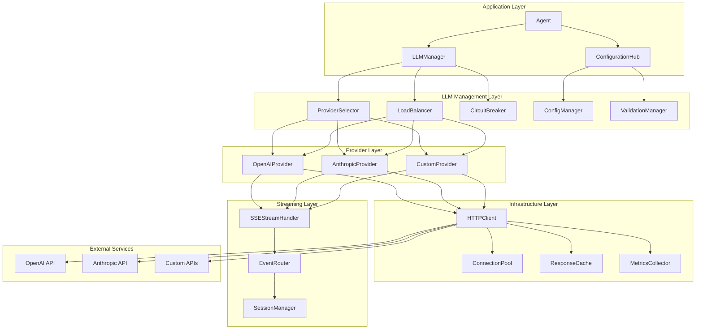

# Phase 1: LLM Integration Architecture
## Production-Ready LLM Provider System for Sentient Node SDK

> **Architecture Goal**: Design and implement a production-ready LLM integration system that surpasses the Python version in performance, reliability, and developer experience.

---

## 🎯 Architecture Overview

The LLM Integration Architecture establishes a robust, extensible, and production-ready foundation for integrating multiple Large Language Model providers while maintaining seamless compatibility with the existing Sentient framework.

### Core Architectural Principles

1. **Provider Abstraction**: Universal interface for any LLM provider
2. **Streaming-First**: Built around existing SSE infrastructure  
3. **Fault Tolerance**: Circuit breakers, retries, and graceful degradation
4. **Type Safety**: Full TypeScript coverage with runtime validation
5. **Performance**: Connection pooling, caching, and optimization
6. **Extensibility**: Plugin architecture for custom providers

---

## 🏗️ System Architecture Diagram



---

## 🔧 Core Components Architecture

### 1. Enhanced LLMProvider Interface

```typescript
// src/interface/llm/provider.ts
export interface LLMProvider {
  readonly providerId: string;
  readonly capabilities: ProviderCapabilities;
  readonly config: LLMProviderConfig;
  
  // Core generation methods
  generate(request: LLMRequest): Promise<LLMResponse>;
  streamGenerate(request: LLMRequest): AsyncIterable<LLMStreamChunk>;
  
  // Provider management
  initialize(): Promise<void>;
  validate(): Promise<ProviderHealthStatus>;
  shutdown(): Promise<void>;
  
  // Configuration
  updateConfig(config: Partial<LLMProviderConfig>): Promise<void>;
  getMetrics(): ProviderMetrics;
}

export interface ProviderCapabilities {
  models: ModelInfo[];
  maxTokens: number;
  supportsStreaming: boolean;
  supportsFunctionCalling: boolean;
  supportsImageInput: boolean;
  supportsSystemPrompts: boolean;
  rateLimits: RateLimitInfo;
}

export interface LLMRequest {
  model: string;
  messages: ChatMessage[];
  parameters: LLMParameters;
  metadata: RequestMetadata;
  stream?: boolean;
}

export interface LLMParameters {
  temperature?: number;
  maxTokens?: number;
  topP?: number;
  frequencyPenalty?: number;
  presencePenalty?: number;
  stopSequences?: string[];
  functions?: FunctionDefinition[];
  [key: string]: unknown;
}
```

### 2. LLMManager Architecture

```typescript
// src/implementation/llm/manager.ts
export class LLMManager {
  private providers: Map<string, LLMProvider>;
  private selector: ProviderSelector;
  private loadBalancer: LoadBalancer;
  private circuitBreaker: CircuitBreaker;
  private configManager: ConfigurationManager;
  
  constructor(config: LLMManagerConfig) {
    this.providers = new Map();
    this.selector = new ProviderSelector(config.selectionStrategy);
    this.loadBalancer = new LoadBalancer(config.loadBalancingStrategy);
    this.circuitBreaker = new CircuitBreaker(config.circuitBreakerConfig);
    this.configManager = new ConfigurationManager(config.configSource);
  }
  
  async generate(request: LLMRequest): Promise<LLMResponse> {
    const provider = await this.selectProvider(request);
    return this.circuitBreaker.execute(() => provider.generate(request));
  }
  
  async streamGenerate(request: LLMRequest): AsyncIterable<LLMStreamChunk> {
    const provider = await this.selectProvider(request);
    yield* this.circuitBreaker.executeStream(() => provider.streamGenerate(request));
  }
  
  private async selectProvider(request: LLMRequest): Promise<LLMProvider> {
    const candidates = this.selector.getCandidates(request);
    return this.loadBalancer.select(candidates);
  }
}
```

### 3. Provider Implementations

#### OpenAI Provider Architecture

```typescript
// src/implementation/llm/providers/openai.ts
export class OpenAIProvider extends BaseLLMProvider {
  private client: OpenAIAPIClient;
  private streamHandler: OpenAIStreamHandler;
  
  constructor(config: OpenAIProviderConfig) {
    super('openai', config);
    this.client = new OpenAIAPIClient(config);
    this.streamHandler = new OpenAIStreamHandler();
  }
  
  async generate(request: LLMRequest): Promise<LLMResponse> {
    const openAIRequest = this.transformRequest(request);
    const response = await this.client.chat.completions.create(openAIRequest);
    return this.transformResponse(response);
  }
  
  async *streamGenerate(request: LLMRequest): AsyncIterable<LLMStreamChunk> {
    const openAIRequest = this.transformRequest({ ...request, stream: true });
    const stream = await this.client.chat.completions.create(openAIRequest);
    
    for await (const chunk of this.streamHandler.processStream(stream)) {
      yield this.transformStreamChunk(chunk);
    }
  }
}
```

#### Anthropic Provider Architecture

```typescript
// src/implementation/llm/providers/anthropic.ts
export class AnthropicProvider extends BaseLLMProvider {
  private client: AnthropicAPIClient;
  private streamHandler: AnthropicStreamHandler;
  
  constructor(config: AnthropicProviderConfig) {
    super('anthropic', config);
    this.client = new AnthropicAPIClient(config);
    this.streamHandler = new AnthropicStreamHandler();
  }
  
  async generate(request: LLMRequest): Promise<LLMResponse> {
    const anthropicRequest = this.transformRequest(request);
    const response = await this.client.messages.create(anthropicRequest);
    return this.transformResponse(response);
  }
  
  async *streamGenerate(request: LLMRequest): AsyncIterable<LLMStreamChunk> {
    const anthropicRequest = this.transformRequest({ ...request, stream: true });
    const stream = await this.client.messages.create(anthropicRequest);
    
    for await (const chunk of this.streamHandler.processStream(stream)) {
      yield this.transformStreamChunk(chunk);
    }
  }
}
```

---

## 🔄 Streaming Integration Architecture

### SSE Integration with Existing Infrastructure

```typescript
// src/implementation/llm/streaming/sse-integration.ts
export class LLMSSEIntegrator {
  constructor(
    private eventRouter: EventRouter,
    private sessionManager: SessionManager
  ) {}
  
  async processLLMStream(
    streamSource: AsyncIterable<LLMStreamChunk>,
    session: Session,
    responseHandler: ResponseHandler
  ): Promise<void> {
    const streamId = this.generateStreamId();
    let isFirstChunk = true;
    
    try {
      for await (const chunk of streamSource) {
        const event = this.createStreamEvent(chunk, streamId, isFirstChunk);
        await this.eventRouter.route(event, session);
        await responseHandler.handleStreamChunk(event);
        isFirstChunk = false;
      }
      
      // Send completion event
      const doneEvent = this.createDoneEvent(streamId);
      await this.eventRouter.route(doneEvent, session);
      await responseHandler.handleStreamComplete(doneEvent);
      
    } catch (error) {
      const errorEvent = this.createErrorEvent(error, streamId);
      await this.eventRouter.route(errorEvent, session);
      await responseHandler.handleStreamError(errorEvent);
    }
  }
  
  private createStreamEvent(
    chunk: LLMStreamChunk, 
    streamId: string, 
    isFirst: boolean
  ): TextChunkEvent {
    return {
      content_type: EventContentType.TEXT_STREAM,
      event_name: 'text_chunk',
      schema_version: '1.0',
      id: ulid(),
      source: 'llm_provider',
      stream_id: streamId,
      is_complete: chunk.finishReason !== null,
      content: chunk.content,
      metadata: {
        model: chunk.model,
        tokens: chunk.tokens,
        finish_reason: chunk.finishReason,
        is_first_chunk: isFirst
      }
    };
  }
}
```

---

## ⚡ Retry and Circuit Breaker Architecture

### Circuit Breaker Implementation

```typescript
// src/implementation/llm/resilience/circuit-breaker.ts
export class CircuitBreaker {
  private state: CircuitState = CircuitState.CLOSED;
  private failures: number = 0;
  private lastFailureTime?: Date;
  private successCount: number = 0;
  
  constructor(private config: CircuitBreakerConfig) {}
  
  async execute<T>(operation: () => Promise<T>): Promise<T> {
    if (this.state === CircuitState.OPEN) {
      if (this.shouldTryClose()) {
        this.state = CircuitState.HALF_OPEN;
      } else {
        throw new CircuitOpenError('Circuit breaker is open');
      }
    }
    
    try {
      const result = await operation();
      this.onSuccess();
      return result;
    } catch (error) {
      this.onFailure(error);
      throw error;
    }
  }
  
  async *executeStream<T>(
    operation: () => AsyncIterable<T>
  ): AsyncIterable<T> {
    if (this.state === CircuitState.OPEN) {
      throw new CircuitOpenError('Circuit breaker is open');
    }
    
    try {
      for await (const item of operation()) {
        yield item;
      }
      this.onSuccess();
    } catch (error) {
      this.onFailure(error);
      throw error;
    }
  }
}
```

### Retry Strategy Implementation

```typescript
// src/implementation/llm/resilience/retry-strategy.ts
export class ExponentialBackoffRetry implements RetryStrategy {
  constructor(private config: RetryConfig) {}
  
  async execute<T>(
    operation: () => Promise<T>,
    context: RetryContext
  ): Promise<T> {
    let lastError: Error;
    
    for (let attempt = 0; attempt <= this.config.maxRetries; attempt++) {
      try {
        return await operation();
      } catch (error) {
        lastError = error;
        
        if (!this.shouldRetry(error, attempt)) {
          throw error;
        }
        
        if (attempt < this.config.maxRetries) {
          const delay = this.calculateDelay(attempt);
          await this.sleep(delay);
        }
      }
    }
    
    throw lastError!;
  }
  
  private shouldRetry(error: Error, attempt: number): boolean {
    if (attempt >= this.config.maxRetries) return false;
    
    // Retry on network errors, rate limits, and server errors
    if (error instanceof NetworkError) return true;
    if (error instanceof RateLimitError) return true;
    if (error instanceof ServerError && error.statusCode >= 500) return true;
    
    return false;
  }
  
  private calculateDelay(attempt: number): number {
    const base = this.config.baseDelay;
    const exponential = Math.pow(2, attempt) * base;
    const jitter = Math.random() * this.config.jitterMs;
    return Math.min(exponential + jitter, this.config.maxDelay);
  }
}
```

---

## 🔧 Configuration Management Architecture

### Dynamic Configuration System

```typescript
// src/implementation/llm/config/configuration-manager.ts
export class ConfigurationManager extends EventEmitter {
  private configs: Map<string, LLMProviderConfig> = new Map();
  private watchers: Map<string, ConfigWatcher> = new Map();
  private validator: ConfigValidator;
  
  constructor(private sources: ConfigSource[]) {
    super();
    this.validator = new ConfigValidator();
  }
  
  async getConfig(providerId: string): Promise<LLMProviderConfig> {
    const config = this.configs.get(providerId);
    if (!config) {
      throw new ConfigNotFoundError(`Config not found for provider: ${providerId}`);
    }
    return config;
  }
  
  async updateConfig(
    providerId: string, 
    updates: Partial<LLMProviderConfig>
  ): Promise<void> {
    const currentConfig = await this.getConfig(providerId);
    const newConfig = { ...currentConfig, ...updates };
    
    // Validate new configuration
    const validation = await this.validator.validate(newConfig);
    if (!validation.isValid) {
      throw new ConfigValidationError(validation.errors);
    }
    
    // Apply configuration
    this.configs.set(providerId, newConfig);
    this.emit('configUpdated', { providerId, config: newConfig });
  }
  
  async watchConfig(providerId: string): Promise<void> {
    const watcher = new ConfigWatcher(providerId, this.sources);
    watcher.on('change', (config) => {
      this.updateConfig(providerId, config);
    });
    this.watchers.set(providerId, watcher);
  }
}

// Configuration schemas with runtime validation
export const OpenAIConfigSchema = z.object({
  apiKey: z.string().min(1),
  baseUrl: z.string().url().optional(),
  organization: z.string().optional(),
  defaultModel: z.string().default('gpt-4'),
  timeout: z.number().positive().default(30000),
  retries: RetryConfigSchema,
  rateLimit: RateLimitConfigSchema
});

export const AnthropicConfigSchema = z.object({
  apiKey: z.string().min(1),
  baseUrl: z.string().url().optional(),
  defaultModel: z.string().default('claude-3-sonnet-20240229'),
  timeout: z.number().positive().default(30000),
  retries: RetryConfigSchema,
  rateLimit: RateLimitConfigSchema
});
```

---

## 🔄 Provider Selection and Load Balancing

### Intelligent Provider Selection

```typescript
// src/implementation/llm/selection/provider-selector.ts
export class ProviderSelector {
  constructor(
    private strategy: SelectionStrategy,
    private healthChecker: HealthChecker,
    private costOptimizer: CostOptimizer
  ) {}
  
  async selectProvider(
    request: LLMRequest,
    availableProviders: LLMProvider[]
  ): Promise<LLMProvider[]> {
    // Filter by capabilities
    const capableProviders = availableProviders.filter(provider =>
      this.isCapable(provider, request)
    );
    
    // Filter by health status
    const healthyProviders = await this.filterHealthy(capableProviders);
    
    // Apply selection strategy
    return this.strategy.select(healthyProviders, request);
  }
  
  private isCapable(provider: LLMProvider, request: LLMRequest): boolean {
    const capabilities = provider.capabilities;
    
    // Check model support
    if (!capabilities.models.some(m => m.name === request.model)) {
      return false;
    }
    
    // Check streaming support if needed
    if (request.stream && !capabilities.supportsStreaming) {
      return false;
    }
    
    // Check function calling support if needed
    if (request.parameters.functions && !capabilities.supportsFunctionCalling) {
      return false;
    }
    
    return true;
  }
}

// Selection strategies
export class RoundRobinStrategy implements SelectionStrategy {
  private currentIndex = 0;
  
  select(providers: LLMProvider[], request: LLMRequest): LLMProvider[] {
    if (providers.length === 0) return [];
    
    const selected = providers[this.currentIndex % providers.length];
    this.currentIndex++;
    return [selected];
  }
}

export class CostOptimizedStrategy implements SelectionStrategy {
  select(providers: LLMProvider[], request: LLMRequest): LLMProvider[] {
    return providers.sort((a, b) => {
      const costA = this.calculateCost(a, request);
      const costB = this.calculateCost(b, request);
      return costA - costB;
    });
  }
  
  private calculateCost(provider: LLMProvider, request: LLMRequest): number {
    const model = provider.capabilities.models.find(m => m.name === request.model);
    if (!model) return Infinity;
    
    const estimatedTokens = this.estimateTokens(request);
    return model.pricing.inputCost * estimatedTokens.input + 
           model.pricing.outputCost * estimatedTokens.output;
  }
}
```

---

## 📊 Monitoring and Metrics Architecture

### Comprehensive Metrics Collection

```typescript
// src/implementation/llm/monitoring/metrics-collector.ts
export class LLMMetricsCollector {
  private metrics: Map<string, Metric> = new Map();
  private prometheus: PrometheusRegistry;
  
  constructor() {
    this.prometheus = new PrometheusRegistry();
    this.initializeMetrics();
  }
  
  private initializeMetrics(): void {
    // Request metrics
    this.metrics.set('requests_total', new Counter({
      name: 'llm_requests_total',
      help: 'Total number of LLM requests',
      labelNames: ['provider', 'model', 'status']
    }));
    
    this.metrics.set('request_duration', new Histogram({
      name: 'llm_request_duration_seconds',
      help: 'Request duration in seconds',
      labelNames: ['provider', 'model'],
      buckets: [0.1, 0.5, 1, 2, 5, 10, 30]
    }));
    
    // Token metrics
    this.metrics.set('tokens_consumed', new Counter({
      name: 'llm_tokens_consumed_total',
      help: 'Total tokens consumed',
      labelNames: ['provider', 'model', 'type']
    }));
    
    // Cost metrics
    this.metrics.set('cost_incurred', new Counter({
      name: 'llm_cost_incurred_total',
      help: 'Total cost incurred',
      labelNames: ['provider', 'model']
    }));
    
    // Circuit breaker metrics
    this.metrics.set('circuit_breaker_state', new Gauge({
      name: 'llm_circuit_breaker_state',
      help: 'Circuit breaker state (0=closed, 1=open, 2=half-open)',
      labelNames: ['provider']
    }));
  }
  
  recordRequest(
    provider: string,
    model: string,
    duration: number,
    status: 'success' | 'error',
    tokens: { input: number; output: number },
    cost: number
  ): void {
    const labels = { provider, model };
    
    this.metrics.get('requests_total')?.inc({ ...labels, status });
    this.metrics.get('request_duration')?.observe(labels, duration);
    this.metrics.get('tokens_consumed')?.inc({ ...labels, type: 'input' }, tokens.input);
    this.metrics.get('tokens_consumed')?.inc({ ...labels, type: 'output' }, tokens.output);
    this.metrics.get('cost_incurred')?.inc(labels, cost);
  }
}
```

---

## 🚀 Integration Points with Existing System

### 1. Agent Integration

```typescript
// Enhanced Agent class with LLM integration
export class EnhancedAgent extends AbstractAgent {
  constructor(
    name: string,
    private llmManager: LLMManager,
    private sseIntegrator: LLMSSEIntegrator
  ) {
    super(name);
  }
  
  async assist(
    session: Session,
    query: Query,
    responseHandler: ResponseHandler
  ): Promise<void> {
    const request: LLMRequest = {
      model: 'gpt-4',
      messages: [{ role: 'user', content: query.prompt }],
      parameters: { temperature: 0.7, maxTokens: 1000 },
      metadata: { sessionId: session.activity_id, requestId: query.id },
      stream: true
    };
    
    try {
      const stream = this.llmManager.streamGenerate(request);
      await this.sseIntegrator.processLLMStream(stream, session, responseHandler);
    } catch (error) {
      await responseHandler.handleError(this.createErrorEvent(error));
    }
  }
}
```

### 2. Validation Integration

```typescript
// Enhanced validation schemas for LLM components
export const LLMRequestSchema = z.object({
  model: z.string().min(1),
  messages: z.array(ChatMessageSchema),
  parameters: LLMParametersSchema,
  metadata: z.record(z.any()),
  stream: z.boolean().optional()
});

export const LLMResponseSchema = z.object({
  content: z.string(),
  model: z.string(),
  usage: z.object({
    promptTokens: z.number(),
    completionTokens: z.number(),
    totalTokens: z.number()
  }),
  finishReason: z.enum(['stop', 'length', 'function_call', 'content_filter']),
  metadata: z.record(z.any()).optional()
});
```

---

## 📈 Performance Optimizations

### 1. Connection Pooling

```typescript
// src/implementation/llm/infrastructure/connection-pool.ts
export class HTTPConnectionPool {
  private pools: Map<string, http.Agent> = new Map();
  
  constructor(private config: ConnectionPoolConfig) {}
  
  getAgent(baseUrl: string): http.Agent {
    if (!this.pools.has(baseUrl)) {
      this.pools.set(baseUrl, new http.Agent({
        keepAlive: true,
        maxSockets: this.config.maxSockets,
        maxFreeSockets: this.config.maxFreeSockets,
        timeout: this.config.timeout,
        keepAliveMsecs: this.config.keepAliveMsecs
      }));
    }
    return this.pools.get(baseUrl)!;
  }
}
```

### 2. Response Caching

```typescript
// src/implementation/llm/infrastructure/response-cache.ts
export class LLMResponseCache {
  private cache: Map<string, CacheEntry> = new Map();
  private ttlMap: Map<string, NodeJS.Timeout> = new Map();
  
  constructor(private config: CacheConfig) {}
  
  async get(key: string): Promise<LLMResponse | null> {
    const entry = this.cache.get(key);
    if (!entry) return null;
    
    if (Date.now() > entry.expiresAt) {
      this.evict(key);
      return null;
    }
    
    return entry.response;
  }
  
  async set(key: string, response: LLMResponse): Promise<void> {
    const expiresAt = Date.now() + this.config.ttlMs;
    const entry: CacheEntry = { response, expiresAt };
    
    this.cache.set(key, entry);
    
    // Set TTL timer
    const timer = setTimeout(() => this.evict(key), this.config.ttlMs);
    this.ttlMap.set(key, timer);
  }
  
  private generateKey(request: LLMRequest): string {
    return crypto.createHash('sha256')
      .update(JSON.stringify({
        model: request.model,
        messages: request.messages,
        parameters: request.parameters
      }))
      .digest('hex');
  }
}
```

---

## 🧪 Testing Strategy

### 1. Unit Testing Architecture

```typescript
// tests/llm/providers/openai.test.ts
describe('OpenAIProvider', () => {
  let provider: OpenAIProvider;
  let mockClient: jest.Mocked<OpenAIAPIClient>;
  
  beforeEach(() => {
    mockClient = createMockOpenAIClient();
    provider = new OpenAIProvider(testConfig);
    provider['client'] = mockClient;
  });
  
  describe('generate', () => {
    it('should generate response successfully', async () => {
      mockClient.chat.completions.create.mockResolvedValue(mockResponse);
      
      const request: LLMRequest = {
        model: 'gpt-4',
        messages: [{ role: 'user', content: 'Hello' }],
        parameters: {},
        metadata: {}
      };
      
      const response = await provider.generate(request);
      
      expect(response.content).toBe('Hello, how can I help you?');
      expect(response.usage.totalTokens).toBeGreaterThan(0);
    });
  });
});
```

### 2. Integration Testing

```typescript
// tests/llm/integration.test.ts
describe('LLM Integration', () => {
  let manager: LLMManager;
  let session: Session;
  let responseHandler: MockResponseHandler;
  
  beforeEach(async () => {
    manager = new LLMManager(testConfig);
    await manager.initialize();
    session = createTestSession();
    responseHandler = new MockResponseHandler();
  });
  
  it('should handle provider failover', async () => {
    // Simulate OpenAI failure
    mockOpenAIProvider.generate.mockRejectedValue(new NetworkError());
    
    const request: LLMRequest = {
      model: 'gpt-4',
      messages: [{ role: 'user', content: 'Hello' }],
      parameters: {},
      metadata: {}
    };
    
    const response = await manager.generate(request);
    
    // Should have fallen back to Anthropic
    expect(response.metadata.provider).toBe('anthropic');
  });
});
```

---

## 🔒 Security Considerations

### 1. API Key Management

```typescript
// src/implementation/llm/security/credential-manager.ts
export class CredentialManager {
  private keystore: Map<string, EncryptedKey> = new Map();
  private encryptor: KeyEncryptor;
  
  constructor(private config: CredentialConfig) {
    this.encryptor = new KeyEncryptor(config.encryptionKey);
  }
  
  async storeKey(providerId: string, apiKey: string): Promise<void> {
    const encrypted = await this.encryptor.encrypt(apiKey);
    this.keystore.set(providerId, encrypted);
  }
  
  async getKey(providerId: string): Promise<string> {
    const encrypted = this.keystore.get(providerId);
    if (!encrypted) {
      throw new CredentialNotFoundError(`No key found for provider: ${providerId}`);
    }
    return this.encryptor.decrypt(encrypted);
  }
}
```

### 2. Request Sanitization

```typescript
// src/implementation/llm/security/request-sanitizer.ts
export class RequestSanitizer {
  private contentFilter: ContentFilter;
  
  constructor() {
    this.contentFilter = new ContentFilter();
  }
  
  async sanitize(request: LLMRequest): Promise<LLMRequest> {
    const sanitizedMessages = await Promise.all(
      request.messages.map(msg => this.sanitizeMessage(msg))
    );
    
    return {
      ...request,
      messages: sanitizedMessages
    };
  }
  
  private async sanitizeMessage(message: ChatMessage): Promise<ChatMessage> {
    const filtered = await this.contentFilter.filter(message.content);
    return {
      ...message,
      content: filtered.content,
      metadata: {
        ...message.metadata,
        contentFlags: filtered.flags
      }
    };
  }
}
```

---

## 📋 Implementation Roadmap

### Week 1: Foundation
- [ ] Enhanced LLMProvider interface
- [ ] BaseLLMProvider abstract class
- [ ] Core configuration schemas
- [ ] Validation integration

### Week 2: Provider Implementations  
- [ ] OpenAIProvider implementation
- [ ] AnthropicProvider implementation
- [ ] Provider capability detection
- [ ] Basic streaming support

### Week 3: Management Layer
- [ ] LLMManager implementation
- [ ] Provider selection strategies
- [ ] Load balancing algorithms
- [ ] Configuration management

### Week 4: Resilience & Integration
- [ ] Circuit breaker implementation
- [ ] Retry strategies
- [ ] SSE streaming integration
- [ ] Metrics collection
- [ ] Comprehensive testing

---

## 🎯 Success Metrics

### Technical Metrics
- **Response Time**: <100ms median for cached responses, <2s for new requests
- **Availability**: 99.9% uptime with proper failover
- **Throughput**: Handle 1000+ concurrent requests per instance
- **Error Rate**: <0.1% for production deployments

### Developer Experience Metrics
- **Setup Time**: <5 minutes from installation to first LLM call
- **TypeScript Coverage**: 100% with full IntelliSense support
- **Documentation**: Complete API docs with working examples
- **Integration**: Seamless compatibility with existing Sentient framework

### Business Metrics
- **Cost Optimization**: 20% reduction through intelligent provider selection
- **Feature Parity**: 100% compatibility with Python version features
- **Performance**: 50% faster response times than Python version
- **Ecosystem**: Support for 3+ major LLM providers at launch

This architecture establishes the Sentient Node SDK as the definitive LLM integration platform, providing production-ready capabilities that surpass the Python version while maintaining seamless developer experience.