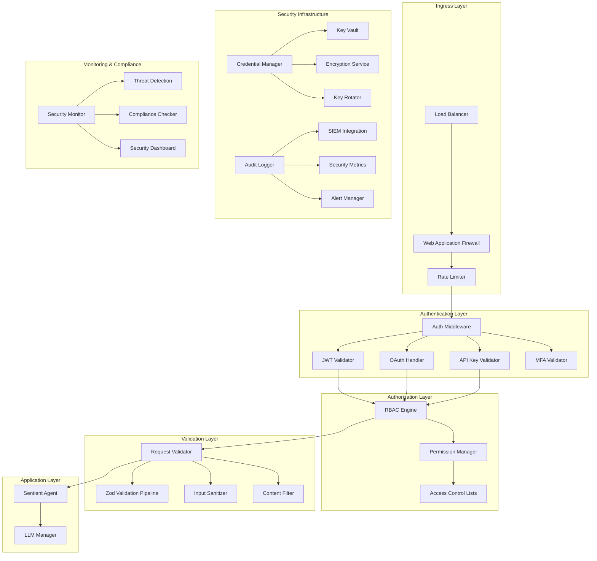

# Phase 2: Security & Authentication Architecture
## Enterprise-Grade Security Infrastructure for Sentient Node SDK

> **Architecture Goal**: Design and implement a comprehensive security and authentication system that provides enterprise-grade protection while maintaining developer-friendly interfaces and seamless integration with existing infrastructure.

---

## 🎯 Security Architecture Overview

The Security & Authentication Architecture establishes a multi-layered defense system that protects against common attack vectors while providing flexible authentication options for diverse deployment scenarios.

### Core Security Principles

1. **Defense in Depth**: Multiple security layers with independent validation
2. **Zero Trust**: Verify all requests regardless of source
3. **Principle of Least Privilege**: Minimal access rights by default
4. **Secure by Default**: Security enabled out-of-the-box
5. **Audit Everything**: Comprehensive logging for compliance
6. **Performance First**: Security without performance compromise

---

## 🏗️ Security System Architecture Diagram



---

## 🔐 Credential Management Architecture

### Enterprise-Grade API Key Management

```typescript
// src/interface/security/credential-manager.ts
export interface CredentialManager {
  // Core credential operations
  storeCredential(credential: CredentialSpec): Promise<CredentialId>;
  retrieveCredential(id: CredentialId): Promise<Credential>;
  updateCredential(id: CredentialId, updates: Partial<CredentialSpec>): Promise<void>;
  deleteCredential(id: CredentialId): Promise<void>;
  
  // Key rotation
  rotateCredential(id: CredentialId): Promise<CredentialRotationResult>;
  scheduleRotation(id: CredentialId, schedule: RotationSchedule): Promise<void>;
  
  // Vault integration
  syncWithVault(): Promise<void>;
  validateVaultConnection(): Promise<VaultStatus>;
}

export interface CredentialSpec {
  type: CredentialType;
  provider: string;
  environment: Environment;
  value: string;
  metadata: CredentialMetadata;
  encryptionConfig: EncryptionConfig;
  rotationPolicy: RotationPolicy;
}

export interface CredentialMetadata {
  name: string;
  description?: string;
  tags: string[];
  createdBy: string;
  expiresAt?: Date;
  permissions: Permission[];
  usageLimit?: UsageLimit;
}

export interface RotationPolicy {
  enabled: boolean;
  interval: number; // in milliseconds
  overlapPeriod: number; // grace period for old keys
  notifyBefore: number; // notification time before rotation
  backupCount: number; // number of previous keys to retain
}
```

### Multi-Vault Support Implementation

```typescript
// src/implementation/security/credential-manager.ts
export class EnterpriseCredentialManager implements CredentialManager {
  private vaults: Map<VaultType, VaultProvider>;
  private encryptionService: EncryptionService;
  private rotationScheduler: RotationScheduler;
  private auditLogger: SecurityAuditLogger;
  
  constructor(config: CredentialManagerConfig) {
    this.vaults = new Map();
    this.initializeVaults(config.vaults);
    this.encryptionService = new EncryptionService(config.encryption);
    this.rotationScheduler = new RotationScheduler(config.rotation);
    this.auditLogger = new SecurityAuditLogger(config.audit);
  }
  
  private initializeVaults(vaultConfigs: VaultConfig[]): void {
    for (const config of vaultConfigs) {
      switch (config.type) {
        case VaultType.AWS_SECRETS_MANAGER:
          this.vaults.set(config.type, new AWSSecretsManagerVault(config));
          break;
        case VaultType.AZURE_KEY_VAULT:
          this.vaults.set(config.type, new AzureKeyVaultProvider(config));
          break;
        case VaultType.HASHICORP_VAULT:
          this.vaults.set(config.type, new HashiCorpVaultProvider(config));
          break;
        case VaultType.GCP_SECRET_MANAGER:
          this.vaults.set(config.type, new GCPSecretManagerVault(config));
          break;
        case VaultType.LOCAL_ENCRYPTED:
          this.vaults.set(config.type, new LocalEncryptedVault(config));
          break;
      }
    }
  }
  
  async storeCredential(credential: CredentialSpec): Promise<CredentialId> {
    const id = this.generateCredentialId();
    
    // Encrypt credential value
    const encryptedValue = await this.encryptionService.encrypt(
      credential.value,
      credential.encryptionConfig
    );
    
    // Store in primary vault
    const primaryVault = this.getPrimaryVault();
    await primaryVault.store(id, {
      ...credential,
      value: encryptedValue
    });
    
    // Replicate to secondary vaults if configured
    await this.replicateToSecondaryVaults(id, credential);
    
    // Schedule rotation if enabled
    if (credential.rotationPolicy.enabled) {
      await this.rotationScheduler.schedule(id, credential.rotationPolicy);
    }
    
    // Audit log
    await this.auditLogger.logCredentialOperation({
      operation: 'STORE',
      credentialId: id,
      actor: credential.metadata.createdBy,
      timestamp: new Date(),
      success: true
    });
    
    return id;
  }
  
  async rotateCredential(id: CredentialId): Promise<CredentialRotationResult> {
    const credential = await this.retrieveCredential(id);
    
    try {
      // Generate new credential value
      const newValue = await this.generateNewCredentialValue(credential);
      
      // Store new credential with overlap period
      const newId = await this.storeCredential({
        ...credential,
        value: newValue,
        metadata: {
          ...credential.metadata,
          parentId: id,
          rotationGeneration: (credential.metadata.rotationGeneration || 0) + 1
        }
      });
      
      // Notify systems about rotation
      await this.notifyRotation(id, newId);
      
      // Schedule old credential deletion after overlap period
      setTimeout(async () => {
        await this.deleteCredential(id);
      }, credential.rotationPolicy.overlapPeriod);
      
      return {
        success: true,
        oldCredentialId: id,
        newCredentialId: newId,
        rotationTime: new Date(),
        overlapExpiresAt: new Date(Date.now() + credential.rotationPolicy.overlapPeriod)
      };
      
    } catch (error) {
      await this.auditLogger.logCredentialOperation({
        operation: 'ROTATE',
        credentialId: id,
        timestamp: new Date(),
        success: false,
        error: error.message
      });
      throw error;
    }
  }
}
```

---

## ⚡ Multi-Tier Rate Limiting Architecture

### Comprehensive Rate Limiting System

```typescript
// src/interface/security/rate-limiter.ts
export interface RateLimiter {
  checkLimit(request: RateLimitRequest): Promise<RateLimitResult>;
  updateLimits(limits: RateLimitConfig[]): Promise<void>;
  getUsage(identifier: string): Promise<UsageStats>;
  resetLimits(identifier: string): Promise<void>;
}

export interface RateLimitRequest {
  identifier: string; // IP, user ID, API key, etc.
  resource: string;   // endpoint, capability, etc.
  weight: number;     // request cost/weight
  metadata: RequestMetadata;
}

export interface RateLimitConfig {
  tier: RateLimitTier;
  algorithm: RateLimitAlgorithm;
  limits: RateLimit[];
  burstAllowance: number;
  penaltyConfig: PenaltyConfig;
}

export enum RateLimitTier {
  GLOBAL = 'global',        // System-wide limits
  TENANT = 'tenant',        // Per-tenant limits
  USER = 'user',           // Per-user limits  
  IP = 'ip',               // Per-IP limits
  API_KEY = 'api_key',     // Per-API key limits
  ENDPOINT = 'endpoint',    // Per-endpoint limits
  LLM_PROVIDER = 'llm_provider' // Per-LLM provider limits
}

export interface RateLimit {
  window: number;      // Time window in milliseconds
  maxRequests: number; // Max requests in window
  maxTokens?: number;  // Max LLM tokens in window
  maxCost?: number;    // Max cost in window
}
```

### Advanced Rate Limiting Implementation

```typescript
// src/implementation/security/rate-limiter.ts
export class MultiTierRateLimiter implements RateLimiter {
  private algorithms: Map<RateLimitAlgorithm, RateLimitEngine>;
  private storage: RateLimitStorage;
  private metrics: RateLimitMetrics;
  private config: RateLimiterConfig;
  
  constructor(config: RateLimiterConfig) {
    this.config = config;
    this.storage = this.initializeStorage(config.storage);
    this.metrics = new RateLimitMetrics();
    this.algorithms = new Map([
      [RateLimitAlgorithm.TOKEN_BUCKET, new TokenBucketEngine(config)],
      [RateLimitAlgorithm.SLIDING_WINDOW, new SlidingWindowEngine(config)],
      [RateLimitAlgorithm.FIXED_WINDOW, new FixedWindowEngine(config)],
      [RateLimitAlgorithm.ADAPTIVE, new AdaptiveRateLimitEngine(config)]
    ]);
  }
  
  async checkLimit(request: RateLimitRequest): Promise<RateLimitResult> {
    const results: RateLimitResult[] = [];
    
    // Check all applicable tiers
    for (const tier of this.getApplicableTiers(request)) {
      const config = this.config.tierConfigs.get(tier);
      if (!config) continue;
      
      const engine = this.algorithms.get(config.algorithm);
      if (!engine) continue;
      
      const tierResult = await engine.checkLimit(
        this.buildTierIdentifier(request, tier),
        request,
        config
      );
      
      results.push(tierResult);
      
      // If any tier denies, fail fast
      if (!tierResult.allowed) {
        await this.metrics.recordRateLimitViolation(tier, request);
        return tierResult;
      }
    }
    
    // All tiers passed
    const successResult: RateLimitResult = {
      allowed: true,
      remainingRequests: Math.min(...results.map(r => r.remainingRequests)),
      resetTime: Math.max(...results.map(r => r.resetTime)),
      tier: RateLimitTier.GLOBAL,
      retryAfter: 0
    };
    
    await this.metrics.recordSuccessfulRequest(request);
    return successResult;
  }
  
  private getApplicableTiers(request: RateLimitRequest): RateLimitTier[] {
    const tiers: RateLimitTier[] = [RateLimitTier.GLOBAL];
    
    if (request.metadata.tenantId) tiers.push(RateLimitTier.TENANT);
    if (request.metadata.userId) tiers.push(RateLimitTier.USER);
    if (request.metadata.ipAddress) tiers.push(RateLimitTier.IP);
    if (request.metadata.apiKey) tiers.push(RateLimitTier.API_KEY);
    if (request.resource) tiers.push(RateLimitTier.ENDPOINT);
    if (request.metadata.llmProvider) tiers.push(RateLimitTier.LLM_PROVIDER);
    
    return tiers;
  }
}

// Token Bucket Algorithm Implementation
export class TokenBucketEngine implements RateLimitEngine {
  async checkLimit(
    identifier: string,
    request: RateLimitRequest,
    config: RateLimitConfig
  ): Promise<RateLimitResult> {
    const bucket = await this.getBucket(identifier, config);
    const now = Date.now();
    
    // Refill bucket based on time elapsed
    const timeSinceLastRefill = now - bucket.lastRefillTime;
    const tokensToAdd = Math.floor(timeSinceLastRefill / config.refillRate);
    bucket.tokens = Math.min(bucket.capacity, bucket.tokens + tokensToAdd);
    bucket.lastRefillTime = now;
    
    // Check if request can be served
    if (bucket.tokens >= request.weight) {
      bucket.tokens -= request.weight;
      await this.saveBucket(identifier, bucket);
      
      return {
        allowed: true,
        remainingRequests: bucket.tokens,
        resetTime: now + (bucket.capacity - bucket.tokens) * config.refillRate,
        tier: config.tier,
        retryAfter: 0
      };
    }
    
    // Request denied
    const retryAfter = (request.weight - bucket.tokens) * config.refillRate;
    return {
      allowed: false,
      remainingRequests: 0,
      resetTime: now + retryAfter,
      tier: config.tier,
      retryAfter: Math.ceil(retryAfter / 1000) // Convert to seconds
    };
  }
}
```

### Distributed Rate Limiting with Redis

```typescript
// src/implementation/security/distributed-rate-limiter.ts
export class DistributedRateLimiter extends MultiTierRateLimiter {
  private redisClient: RedisClient;
  private luaScripts: Map<string, LuaScript>;
  
  constructor(config: RateLimiterConfig) {
    super(config);
    this.redisClient = new RedisClient(config.redis);
    this.luaScripts = this.loadLuaScripts();
  }
  
  private loadLuaScripts(): Map<string, LuaScript> {
    const scripts = new Map();
    
    // Token bucket script for atomic operations
    scripts.set('token_bucket', new LuaScript(`
      local key = KEYS[1]
      local capacity = tonumber(ARGV[1])
      local refill_rate = tonumber(ARGV[2])
      local requested = tonumber(ARGV[3])
      local now = tonumber(ARGV[4])
      
      local bucket = redis.call('HMGET', key, 'tokens', 'last_refill')
      local tokens = tonumber(bucket[1]) or capacity
      local last_refill = tonumber(bucket[2]) or now
      
      -- Refill tokens
      local time_passed = now - last_refill
      local new_tokens = math.min(capacity, tokens + math.floor(time_passed / refill_rate))
      
      if new_tokens >= requested then
        new_tokens = new_tokens - requested
        redis.call('HMSET', key, 'tokens', new_tokens, 'last_refill', now)
        redis.call('EXPIRE', key, 3600)
        return {1, new_tokens, 0}
      else
        local retry_after = math.ceil((requested - new_tokens) * refill_rate / 1000)
        return {0, 0, retry_after}
      end
    `));
    
    return scripts;
  }
  
  async checkDistributedLimit(
    identifier: string,
    request: RateLimitRequest,
    config: RateLimitConfig
  ): Promise<RateLimitResult> {
    const script = this.luaScripts.get('token_bucket');
    const key = `rate_limit:${config.tier}:${identifier}`;
    
    const result = await this.redisClient.eval(
      script.content,
      [key],
      [config.limits[0].maxRequests, config.refillRate, request.weight, Date.now()]
    );
    
    return {
      allowed: result[0] === 1,
      remainingRequests: result[1],
      resetTime: Date.now() + (result[2] * 1000),
      tier: config.tier,
      retryAfter: result[2]
    };
  }
}
```

---

## 🔒 Authentication Middleware Suite

### Universal Authentication Interface

```typescript
// src/interface/security/authentication.ts
export interface AuthenticationProvider {
  readonly name: string;
  readonly type: AuthenticationType;
  
  authenticate(request: AuthRequest): Promise<AuthResult>;
  validate(token: string): Promise<ValidationResult>;
  refresh(refreshToken: string): Promise<RefreshResult>;
  revoke(token: string): Promise<void>;
}

export interface AuthRequest {
  headers: Record<string, string>;
  body?: any;
  query: Record<string, string>;
  ip: string;
  userAgent: string;
  metadata: RequestMetadata;
}

export interface AuthResult {
  success: boolean;
  user?: User;
  token?: string;
  refreshToken?: string;
  expiresAt?: Date;
  permissions: Permission[];
  metadata: AuthMetadata;
}

export interface User {
  id: string;
  email: string;
  name: string;
  roles: Role[];
  tenantId?: string;
  metadata: UserMetadata;
  lastLoginAt?: Date;
  createdAt: Date;
  updatedAt: Date;
}
```

### JWT Authentication Provider

```typescript
// src/implementation/security/auth/jwt-provider.ts
export class JWTAuthProvider implements AuthenticationProvider {
  readonly name = 'jwt';
  readonly type = AuthenticationType.JWT;
  
  private jwtService: JWTService;
  private userService: UserService;
  private auditLogger: SecurityAuditLogger;
  
  constructor(config: JWTConfig) {
    this.jwtService = new JWTService(config);
    this.userService = new UserService(config.userStore);
    this.auditLogger = new SecurityAuditLogger(config.audit);
  }
  
  async authenticate(request: AuthRequest): Promise<AuthResult> {
    try {
      const token = this.extractToken(request);
      if (!token) {
        throw new AuthenticationError('No token provided');
      }
      
      const payload = await this.jwtService.verify(token);
      const user = await this.userService.findById(payload.sub);
      
      if (!user) {
        throw new AuthenticationError('User not found');
      }
      
      await this.auditLogger.logAuthEvent({
        type: 'JWT_AUTH_SUCCESS',
        userId: user.id,
        ip: request.ip,
        userAgent: request.userAgent,
        timestamp: new Date()
      });
      
      return {
        success: true,
        user,
        token,
        permissions: await this.getUserPermissions(user),
        metadata: {
          authType: 'jwt',
          tokenIssuer: payload.iss,
          tokenExpiry: new Date(payload.exp * 1000)
        }
      };
      
    } catch (error) {
      await this.auditLogger.logAuthEvent({
        type: 'JWT_AUTH_FAILURE',
        ip: request.ip,
        userAgent: request.userAgent,
        error: error.message,
        timestamp: new Date()
      });
      
      return {
        success: false,
        permissions: [],
        metadata: { authType: 'jwt', error: error.message }
      };
    }
  }
  
  private extractToken(request: AuthRequest): string | null {
    // Try Authorization header first
    const authHeader = request.headers.authorization;
    if (authHeader?.startsWith('Bearer ')) {
      return authHeader.substring(7);
    }
    
    // Try query parameter
    if (request.query.token) {
      return request.query.token;
    }
    
    // Try cookie
    const cookie = request.headers.cookie;
    if (cookie) {
      const match = cookie.match(/auth_token=([^;]+)/);
      if (match) return match[1];
    }
    
    return null;
  }
}
```

### OAuth 2.0 Provider

```typescript
// src/implementation/security/auth/oauth-provider.ts
export class OAuth2Provider implements AuthenticationProvider {
  readonly name = 'oauth2';
  readonly type = AuthenticationType.OAUTH2;
  
  private oauthClient: OAuth2Client;
  private tokenStore: TokenStore;
  private auditLogger: SecurityAuditLogger;
  
  constructor(config: OAuth2Config) {
    this.oauthClient = new OAuth2Client(config);
    this.tokenStore = new TokenStore(config.tokenStore);
    this.auditLogger = new SecurityAuditLogger(config.audit);
  }
  
  async authenticate(request: AuthRequest): Promise<AuthResult> {
    try {
      const accessToken = this.extractAccessToken(request);
      if (!accessToken) {
        throw new AuthenticationError('No access token provided');
      }
      
      // Validate token with OAuth provider
      const tokenInfo = await this.oauthClient.validateToken(accessToken);
      
      // Get user info from provider
      const userInfo = await this.oauthClient.getUserInfo(accessToken);
      
      const user = await this.mapOAuthUserToLocalUser(userInfo);
      
      return {
        success: true,
        user,
        token: accessToken,
        permissions: await this.getUserPermissions(user),
        metadata: {
          authType: 'oauth2',
          provider: tokenInfo.iss,
          scope: tokenInfo.scope,
          tokenExpiry: new Date(tokenInfo.exp * 1000)
        }
      };
      
    } catch (error) {
      await this.auditLogger.logAuthEvent({
        type: 'OAUTH_AUTH_FAILURE',
        ip: request.ip,
        error: error.message,
        timestamp: new Date()
      });
      
      return {
        success: false,
        permissions: [],
        metadata: { authType: 'oauth2', error: error.message }
      };
    }
  }
}
```

### Multi-Factor Authentication

```typescript
// src/implementation/security/auth/mfa-provider.ts
export class MFAProvider {
  private tofuService: TOTPService;
  private smsService: SMSService;
  private pushService: PushNotificationService;
  
  constructor(config: MFAConfig) {
    this.tofuService = new TOTPService(config.totp);
    this.smsService = new SMSService(config.sms);
    this.pushService = new PushNotificationService(config.push);
  }
  
  async initiateMFA(user: User, method: MFAMethod): Promise<MFAChallenge> {
    switch (method) {
      case MFAMethod.TOTP:
        return this.initiateTotp(user);
      case MFAMethod.SMS:
        return this.initiateSMS(user);
      case MFAMethod.PUSH:
        return this.initiatePush(user);
      default:
        throw new Error(`Unsupported MFA method: ${method}`);
    }
  }
  
  async verifyMFA(challengeId: string, response: string): Promise<MFAResult> {
    const challenge = await this.getChallengeById(challengeId);
    
    switch (challenge.method) {
      case MFAMethod.TOTP:
        return this.verifyTotp(challenge, response);
      case MFAMethod.SMS:
        return this.verifySMS(challenge, response);
      case MFAMethod.PUSH:
        return this.verifyPush(challenge, response);
      default:
        throw new Error(`Unsupported MFA method: ${challenge.method}`);
    }
  }
  
  private async verifyTotp(challenge: MFAChallenge, token: string): Promise<MFAResult> {
    const user = await this.getUserById(challenge.userId);
    const isValid = await this.tofuService.verify(token, user.totpSecret);
    
    return {
      success: isValid,
      challengeId: challenge.id,
      method: MFAMethod.TOTP,
      verifiedAt: new Date()
    };
  }
}
```

---

## 🛡️ Request Validation Pipeline Enhancement

### Enhanced Zod Integration

```typescript
// src/implementation/security/validation/enhanced-validation-pipeline.ts
export class EnhancedValidationPipeline extends ValidationPipeline {
  private securityRules: SecurityRuleEngine;
  private contentFilter: ContentFilter;
  private injectionDetector: InjectionDetector;
  private auditLogger: SecurityAuditLogger;
  
  constructor(config: ValidationConfig) {
    super(config);
    this.securityRules = new SecurityRuleEngine(config.security);
    this.contentFilter = new ContentFilter(config.contentFiltering);
    this.injectionDetector = new InjectionDetector(config.injectionDetection);
    this.auditLogger = new SecurityAuditLogger(config.audit);
  }
  
  async validate<T>(
    data: unknown,
    schema: z.ZodSchema<T>,
    context: ValidationContext
  ): Promise<EnhancedValidationResult<T>> {
    try {
      // Phase 1: Basic Zod validation
      const basicResult = await super.validate(data, schema, context);
      if (!basicResult.success) {
        return this.enhanceValidationError(basicResult);
      }
      
      // Phase 2: Security rule validation
      const securityResult = await this.validateSecurityRules(basicResult.data, context);
      if (!securityResult.passed) {
        await this.auditLogger.logSecurityViolation({
          type: 'SECURITY_RULE_VIOLATION',
          violations: securityResult.violations,
          context,
          timestamp: new Date()
        });
        
        return {
          success: false,
          error: new SecurityValidationError(securityResult.violations),
          securityViolations: securityResult.violations
        };
      }
      
      // Phase 3: Content filtering
      const filteredData = await this.contentFilter.filter(basicResult.data);
      
      // Phase 4: Injection detection
      const injectionResult = await this.injectionDetector.detect(filteredData);
      if (injectionResult.detected) {
        await this.auditLogger.logSecurityViolation({
          type: 'INJECTION_ATTEMPT',
          injectionType: injectionResult.type,
          payload: injectionResult.payload,
          context,
          timestamp: new Date()
        });
        
        throw new InjectionAttemptError(injectionResult);
      }
      
      return {
        success: true,
        data: filteredData,
        securityMetadata: {
          rulesApplied: securityResult.rulesApplied,
          contentFiltered: filteredData !== basicResult.data,
          injectionChecked: true
        }
      };
      
    } catch (error) {
      await this.auditLogger.logValidationError({
        error: error.message,
        context,
        timestamp: new Date()
      });
      throw error;
    }
  }
}
```

### Content Filtering and Sanitization

```typescript
// src/implementation/security/validation/content-filter.ts
export class ContentFilter {
  private profanityFilter: ProfanityFilter;
  private htmlSanitizer: HTMLSanitizer;
  private urlValidator: URLValidator;
  private patterns: SecurityPatterns;
  
  constructor(config: ContentFilterConfig) {
    this.profanityFilter = new ProfanityFilter(config.profanity);
    this.htmlSanitizer = new HTMLSanitizer(config.html);
    this.urlValidator = new URLValidator(config.urls);
    this.patterns = new SecurityPatterns(config.patterns);
  }
  
  async filter(data: any): Promise<any> {
    if (typeof data === 'string') {
      return this.filterString(data);
    }
    
    if (Array.isArray(data)) {
      return Promise.all(data.map(item => this.filter(item)));
    }
    
    if (data && typeof data === 'object') {
      const filtered: any = {};
      for (const [key, value] of Object.entries(data)) {
        filtered[key] = await this.filter(value);
      }
      return filtered;
    }
    
    return data;
  }
  
  private async filterString(input: string): Promise<string> {
    let filtered = input;
    
    // Remove profanity
    filtered = await this.profanityFilter.filter(filtered);
    
    // Sanitize HTML
    filtered = this.htmlSanitizer.sanitize(filtered);
    
    // Validate and sanitize URLs
    filtered = await this.urlValidator.sanitizeUrls(filtered);
    
    // Apply security patterns
    filtered = this.patterns.sanitize(filtered);
    
    return filtered;
  }
}

// Injection Detection System
export class InjectionDetector {
  private sqlPatterns: RegExp[];
  private xssPatterns: RegExp[];
  private commandPatterns: RegExp[];
  private ldapPatterns: RegExp[];
  
  constructor(config: InjectionDetectionConfig) {
    this.sqlPatterns = this.compileSQLPatterns(config.sql);
    this.xssPatterns = this.compileXSSPatterns(config.xss);
    this.commandPatterns = this.compileCommandPatterns(config.command);
    this.ldapPatterns = this.compileLDAPPatterns(config.ldap);
  }
  
  async detect(data: any): Promise<InjectionDetectionResult> {
    const results: InjectionMatch[] = [];
    
    await this.scanData(data, '', results);
    
    return {
      detected: results.length > 0,
      matches: results,
      type: results.length > 0 ? results[0].type : null,
      payload: results.length > 0 ? results[0].payload : null
    };
  }
  
  private async scanData(data: any, path: string, results: InjectionMatch[]): Promise<void> {
    if (typeof data === 'string') {
      const matches = this.scanString(data);
      for (const match of matches) {
        results.push({ ...match, path });
      }
    } else if (Array.isArray(data)) {
      for (let i = 0; i < data.length; i++) {
        await this.scanData(data[i], `${path}[${i}]`, results);
      }
    } else if (data && typeof data === 'object') {
      for (const [key, value] of Object.entries(data)) {
        await this.scanData(value, path ? `${path}.${key}` : key, results);
      }
    }
  }
  
  private scanString(input: string): InjectionMatch[] {
    const matches: InjectionMatch[] = [];
    
    // Check for SQL injection
    for (const pattern of this.sqlPatterns) {
      const match = pattern.exec(input);
      if (match) {
        matches.push({
          type: InjectionType.SQL,
          payload: match[0],
          confidence: this.calculateConfidence(match, InjectionType.SQL),
          position: match.index
        });
      }
    }
    
    // Check for XSS
    for (const pattern of this.xssPatterns) {
      const match = pattern.exec(input);
      if (match) {
        matches.push({
          type: InjectionType.XSS,
          payload: match[0],
          confidence: this.calculateConfidence(match, InjectionType.XSS),
          position: match.index
        });
      }
    }
    
    // Check for command injection
    for (const pattern of this.commandPatterns) {
      const match = pattern.exec(input);
      if (match) {
        matches.push({
          type: InjectionType.COMMAND,
          payload: match[0],
          confidence: this.calculateConfidence(match, InjectionType.COMMAND),
          position: match.index
        });
      }
    }
    
    return matches;
  }
}
```

---

## 📊 Security Event Auditing and Monitoring

### Comprehensive Security Audit System

```typescript
// src/implementation/security/audit/security-audit-logger.ts
export class SecurityAuditLogger {
  private loggers: Map<AuditEventType, AuditLogger>;
  private siemIntegration: SIEMIntegration;
  private alertManager: SecurityAlertManager;
  private eventStore: SecurityEventStore;
  
  constructor(config: SecurityAuditConfig) {
    this.loggers = this.initializeLoggers(config.loggers);
    this.siemIntegration = new SIEMIntegration(config.siem);
    this.alertManager = new SecurityAlertManager(config.alerts);
    this.eventStore = new SecurityEventStore(config.eventStore);
  }
  
  async logSecurityEvent(event: SecurityEvent): Promise<void> {
    try {
      // Enrich event with metadata
      const enrichedEvent = await this.enrichEvent(event);
      
      // Store in local event store
      await this.eventStore.store(enrichedEvent);
      
      // Send to appropriate loggers
      const logger = this.loggers.get(event.type);
      if (logger) {
        await logger.log(enrichedEvent);
      }
      
      // Send to SIEM
      if (this.shouldSendToSIEM(enrichedEvent)) {
        await this.siemIntegration.send(enrichedEvent);
      }
      
      // Check for alert conditions
      if (this.shouldAlert(enrichedEvent)) {
        await this.alertManager.processEvent(enrichedEvent);
      }
      
    } catch (error) {
      // Fallback logging - never let audit failures break the application
      console.error('Security audit logging failed:', error);
      await this.logAuditFailure(event, error);
    }
  }
  
  async logAuthEvent(event: AuthEvent): Promise<void> {
    const securityEvent: SecurityEvent = {
      id: ulid(),
      type: AuditEventType.AUTHENTICATION,
      timestamp: event.timestamp,
      severity: this.calculateSeverity(event),
      source: 'authentication_system',
      details: event,
      metadata: {
        ip: event.ip,
        userAgent: event.userAgent,
        userId: event.userId
      }
    };
    
    await this.logSecurityEvent(securityEvent);
  }
  
  async logSecurityViolation(violation: SecurityViolation): Promise<void> {
    const securityEvent: SecurityEvent = {
      id: ulid(),
      type: AuditEventType.SECURITY_VIOLATION,
      timestamp: violation.timestamp,
      severity: SecuritySeverity.HIGH,
      source: 'security_validator',
      details: violation,
      metadata: {
        violationType: violation.type,
        context: violation.context
      }
    };
    
    await this.logSecurityEvent(securityEvent);
  }
  
  private async enrichEvent(event: SecurityEvent): Promise<EnrichedSecurityEvent> {
    return {
      ...event,
      enrichment: {
        geoLocation: await this.getGeoLocation(event.metadata?.ip),
        threatIntelligence: await this.getThreatIntelligence(event.metadata?.ip),
        riskScore: await this.calculateRiskScore(event),
        correlationId: this.generateCorrelationId(event),
        environment: process.env.NODE_ENV || 'unknown'
      }
    };
  }
}
```

### Real-time Security Monitoring

```typescript
// src/implementation/security/monitoring/security-monitor.ts
export class SecurityMonitor extends EventEmitter {
  private detectors: Map<ThreatType, ThreatDetector>;
  private metrics: SecurityMetrics;
  private dashboard: SecurityDashboard;
  private alertManager: SecurityAlertManager;
  
  constructor(config: SecurityMonitorConfig) {
    super();
    this.detectors = this.initializeDetectors(config.detectors);
    this.metrics = new SecurityMetrics(config.metrics);
    this.dashboard = new SecurityDashboard(config.dashboard);
    this.alertManager = new SecurityAlertManager(config.alerts);
  }
  
  async startMonitoring(): Promise<void> {
    // Start threat detectors
    for (const [type, detector] of this.detectors) {
      detector.on('threat', (threat) => this.handleThreat(type, threat));
      await detector.start();
    }
    
    // Start metrics collection
    await this.metrics.startCollection();
    
    // Initialize dashboard
    await this.dashboard.initialize();
  }
  
  private async handleThreat(type: ThreatType, threat: ThreatDetection): Promise<void> {
    // Log the threat
    await this.auditLogger.logSecurityEvent({
      id: ulid(),
      type: AuditEventType.THREAT_DETECTED,
      timestamp: new Date(),
      severity: threat.severity,
      source: `threat_detector_${type}`,
      details: threat,
      metadata: { threatType: type }
    });
    
    // Update metrics
    await this.metrics.recordThreat(type, threat);
    
    // Send alert if necessary
    if (threat.severity >= SecuritySeverity.HIGH) {
      await this.alertManager.sendAlert({
        type: AlertType.SECURITY_THREAT,
        severity: threat.severity,
        title: `${type} threat detected`,
        description: threat.description,
        metadata: threat.metadata
      });
    }
    
    // Emit event for other components
    this.emit('threat', { type, threat });
  }
}

// Brute Force Attack Detector
export class BruteForceDetector implements ThreatDetector {
  private attempts: Map<string, AttemptRecord[]> = new Map();
  private config: BruteForceConfig;
  
  constructor(config: BruteForceConfig) {
    this.config = config;
  }
  
  async analyze(event: SecurityEvent): Promise<ThreatDetection | null> {
    if (event.type !== AuditEventType.AUTHENTICATION || event.details.success) {
      return null;
    }
    
    const identifier = this.getIdentifier(event);
    const attempts = this.attempts.get(identifier) || [];
    
    // Clean old attempts
    const cutoff = Date.now() - this.config.windowMs;
    const recentAttempts = attempts.filter(a => a.timestamp > cutoff);
    
    // Add current attempt
    recentAttempts.push({
      timestamp: Date.now(),
      ip: event.metadata?.ip,
      userAgent: event.metadata?.userAgent
    });
    
    this.attempts.set(identifier, recentAttempts);
    
    // Check if threshold exceeded
    if (recentAttempts.length >= this.config.maxAttempts) {
      return {
        id: ulid(),
        type: ThreatType.BRUTE_FORCE,
        severity: SecuritySeverity.HIGH,
        confidence: this.calculateConfidence(recentAttempts),
        description: `Brute force attack detected: ${recentAttempts.length} failed attempts`,
        metadata: {
          identifier,
          attemptCount: recentAttempts.length,
          timeWindow: this.config.windowMs,
          ips: [...new Set(recentAttempts.map(a => a.ip))],
          userAgents: [...new Set(recentAttempts.map(a => a.userAgent))]
        },
        mitigationSuggestions: [
          'Temporarily block IP address',
          'Require additional authentication factors',
          'Notify security team'
        ]
      };
    }
    
    return null;
  }
}
```

---

## 🔧 Framework Integration Architecture

### Express.js Integration

```typescript
// src/implementation/security/middleware/express-security.ts
export function createExpressSecurityMiddleware(config: SecurityMiddlewareConfig): RequestHandler[] {
  const rateLimiter = new MultiTierRateLimiter(config.rateLimiting);
  const authManager = new AuthenticationManager(config.authentication);
  const validator = new EnhancedValidationPipeline(config.validation);
  const auditLogger = new SecurityAuditLogger(config.audit);
  
  return [
    // Rate limiting middleware
    async (req: Request, res: Response, next: NextFunction) => {
      try {
        const rateLimitRequest: RateLimitRequest = {
          identifier: req.ip,
          resource: req.path,
          weight: 1,
          metadata: {
            ip: req.ip,
            userAgent: req.get('User-Agent') || '',
            method: req.method,
            endpoint: req.path
          }
        };
        
        const result = await rateLimiter.checkLimit(rateLimitRequest);
        
        // Set rate limit headers
        res.set({
          'X-RateLimit-Limit': result.maxRequests?.toString() || '1000',
          'X-RateLimit-Remaining': result.remainingRequests.toString(),
          'X-RateLimit-Reset': result.resetTime.toString()
        });
        
        if (!result.allowed) {
          res.status(429).json({
            error: 'Rate limit exceeded',
            retryAfter: result.retryAfter,
            tier: result.tier
          });
          return;
        }
        
        next();
      } catch (error) {
        next(error);
      }
    },
    
    // Authentication middleware
    async (req: Request, res: Response, next: NextFunction) => {
      try {
        const authRequest: AuthRequest = {
          headers: req.headers as Record<string, string>,
          body: req.body,
          query: req.query as Record<string, string>,
          ip: req.ip,
          userAgent: req.get('User-Agent') || '',
          metadata: {
            method: req.method,
            path: req.path,
            timestamp: new Date()
          }
        };
        
        const authResult = await authManager.authenticate(authRequest);
        
        if (!authResult.success) {
          res.status(401).json({
            error: 'Authentication failed',
            message: authResult.error?.message
          });
          return;
        }
        
        // Attach user and permissions to request
        (req as any).user = authResult.user;
        (req as any).permissions = authResult.permissions;
        (req as any).authMetadata = authResult.metadata;
        
        next();
      } catch (error) {
        next(error);
      }
    },
    
    // Request validation middleware
    async (req: Request, res: Response, next: NextFunction) => {
      try {
        const validationContext: ValidationContext = {
          user: (req as any).user,
          permissions: (req as any).permissions,
          ip: req.ip,
          userAgent: req.get('User-Agent') || ''
        };
        
        // Validate request body if present
        if (req.body && Object.keys(req.body).length > 0) {
          const schema = getSchemaForEndpoint(req.path, req.method);
          if (schema) {
            const result = await validator.validate(req.body, schema, validationContext);
            if (!result.success) {
              res.status(400).json({
                error: 'Validation failed',
                details: result.error?.issues
              });
              return;
            }
            req.body = result.data;
          }
        }
        
        next();
      } catch (error) {
        next(error);
      }
    }
  ];
}
```

### Fastify Plugin

```typescript
// src/implementation/security/plugins/fastify-security.ts
import { FastifyPluginCallback } from 'fastify';

export const securityPlugin: FastifyPluginCallback<SecurityPluginOptions> = (
  fastify,
  options,
  done
) => {
  const rateLimiter = new MultiTierRateLimiter(options.rateLimiting);
  const authManager = new AuthenticationManager(options.authentication);
  const validator = new EnhancedValidationPipeline(options.validation);
  
  // Register rate limiting hook
  fastify.addHook('preHandler', async (request, reply) => {
    const rateLimitRequest: RateLimitRequest = {
      identifier: request.ip,
      resource: request.routerPath,
      weight: 1,
      metadata: {
        ip: request.ip,
        userAgent: request.headers['user-agent'] || '',
        method: request.method,
        endpoint: request.routerPath
      }
    };
    
    const result = await rateLimiter.checkLimit(rateLimitRequest);
    
    if (!result.allowed) {
      reply.status(429).send({
        error: 'Rate limit exceeded',
        retryAfter: result.retryAfter
      });
      return;
    }
  });
  
  // Register authentication hook
  fastify.addHook('preHandler', async (request, reply) => {
    if (shouldSkipAuth(request.routerPath)) {
      return;
    }
    
    const authResult = await authManager.authenticate({
      headers: request.headers as Record<string, string>,
      body: request.body,
      query: request.query as Record<string, string>,
      ip: request.ip,
      userAgent: request.headers['user-agent'] || '',
      metadata: { method: request.method, path: request.routerPath }
    });
    
    if (!authResult.success) {
      reply.status(401).send({ error: 'Authentication failed' });
      return;
    }
    
    request.user = authResult.user;
    request.permissions = authResult.permissions;
  });
  
  done();
};
```

---

## 📋 Implementation Timeline

### Week 1: Security Foundation
- [ ] Enhanced credential management system
- [ ] Multi-vault provider architecture
- [ ] Basic rate limiting implementation
- [ ] Security audit logging framework

### Week 2: Authentication Systems
- [ ] JWT authentication provider
- [ ] OAuth 2.0 integration
- [ ] API key management
- [ ] MFA implementation

### Week 3: Advanced Security
- [ ] Enhanced validation pipeline
- [ ] Content filtering and sanitization
- [ ] Injection detection system
- [ ] Distributed rate limiting

### Week 4: Monitoring & Integration
- [ ] Security monitoring dashboard
- [ ] Threat detection systems
- [ ] Framework middleware (Express/Fastify)
- [ ] SIEM integration
- [ ] Compliance reporting

---

## 🎯 Security Metrics and KPIs

### Technical Security Metrics
- **Authentication Success Rate**: >99.5%
- **Rate Limit Effectiveness**: <0.1% false positives
- **Credential Rotation**: Automated with <5 minutes downtime
- **Threat Detection**: <1 second average detection time
- **Audit Log Integrity**: 100% with tamper detection

### Performance Security Metrics
- **Authentication Latency**: <50ms median
- **Rate Limiting Overhead**: <5ms per request
- **Validation Performance**: <10ms for complex schemas
- **Security Monitoring**: <100ms event processing

### Compliance Metrics
- **SOC 2 Type II**: Full compliance
- **GDPR**: Privacy by design implementation
- **PCI DSS**: Tokenization and encryption standards
- **HIPAA**: Healthcare data protection (when applicable)

This comprehensive security architecture establishes the Sentient Node SDK as an enterprise-ready platform with security capabilities that exceed industry standards while maintaining optimal performance and developer experience.