# Phase 3: Production Infrastructure Architecture
## Enterprise-Grade Production Infrastructure for Sentient Node SDK

> **Architecture Goal**: Design and implement a comprehensive production infrastructure system that ensures high availability, scalability, and observability while maintaining optimal performance and operational excellence.

---

## 🎯 Production Infrastructure Overview

The Production Infrastructure Architecture establishes a robust, scalable, and observable foundation that enables the Sentient Node SDK to operate reliably at enterprise scale with comprehensive monitoring, health management, and high availability features.

### Core Infrastructure Principles

1. **Observability First**: Comprehensive metrics, logging, and tracing
2. **High Availability**: Multi-instance clustering with failover
3. **Graceful Degradation**: Resilient operation under adverse conditions
4. **Resource Efficiency**: Optimal resource utilization and connection pooling
5. **Operational Excellence**: Automated health checks and recovery
6. **Cloud Native**: Kubernetes-ready with container orchestration support

---

## 🏗️ Production Infrastructure Architecture Diagram

```mermaid
graph TB
    subgraph "Load Balancer Layer"
        ALB[Application Load Balancer] --> HM[Health Monitor]
        HM --> HC1[Health Check /health]
        HM --> HC2[Health Check /ready]
        HM --> HC3[Health Check /live]
    end
    
    subgraph "Application Cluster"
        ALB --> App1[Sentient App Instance 1]
        ALB --> App2[Sentient App Instance 2]
        ALB --> App3[Sentient App Instance N]
        
        App1 --> SM1[Service Manager 1]
        App2 --> SM2[Service Manager 2]
        App3 --> SM3[Service Manager N]
    end
    
    subgraph "Service Management Layer"
        SM1 --> LE1[Leader Election]
        SM2 --> LE1
        SM3 --> LE1
        
        LE1 --> CS[Cluster State]
        LE1 --> CD[Configuration Distribution]
        LE1 --> HB[Heartbeat Manager]
    end
    
    subgraph "Connection Management"
        CP[Connection Pool Manager] --> HTTP[HTTP Connection Pools]
        CP --> WS[WebSocket Connection Pools]
        CP --> DB[Database Connection Pools]
        
        HTTP --> OpenAI[OpenAI API Pool]
        HTTP --> Anthropic[Anthropic API Pool]
        HTTP --> Custom[Custom API Pools]
    end
    
    subgraph "Monitoring & Observability"
        MC[Metrics Collector] --> Prometheus[Prometheus]
        MC --> Custom[Custom Metrics]
        
        Prometheus --> Grafana[Grafana Dashboard]
        Prometheus --> AM[Alert Manager]
        
        TM[Trace Manager] --> Jaeger[Jaeger Tracing]
        TM --> OTEL[OpenTelemetry]
    end
    
    subgraph "Health Management"
        HMS[Health Management System] --> HealthCheckers[Health Checkers]
        HMS --> CircuitBreakers[Circuit Breakers]
        HMS --> Recovery[Auto Recovery]
        
        HealthCheckers --> LLMHealth[LLM Provider Health]
        HealthCheckers --> DBHealth[Database Health]
        HealthCheckers --> CacheHealth[Cache Health]
        HealthCheckers --> StorageHealth[Storage Health]
    end
    
    subgraph "Graceful Lifecycle"
        GLM[Graceful Lifecycle Manager] --> Startup[Startup Sequencer]
        GLM --> Shutdown[Shutdown Controller]
        GLM --> SignalHandler[Signal Handler]
        
        Shutdown --> RequestDraining[Request Draining]
        Shutdown --> ConnectionCleanup[Connection Cleanup]
        Shutdown --> StateSync[State Synchronization]
    end
    
    subgraph "External Dependencies"
        Redis[Redis Cluster]
        PostgreSQL[PostgreSQL Cluster]
        Vault[HashiCorp Vault]
        S3[Object Storage]
    end
```



---

## 🏥 Health Check and Monitoring System

### Comprehensive Health Check Architecture

```typescript
// src/interface/health/health-checker.ts
export interface HealthChecker {
  readonly name: string;
  readonly type: HealthCheckType;
  readonly timeout: number;
  
  check(): Promise<HealthCheckResult>;
  getMetadata(): HealthCheckMetadata;
}

export interface HealthCheckResult {
  status: HealthStatus;
  timestamp: Date;
  responseTime: number;
  details: Record<string, any>;
  error?: Error;
  metadata: HealthCheckMetadata;
}

export enum HealthStatus {
  HEALTHY = 'healthy',
  DEGRADED = 'degraded',
  UNHEALTHY = 'unhealthy',
  UNKNOWN = 'unknown'
}

export interface HealthCheckMetadata {
  version: string;
  environment: string;
  instanceId: string;
  region?: string;
  dependencies: string[];
  lastHealthyAt?: Date;
  consecutiveFailures: number;
}

export interface HealthEndpointConfig {
  path: string;
  includeDetails: boolean;
  includeSystem: boolean;
  includeDependencies: boolean;
  timeout: number;
  cacheTTL: number;
}
```

### Production Health Management System

```typescript
// src/implementation/health/health-manager.ts
export class HealthManager extends EventEmitter {
  private checkers: Map<string, HealthChecker>;
  private results: Map<string, HealthCheckResult>;
  private config: HealthManagerConfig;
  private scheduler: HealthCheckScheduler;
  private cache: HealthResultCache;
  private metrics: HealthMetrics;
  
  constructor(config: HealthManagerConfig) {
    super();
    this.config = config;
    this.checkers = new Map();
    this.results = new Map();
    this.scheduler = new HealthCheckScheduler(config.scheduling);
    this.cache = new HealthResultCache(config.cache);
    this.metrics = new HealthMetrics(config.metrics);
  }
  
  async initialize(): Promise<void> {
    // Register core health checkers
    await this.registerCoreCheckers();
    
    // Start health check scheduler
    await this.scheduler.start();
    
    // Schedule periodic health checks
    this.scheduler.schedule('comprehensive', this.config.intervals.comprehensive, 
      () => this.runComprehensiveHealthCheck()
    );
    
    this.scheduler.schedule('quick', this.config.intervals.quick,
      () => this.runQuickHealthCheck()
    );
  }
  
  private async registerCoreCheckers(): Promise<void> {
    // System health checkers
    this.registerChecker(new SystemResourcesChecker(this.config.system));
    this.registerChecker(new MemoryHealthChecker(this.config.memory));
    this.registerChecker(new DiskSpaceChecker(this.config.disk));
    
    // Application health checkers
    this.registerChecker(new LLMProvidersHealthChecker(this.config.llm));
    this.registerChecker(new DatabaseHealthChecker(this.config.database));
    this.registerChecker(new CacheHealthChecker(this.config.cache));
    this.registerChecker(new SessionStoreHealthChecker(this.config.sessionStore));
    
    // External dependencies
    this.registerChecker(new VaultHealthChecker(this.config.vault));
    this.registerChecker(new StorageHealthChecker(this.config.storage));
    this.registerChecker(new MessageQueueHealthChecker(this.config.messageQueue));
  }
  
  async getOverallHealth(): Promise<OverallHealthStatus> {
    const results = await this.runAllHealthChecks();
    
    const healthyCount = results.filter(r => r.status === HealthStatus.HEALTHY).length;
    const degradedCount = results.filter(r => r.status === HealthStatus.DEGRADED).length;
    const unhealthyCount = results.filter(r => r.status === HealthStatus.UNHEALTHY).length;
    
    let overallStatus: HealthStatus;
    if (unhealthyCount > 0) {
      overallStatus = HealthStatus.UNHEALTHY;
    } else if (degradedCount > 0) {
      overallStatus = HealthStatus.DEGRADED;
    } else {
      overallStatus = HealthStatus.HEALTHY;
    }
    
    return {
      status: overallStatus,
      timestamp: new Date(),
      checks: results.length,
      healthy: healthyCount,
      degraded: degradedCount,
      unhealthy: unhealthyCount,
      details: results,
      uptime: process.uptime(),
      version: this.config.version,
      instanceId: this.config.instanceId
    };
  }
  
  // Kubernetes-compatible health endpoints
  async getLivenessProbe(): Promise<LivenessProbeResult> {
    // Check if the application is alive and responding
    const criticalCheckers = ['system-resources', 'memory', 'core-services'];
    const results = await this.runSpecificChecks(criticalCheckers);
    
    const hasUnhealthy = results.some(r => r.status === HealthStatus.UNHEALTHY);
    
    return {
      status: hasUnhealthy ? HealthStatus.UNHEALTHY : HealthStatus.HEALTHY,
      timestamp: new Date(),
      checks: results
    };
  }
  
  async getReadinessProbe(): Promise<ReadinessProbeResult> {
    // Check if the application is ready to serve requests
    const readinessCheckers = ['database', 'cache', 'llm-providers', 'vault'];
    const results = await this.runSpecificChecks(readinessCheckers);
    
    const hasUnhealthyOrDegraded = results.some(r => 
      r.status === HealthStatus.UNHEALTHY || r.status === HealthStatus.DEGRADED
    );
    
    return {
      status: hasUnhealthyOrDegraded ? HealthStatus.UNHEALTHY : HealthStatus.HEALTHY,
      timestamp: new Date(),
      checks: results,
      ready: !hasUnhealthyOrDegraded
    };
  }
}
```

### Specialized Health Checkers

```typescript
// src/implementation/health/checkers/llm-providers-checker.ts
export class LLMProvidersHealthChecker implements HealthChecker {
  readonly name = 'llm-providers';
  readonly type = HealthCheckType.DEPENDENCY;
  readonly timeout = 10000;
  
  constructor(
    private llmManager: LLMManager,
    private config: LLMHealthConfig
  ) {}
  
  async check(): Promise<HealthCheckResult> {
    const startTime = Date.now();
    const providerResults: Record<string, any> = {};
    
    try {
      const providers = this.llmManager.getProviders();
      
      for (const [providerId, provider] of providers) {
        try {
          const providerHealth = await this.checkProvider(provider);
          providerResults[providerId] = providerHealth;
        } catch (error) {
          providerResults[providerId] = {
            status: HealthStatus.UNHEALTHY,
            error: error.message,
            responseTime: Date.now() - startTime
          };
        }
      }
      
      // Determine overall status
      const statuses = Object.values(providerResults).map(r => r.status);
      const hasHealthy = statuses.includes(HealthStatus.HEALTHY);
      const hasUnhealthy = statuses.includes(HealthStatus.UNHEALTHY);
      
      let overallStatus: HealthStatus;
      if (!hasHealthy && hasUnhealthy) {
        overallStatus = HealthStatus.UNHEALTHY;
      } else if (hasUnhealthy) {
        overallStatus = HealthStatus.DEGRADED;
      } else {
        overallStatus = HealthStatus.HEALTHY;
      }
      
      return {
        status: overallStatus,
        timestamp: new Date(),
        responseTime: Date.now() - startTime,
        details: {
          providers: providerResults,
          totalProviders: providers.size,
          healthyProviders: statuses.filter(s => s === HealthStatus.HEALTHY).length
        },
        metadata: this.getMetadata()
      };
      
    } catch (error) {
      return {
        status: HealthStatus.UNHEALTHY,
        timestamp: new Date(),
        responseTime: Date.now() - startTime,
        details: { error: error.message },
        error,
        metadata: this.getMetadata()
      };
    }
  }
  
  private async checkProvider(provider: LLMProvider): Promise<any> {
    const startTime = Date.now();
    
    try {
      // Simple health check request
      const healthRequest: LLMRequest = {
        model: provider.capabilities.models[0]?.name || 'default',
        messages: [{ role: 'user', content: 'health check' }],
        parameters: { maxTokens: 1, temperature: 0 },
        metadata: { healthCheck: true }
      };
      
      await provider.generate(healthRequest);
      
      return {
        status: HealthStatus.HEALTHY,
        responseTime: Date.now() - startTime,
        model: healthRequest.model,
        capabilities: provider.capabilities
      };
      
    } catch (error) {
      return {
        status: HealthStatus.UNHEALTHY,
        responseTime: Date.now() - startTime,
        error: error.message,
        errorType: error.constructor.name
      };
    }
  }
}

// System Resources Health Checker
export class SystemResourcesChecker implements HealthChecker {
  readonly name = 'system-resources';
  readonly type = HealthCheckType.SYSTEM;
  readonly timeout = 5000;
  
  constructor(private config: SystemHealthConfig) {}
  
  async check(): Promise<HealthCheckResult> {
    const startTime = Date.now();
    
    try {
      const cpuUsage = await this.getCPUUsage();
      const memoryUsage = this.getMemoryUsage();
      const diskUsage = await this.getDiskUsage();
      const loadAverage = this.getLoadAverage();
      
      const issues: string[] = [];
      let status = HealthStatus.HEALTHY;
      
      // Check CPU usage
      if (cpuUsage > this.config.thresholds.cpu.critical) {
        issues.push(`CPU usage critical: ${cpuUsage.toFixed(1)}%`);
        status = HealthStatus.UNHEALTHY;
      } else if (cpuUsage > this.config.thresholds.cpu.warning) {
        issues.push(`CPU usage high: ${cpuUsage.toFixed(1)}%`);
        if (status === HealthStatus.HEALTHY) status = HealthStatus.DEGRADED;
      }
      
      // Check memory usage
      if (memoryUsage.percentage > this.config.thresholds.memory.critical) {
        issues.push(`Memory usage critical: ${memoryUsage.percentage.toFixed(1)}%`);
        status = HealthStatus.UNHEALTHY;
      } else if (memoryUsage.percentage > this.config.thresholds.memory.warning) {
        issues.push(`Memory usage high: ${memoryUsage.percentage.toFixed(1)}%`);
        if (status === HealthStatus.HEALTHY) status = HealthStatus.DEGRADED;
      }
      
      // Check disk usage
      if (diskUsage.percentage > this.config.thresholds.disk.critical) {
        issues.push(`Disk usage critical: ${diskUsage.percentage.toFixed(1)}%`);
        status = HealthStatus.UNHEALTHY;
      } else if (diskUsage.percentage > this.config.thresholds.disk.warning) {
        issues.push(`Disk usage high: ${diskUsage.percentage.toFixed(1)}%`);
        if (status === HealthStatus.HEALTHY) status = HealthStatus.DEGRADED;
      }
      
      return {
        status,
        timestamp: new Date(),
        responseTime: Date.now() - startTime,
        details: {
          cpu: { usage: cpuUsage, threshold: this.config.thresholds.cpu },
          memory: { ...memoryUsage, threshold: this.config.thresholds.memory },
          disk: { ...diskUsage, threshold: this.config.thresholds.disk },
          loadAverage,
          issues
        },
        metadata: this.getMetadata()
      };
      
    } catch (error) {
      return {
        status: HealthStatus.UNHEALTHY,
        timestamp: new Date(),
        responseTime: Date.now() - startTime,
        details: { error: error.message },
        error,
        metadata: this.getMetadata()
      };
    }
  }
}
```

---

## 📊 Metrics Collection and Monitoring

### Prometheus Integration Architecture

```typescript
// src/interface/metrics/metrics-collector.ts
export interface MetricsCollector {
  // Core metrics methods
  incrementCounter(name: string, labels?: Record<string, string>, value?: number): void;
  setGauge(name: string, value: number, labels?: Record<string, string>): void;
  observeHistogram(name: string, value: number, labels?: Record<string, string>): void;
  observeSummary(name: string, value: number, labels?: Record<string, string>): void;
  
  // Batch operations for performance
  recordBatch(metrics: MetricBatch[]): void;
  
  // Registry management
  register(metric: Metric): void;
  unregister(name: string): void;
  getRegistry(): MetricsRegistry;
  
  // Export formats
  exportPrometheus(): Promise<string>;
  exportJSON(): Promise<object>;
  exportOpenTelemetry(): Promise<any>;
}

export interface MetricBatch {
  type: MetricType;
  name: string;
  value: number;
  labels?: Record<string, string>;
  timestamp?: Date;
}

export enum MetricType {
  COUNTER = 'counter',
  GAUGE = 'gauge',
  HISTOGRAM = 'histogram',
  SUMMARY = 'summary'
}
```

### Production Metrics Implementation

```typescript
// src/implementation/metrics/production-metrics-collector.ts
export class ProductionMetricsCollector implements MetricsCollector {
  private registry: prom.Registry;
  private metrics: Map<string, prom.Metric>;
  private config: MetricsConfig;
  private batchProcessor: BatchProcessor;
  private exporters: Map<string, MetricsExporter>;
  
  constructor(config: MetricsConfig) {
    this.config = config;
    this.registry = new prom.Registry();
    this.metrics = new Map();
    this.batchProcessor = new BatchProcessor(config.batch);
    this.exporters = this.initializeExporters(config.exporters);
    
    // Register default Node.js metrics
    if (config.includeNodeMetrics) {
      prom.collectDefaultMetrics({ 
        register: this.registry,
        prefix: config.prefix || 'sentient_'
      });
    }
    
    this.initializeCustomMetrics();
  }
  
  private initializeCustomMetrics(): void {
    // HTTP Request metrics
    this.register(new prom.Counter({
      name: 'http_requests_total',
      help: 'Total number of HTTP requests',
      labelNames: ['method', 'route', 'status_code'],
      registers: [this.registry]
    }));
    
    this.register(new prom.Histogram({
      name: 'http_request_duration_seconds',
      help: 'Duration of HTTP requests in seconds',
      labelNames: ['method', 'route', 'status_code'],
      buckets: [0.001, 0.005, 0.01, 0.05, 0.1, 0.5, 1, 2, 5, 10],
      registers: [this.registry]
    }));
    
    // LLM Provider metrics
    this.register(new prom.Counter({
      name: 'llm_requests_total',
      help: 'Total number of LLM requests',
      labelNames: ['provider', 'model', 'status'],
      registers: [this.registry]
    }));
    
    this.register(new prom.Histogram({
      name: 'llm_request_duration_seconds',
      help: 'Duration of LLM requests in seconds',
      labelNames: ['provider', 'model'],
      buckets: [0.1, 0.5, 1, 2, 5, 10, 30, 60],
      registers: [this.registry]
    }));
    
    this.register(new prom.Counter({
      name: 'llm_tokens_consumed_total',
      help: 'Total number of LLM tokens consumed',
      labelNames: ['provider', 'model', 'type'],
      registers: [this.registry]
    }));
    
    this.register(new prom.Counter({
      name: 'llm_cost_usd_total',
      help: 'Total LLM cost in USD',
      labelNames: ['provider', 'model'],
      registers: [this.registry]
    }));
    
    // Authentication metrics
    this.register(new prom.Counter({
      name: 'auth_attempts_total',
      help: 'Total number of authentication attempts',
      labelNames: ['type', 'result'],
      registers: [this.registry]
    }));
    
    // Rate limiting metrics
    this.register(new prom.Counter({
      name: 'rate_limit_hits_total',
      help: 'Total number of rate limit hits',
      labelNames: ['tier', 'identifier_type'],
      registers: [this.registry]
    }));
    
    // Health check metrics
    this.register(new prom.Gauge({
      name: 'health_check_status',
      help: 'Health check status (1=healthy, 0=unhealthy)',
      labelNames: ['checker', 'type'],
      registers: [this.registry]
    }));
    
    // Session metrics
    this.register(new prom.Gauge({
      name: 'active_sessions_total',
      help: 'Number of active sessions',
      registers: [this.registry]
    }));
    
    // Circuit breaker metrics
    this.register(new prom.Gauge({
      name: 'circuit_breaker_state',
      help: 'Circuit breaker state (0=closed, 1=open, 2=half-open)',
      labelNames: ['name'],
      registers: [this.registry]
    }));
  }
  
  async recordHTTPRequest(
    method: string,
    route: string,
    statusCode: number,
    duration: number
  ): Promise<void> {
    const labels = { method, route, status_code: statusCode.toString() };
    
    this.incrementCounter('http_requests_total', labels);
    this.observeHistogram('http_request_duration_seconds', duration / 1000, labels);
  }
  
  async recordLLMRequest(
    provider: string,
    model: string,
    duration: number,
    tokens: { input: number; output: number },
    cost: number,
    status: 'success' | 'error'
  ): Promise<void> {
    const baseLabels = { provider, model };
    
    this.incrementCounter('llm_requests_total', { ...baseLabels, status });
    this.observeHistogram('llm_request_duration_seconds', duration / 1000, baseLabels);
    this.incrementCounter('llm_tokens_consumed_total', { ...baseLabels, type: 'input' }, tokens.input);
    this.incrementCounter('llm_tokens_consumed_total', { ...baseLabels, type: 'output' }, tokens.output);
    this.incrementCounter('llm_cost_usd_total', baseLabels, cost);
  }
  
  async exportPrometheus(): Promise<string> {
    return this.registry.metrics();
  }
  
  register(metric: prom.Metric): void {
    this.metrics.set(metric.name, metric);
    this.registry.registerMetric(metric);
  }
}
```

### Custom Business Metrics

```typescript
// src/implementation/metrics/business-metrics.ts
export class BusinessMetricsCollector extends ProductionMetricsCollector {
  constructor(config: MetricsConfig) {
    super(config);
    this.initializeBusinessMetrics();
  }
  
  private initializeBusinessMetrics(): void {
    // Agent performance metrics
    this.register(new prom.Histogram({
      name: 'agent_response_quality_score',
      help: 'Agent response quality score',
      labelNames: ['agent_type', 'capability'],
      buckets: [0.1, 0.2, 0.3, 0.4, 0.5, 0.6, 0.7, 0.8, 0.9, 1.0],
      registers: [this.registry]
    }));
    
    // User engagement metrics
    this.register(new prom.Counter({
      name: 'user_interactions_total',
      help: 'Total number of user interactions',
      labelNames: ['interaction_type', 'user_tier'],
      registers: [this.registry]
    }));
    
    this.register(new prom.Histogram({
      name: 'session_duration_seconds',
      help: 'Duration of user sessions in seconds',
      labelNames: ['user_tier'],
      buckets: [60, 300, 900, 1800, 3600, 7200, 14400],
      registers: [this.registry]
    }));
    
    // Revenue metrics
    this.register(new prom.Counter({
      name: 'revenue_usd_total',
      help: 'Total revenue in USD',
      labelNames: ['subscription_tier', 'billing_period'],
      registers: [this.registry]
    }));
    
    // Error tracking
    this.register(new prom.Counter({
      name: 'errors_total',
      help: 'Total number of errors',
      labelNames: ['error_type', 'severity', 'component'],
      registers: [this.registry]
    }));
  }
  
  recordAgentInteraction(
    agentType: string,
    capability: string,
    qualityScore: number,
    duration: number
  ): void {
    this.observeHistogram('agent_response_quality_score', qualityScore, {
      agent_type: agentType,
      capability
    });
  }
  
  recordUserSession(userTier: string, duration: number): void {
    this.observeHistogram('session_duration_seconds', duration, { user_tier: userTier });
  }
  
  recordRevenue(subscriptionTier: string, billingPeriod: string, amount: number): void {
    this.incrementCounter('revenue_usd_total', {
      subscription_tier: subscriptionTier,
      billing_period: billingPeriod
    }, amount);
  }
  
  recordError(errorType: string, severity: string, component: string): void {
    this.incrementCounter('errors_total', {
      error_type: errorType,
      severity,
      component
    });
  }
}
```

---

## 🔌 Connection Pooling and Scalability

### Advanced Connection Pool Management

```typescript
// src/interface/infrastructure/connection-pool.ts
export interface ConnectionPool<T> {
  readonly name: string;
  readonly config: ConnectionPoolConfig;
  
  // Connection lifecycle
  acquire(): Promise<PooledConnection<T>>;
  release(connection: PooledConnection<T>): Promise<void>;
  destroy(connection: PooledConnection<T>): Promise<void>;
  
  // Pool management
  warmup(): Promise<void>;
  drain(): Promise<void>;
  resize(newSize: number): Promise<void>;
  
  // Monitoring
  getStats(): ConnectionPoolStats;
  getHealth(): ConnectionPoolHealth;
}

export interface PooledConnection<T> {
  readonly id: string;
  readonly connection: T;
  readonly createdAt: Date;
  readonly lastUsedAt: Date;
  readonly usageCount: number;
  readonly isHealthy: boolean;
  
  use<R>(operation: (connection: T) => Promise<R>): Promise<R>;
  validate(): Promise<boolean>;
  reset(): Promise<void>;
}

export interface ConnectionPoolConfig {
  minConnections: number;
  maxConnections: number;
  acquireTimeout: number;
  idleTimeout: number;
  maxLifetime: number;
  validationInterval: number;
  warmupOnStartup: boolean;
  healthCheckInterval: number;
}
```

### HTTP Connection Pool Implementation

```typescript
// src/implementation/infrastructure/http-connection-pool.ts
export class HTTPConnectionPool implements ConnectionPool<http.Agent> {
  readonly name: string;
  readonly config: ConnectionPoolConfig;
  
  private pool: PooledConnection<http.Agent>[] = [];
  private activeConnections: Set<string> = new Set();
  private waitingQueue: QueuedRequest[] = [];
  private stats: ConnectionPoolStats;
  private healthChecker: PoolHealthChecker;
  private scheduler: PoolScheduler;
  
  constructor(name: string, config: ConnectionPoolConfig) {
    this.name = name;
    this.config = config;
    this.stats = new ConnectionPoolStats();
    this.healthChecker = new PoolHealthChecker(this, config);
    this.scheduler = new PoolScheduler(this, config);
  }
  
  async initialize(): Promise<void> {
    // Pre-warm connections if configured
    if (this.config.warmupOnStartup) {
      await this.warmup();
    }
    
    // Start health checking
    await this.healthChecker.start();
    
    // Start maintenance scheduler
    await this.scheduler.start();
  }
  
  async acquire(): Promise<PooledConnection<http.Agent>> {
    const startTime = Date.now();
    
    try {
      // Try to get an available connection
      let connection = this.getAvailableConnection();
      
      if (!connection) {
        // Create new connection if under limit
        if (this.pool.length < this.config.maxConnections) {
          connection = await this.createConnection();
        } else {
          // Wait for connection to become available
          connection = await this.waitForConnection();
        }
      }
      
      // Mark as active and update stats
      this.activeConnections.add(connection.id);
      connection.lastUsedAt = new Date();
      connection.usageCount++;
      
      this.stats.recordAcquisition(Date.now() - startTime);
      
      return connection;
      
    } catch (error) {
      this.stats.recordAcquisitionError();
      throw new ConnectionAcquisitionError(`Failed to acquire connection: ${error.message}`);
    }
  }
  
  async release(connection: PooledConnection<http.Agent>): Promise<void> {
    try {
      // Remove from active set
      this.activeConnections.delete(connection.id);
      
      // Validate connection health
      if (await connection.validate()) {
        // Connection is healthy, return to pool
        this.returnToPool(connection);
      } else {
        // Connection is unhealthy, destroy it
        await this.destroy(connection);
      }
      
      // Process waiting queue
      await this.processWaitingQueue();
      
    } catch (error) {
      console.error('Error releasing connection:', error);
      await this.destroy(connection);
    }
  }
  
  private async createConnection(): Promise<PooledConnection<http.Agent>> {
    const agent = new http.Agent({
      keepAlive: true,
      maxSockets: this.config.maxConnectionsPerHost || 10,
      maxFreeSockets: this.config.maxFreeConnectionsPerHost || 5,
      timeout: this.config.connectionTimeout || 30000,
      keepAliveMsecs: this.config.keepAliveMsecs || 1000
    });
    
    const pooledConnection: PooledConnection<http.Agent> = {
      id: this.generateConnectionId(),
      connection: agent,
      createdAt: new Date(),
      lastUsedAt: new Date(),
      usageCount: 0,
      isHealthy: true,
      
      async use<R>(operation: (agent: http.Agent) => Promise<R>): Promise<R> {
        try {
          this.lastUsedAt = new Date();
          this.usageCount++;
          return await operation(this.connection);
        } catch (error) {
          this.isHealthy = false;
          throw error;
        }
      },
      
      async validate(): Promise<boolean> {
        try {
          // Perform health check on the agent
          const healthCheck = new Promise<boolean>((resolve) => {
            const req = http.request({
              hostname: 'httpbin.org',
              path: '/status/200',
              method: 'GET',
              agent: this.connection,
              timeout: 5000
            }, (res) => {
              resolve(res.statusCode === 200);
            });
            
            req.on('error', () => resolve(false));
            req.on('timeout', () => resolve(false));
            req.end();
          });
          
          this.isHealthy = await healthCheck;
          return this.isHealthy;
        } catch {
          this.isHealthy = false;
          return false;
        }
      },
      
      async reset(): Promise<void> {
        // Reset connection state if needed
        this.usageCount = 0;
        this.lastUsedAt = new Date();
        this.isHealthy = true;
      }
    };
    
    this.pool.push(pooledConnection);
    this.stats.recordConnectionCreated();
    
    return pooledConnection;
  }
  
  getStats(): ConnectionPoolStats {
    return {
      totalConnections: this.pool.length,
      activeConnections: this.activeConnections.size,
      idleConnections: this.pool.length - this.activeConnections.size,
      waitingRequests: this.waitingQueue.length,
      acquisitionTime: this.stats.getAverageAcquisitionTime(),
      createdConnections: this.stats.createdConnections,
      destroyedConnections: this.stats.destroyedConnections,
      acquisitionErrors: this.stats.acquisitionErrors,
      healthyConnections: this.pool.filter(c => c.isHealthy).length
    };
  }
}
```

### Database Connection Pool

```typescript
// src/implementation/infrastructure/database-connection-pool.ts
export class DatabaseConnectionPool implements ConnectionPool<pg.Client> {
  private pgPool: pg.Pool;
  private config: DatabasePoolConfig;
  private metrics: DatabasePoolMetrics;
  
  constructor(config: DatabasePoolConfig) {
    this.config = config;
    this.metrics = new DatabasePoolMetrics();
    
    this.pgPool = new pg.Pool({
      host: config.host,
      port: config.port,
      database: config.database,
      user: config.user,
      password: config.password,
      min: config.minConnections,
      max: config.maxConnections,
      idleTimeoutMillis: config.idleTimeout,
      connectionTimeoutMillis: config.acquireTimeout,
      statement_timeout: config.statementTimeout,
      query_timeout: config.queryTimeout,
      
      // Advanced configuration
      keepAlive: true,
      keepAliveInitialDelayMillis: 10000,
      
      // SSL configuration
      ssl: config.ssl ? {
        rejectUnauthorized: config.ssl.rejectUnauthorized,
        ca: config.ssl.ca,
        cert: config.ssl.cert,
        key: config.ssl.key
      } : false
    });
    
    this.setupEventHandlers();
  }
  
  private setupEventHandlers(): void {
    this.pgPool.on('connect', (client) => {
      this.metrics.recordConnection('connect');
      console.log('Database connection established');
    });
    
    this.pgPool.on('acquire', (client) => {
      this.metrics.recordConnection('acquire');
    });
    
    this.pgPool.on('remove', (client) => {
      this.metrics.recordConnection('remove');
    });
    
    this.pgPool.on('error', (error, client) => {
      this.metrics.recordError();
      console.error('Database pool error:', error);
    });
  }
  
  async acquire(): Promise<PooledConnection<pg.Client>> {
    const startTime = Date.now();
    
    try {
      const client = await this.pgPool.connect();
      const acquisitionTime = Date.now() - startTime;
      
      this.metrics.recordAcquisition(acquisitionTime);
      
      return {
        id: this.generateConnectionId(),
        connection: client,
        createdAt: new Date(),
        lastUsedAt: new Date(),
        usageCount: 0,
        isHealthy: true,
        
        async use<R>(operation: (client: pg.Client) => Promise<R>): Promise<R> {
          try {
            this.lastUsedAt = new Date();
            this.usageCount++;
            return await operation(this.connection);
          } catch (error) {
            this.isHealthy = false;
            throw error;
          }
        },
        
        async validate(): Promise<boolean> {
          try {
            await this.connection.query('SELECT 1');
            this.isHealthy = true;
            return true;
          } catch {
            this.isHealthy = false;
            return false;
          }
        },
        
        async reset(): Promise<void> {
          // Reset connection state
          this.usageCount = 0;
          this.lastUsedAt = new Date();
          this.isHealthy = true;
        }
      };
      
    } catch (error) {
      this.metrics.recordAcquisitionError();
      throw new DatabaseConnectionError(`Failed to acquire database connection: ${error.message}`);
    }
  }
  
  async release(connection: PooledConnection<pg.Client>): Promise<void> {
    try {
      connection.connection.release();
      this.metrics.recordRelease();
    } catch (error) {
      console.error('Error releasing database connection:', error);
      await this.destroy(connection);
    }
  }
  
  async executeTransaction<T>(
    operation: (client: pg.Client) => Promise<T>
  ): Promise<T> {
    const connection = await this.acquire();
    
    try {
      await connection.connection.query('BEGIN');
      const result = await operation(connection.connection);
      await connection.connection.query('COMMIT');
      return result;
    } catch (error) {
      await connection.connection.query('ROLLBACK');
      throw error;
    } finally {
      await this.release(connection);
    }
  }
}
```

---

## 🔄 Graceful Shutdown and Error Recovery

### Graceful Lifecycle Management

```typescript
// src/interface/infrastructure/lifecycle-manager.ts
export interface LifecycleManager {
  // Startup management
  startup(): Promise<void>;
  registerStartupTask(task: StartupTask): void;
  
  // Shutdown management
  shutdown(signal?: NodeJS.Signals): Promise<void>;
  registerShutdownTask(task: ShutdownTask): void;
  
  // Signal handling
  handleSignal(signal: NodeJS.Signals): Promise<void>;
  
  // State management
  getState(): LifecycleState;
  isHealthy(): boolean;
}

export interface StartupTask {
  name: string;
  priority: number;
  timeout: number;
  execute(): Promise<void>;
  healthCheck?(): Promise<boolean>;
}

export interface ShutdownTask {
  name: string;
  priority: number;
  timeout: number;
  execute(): Promise<void>;
  force?(): Promise<void>;
}

export enum LifecycleState {
  STARTING = 'starting',
  RUNNING = 'running',
  SHUTTING_DOWN = 'shutting_down',
  STOPPED = 'stopped',
  ERROR = 'error'
}
```

### Production Lifecycle Manager

```typescript
// src/implementation/infrastructure/graceful-lifecycle-manager.ts
export class GracefulLifecycleManager implements LifecycleManager {
  private state: LifecycleState = LifecycleState.STOPPED;
  private startupTasks: StartupTask[] = [];
  private shutdownTasks: ShutdownTask[] = [];
  private config: LifecycleConfig;
  private logger: Logger;
  private metrics: LifecycleMetrics;
  private activeRequests: Set<string> = new Set();
  private shutdownPromise?: Promise<void>;
  
  constructor(config: LifecycleConfig) {
    this.config = config;
    this.logger = new Logger('LifecycleManager');
    this.metrics = new LifecycleMetrics();
    
    this.setupSignalHandlers();
  }
  
  private setupSignalHandlers(): void {
    // Graceful shutdown signals
    process.on('SIGTERM', () => this.handleSignal('SIGTERM'));
    process.on('SIGINT', () => this.handleSignal('SIGINT'));
    
    // Immediate shutdown signals
    process.on('SIGQUIT', () => this.handleSignal('SIGQUIT'));
    
    // Prevent double shutdowns
    process.on('uncaughtException', async (error) => {
      this.logger.error('Uncaught exception:', error);
      await this.handleSignal('SIGTERM');
      process.exit(1);
    });
    
    process.on('unhandledRejection', async (reason, promise) => {
      this.logger.error('Unhandled rejection at:', promise, 'reason:', reason);
      await this.handleSignal('SIGTERM');
      process.exit(1);
    });
  }
  
  async startup(): Promise<void> {
    if (this.state !== LifecycleState.STOPPED) {
      throw new Error(`Cannot start from state: ${this.state}`);
    }
    
    this.state = LifecycleState.STARTING;
    const startTime = Date.now();
    
    try {
      this.logger.info('Starting application...');
      
      // Sort tasks by priority (higher priority first)
      const sortedTasks = this.startupTasks.sort((a, b) => b.priority - a.priority);
      
      for (const task of sortedTasks) {
        this.logger.info(`Executing startup task: ${task.name}`);
        
        const taskStartTime = Date.now();
        
        try {
          await this.executeWithTimeout(task.execute(), task.timeout, `Startup task ${task.name}`);
          
          // Run health check if provided
          if (task.healthCheck) {
            const isHealthy = await task.healthCheck();
            if (!isHealthy) {
              throw new Error(`Health check failed for task: ${task.name}`);
            }
          }
          
          const taskDuration = Date.now() - taskStartTime;
          this.metrics.recordStartupTask(task.name, taskDuration, true);
          
          this.logger.info(`Startup task completed: ${task.name} (${taskDuration}ms)`);
          
        } catch (error) {
          const taskDuration = Date.now() - taskStartTime;
          this.metrics.recordStartupTask(task.name, taskDuration, false);
          
          this.logger.error(`Startup task failed: ${task.name}`, error);
          throw new StartupError(`Failed to execute startup task: ${task.name}`, error);
        }
      }
      
      this.state = LifecycleState.RUNNING;
      const totalDuration = Date.now() - startTime;
      
      this.logger.info(`Application started successfully (${totalDuration}ms)`);
      this.metrics.recordStartup(totalDuration, true);
      
    } catch (error) {
      this.state = LifecycleState.ERROR;
      const totalDuration = Date.now() - startTime;
      
      this.logger.error('Application startup failed:', error);
      this.metrics.recordStartup(totalDuration, false);
      
      throw error;
    }
  }
  
  async shutdown(signal?: NodeJS.Signals): Promise<void> {
    if (this.shutdownPromise) {
      return this.shutdownPromise;
    }
    
    this.shutdownPromise = this.performShutdown(signal);
    return this.shutdownPromise;
  }
  
  private async performShutdown(signal?: NodeJS.Signals): Promise<void> {
    if (this.state === LifecycleState.STOPPED || this.state === LifecycleState.SHUTTING_DOWN) {
      return;
    }
    
    this.state = LifecycleState.SHUTTING_DOWN;
    const startTime = Date.now();
    
    this.logger.info(`Initiating graceful shutdown (signal: ${signal || 'manual'})`);
    
    try {
      // Phase 1: Stop accepting new requests
      await this.stopAcceptingRequests();
      
      // Phase 2: Drain existing requests
      await this.drainActiveRequests();
      
      // Phase 3: Execute shutdown tasks
      await this.executeShutdownTasks();
      
      // Phase 4: Close connections and cleanup
      await this.cleanupResources();
      
      this.state = LifecycleState.STOPPED;
      const totalDuration = Date.now() - startTime;
      
      this.logger.info(`Graceful shutdown completed (${totalDuration}ms)`);
      this.metrics.recordShutdown(totalDuration, true);
      
    } catch (error) {
      const totalDuration = Date.now() - startTime;
      
      this.logger.error('Shutdown failed:', error);
      this.metrics.recordShutdown(totalDuration, false);
      
      // Force shutdown if graceful shutdown fails
      await this.forceShutdown();
    }
  }
  
  private async drainActiveRequests(): Promise<void> {
    if (this.activeRequests.size === 0) {
      return;
    }
    
    this.logger.info(`Draining ${this.activeRequests.size} active requests...`);
    
    const drainTimeout = this.config.drainTimeout || 30000;
    const startTime = Date.now();
    
    while (this.activeRequests.size > 0 && (Date.now() - startTime) < drainTimeout) {
      await new Promise(resolve => setTimeout(resolve, 100));
    }
    
    if (this.activeRequests.size > 0) {
      this.logger.warn(`Timeout draining requests, ${this.activeRequests.size} requests remaining`);
    } else {
      this.logger.info('All active requests drained successfully');
    }
  }
  
  private async executeShutdownTasks(): Promise<void> {
    // Sort tasks by priority (higher priority first)
    const sortedTasks = this.shutdownTasks.sort((a, b) => b.priority - a.priority);
    
    for (const task of sortedTasks) {
      this.logger.info(`Executing shutdown task: ${task.name}`);
      
      const taskStartTime = Date.now();
      
      try {
        await this.executeWithTimeout(task.execute(), task.timeout, `Shutdown task ${task.name}`);
        
        const taskDuration = Date.now() - taskStartTime;
        this.metrics.recordShutdownTask(task.name, taskDuration, true);
        
        this.logger.info(`Shutdown task completed: ${task.name} (${taskDuration}ms)`);
        
      } catch (error) {
        const taskDuration = Date.now() - taskStartTime;
        this.metrics.recordShutdownTask(task.name, taskDuration, false);
        
        this.logger.error(`Shutdown task failed: ${task.name}`, error);
        
        // Try force shutdown if available
        if (task.force) {
          try {
            await task.force();
            this.logger.info(`Force shutdown completed for task: ${task.name}`);
          } catch (forceError) {
            this.logger.error(`Force shutdown failed for task: ${task.name}`, forceError);
          }
        }
      }
    }
  }
  
  // Request tracking for graceful shutdown
  trackRequest(requestId: string): void {
    this.activeRequests.add(requestId);
  }
  
  untrackRequest(requestId: string): void {
    this.activeRequests.delete(requestId);
  }
  
  // Common startup tasks registration
  registerCommonStartupTasks(): void {
    // Database connection task
    this.registerStartupTask({
      name: 'database-connection',
      priority: 100,
      timeout: 30000,
      execute: async () => {
        // Initialize database connections
      },
      healthCheck: async () => {
        // Check database connectivity
        return true;
      }
    });
    
    // Cache connection task
    this.registerStartupTask({
      name: 'cache-connection',
      priority: 90,
      timeout: 15000,
      execute: async () => {
        // Initialize cache connections
      }
    });
    
    // LLM providers initialization
    this.registerStartupTask({
      name: 'llm-providers',
      priority: 80,
      timeout: 20000,
      execute: async () => {
        // Initialize LLM providers
      }
    });
    
    // Security services initialization
    this.registerStartupTask({
      name: 'security-services',
      priority: 70,
      timeout: 10000,
      execute: async () => {
        // Initialize security services
      }
    });
  }
  
  // Common shutdown tasks registration
  registerCommonShutdownTasks(): void {
    // HTTP server shutdown
    this.registerShutdownTask({
      name: 'http-server',
      priority: 100,
      timeout: 10000,
      execute: async () => {
        // Close HTTP server
      },
      force: async () => {
        // Force close HTTP server
      }
    });
    
    // Database connections cleanup
    this.registerShutdownTask({
      name: 'database-cleanup',
      priority: 90,
      timeout: 15000,
      execute: async () => {
        // Close database connections
      }
    });
    
    // Cache connections cleanup
    this.registerShutdownTask({
      name: 'cache-cleanup',
      priority: 80,
      timeout: 10000,
      execute: async () => {
        // Close cache connections
      }
    });
    
    // Background tasks cleanup
    this.registerShutdownTask({
      name: 'background-tasks',
      priority: 70,
      timeout: 20000,
      execute: async () => {
        // Stop background tasks
      }
    });
  }
}
```

---

## 🔗 Clustering and High Availability

### Cluster Management Architecture

```typescript
// src/interface/infrastructure/cluster-manager.ts
export interface ClusterManager {
  // Cluster lifecycle
  initialize(): Promise<void>;
  join(clusterId: string): Promise<void>;
  leave(): Promise<void>;
  
  // Node management
  getNodes(): Promise<ClusterNode[]>;
  getLeader(): Promise<ClusterNode | null>;
  isLeader(): boolean;
  
  // Service discovery
  registerService(service: ServiceRegistration): Promise<void>;
  unregisterService(serviceId: string): Promise<void>;
  discoverServices(serviceName: string): Promise<ServiceInstance[]>;
  
  // Configuration management
  updateConfiguration(config: ClusterConfiguration): Promise<void>;
  getConfiguration(): Promise<ClusterConfiguration>;
  
  // Health and monitoring
  getClusterHealth(): Promise<ClusterHealth>;
  broadcastHealthUpdate(health: NodeHealth): Promise<void>;
}

export interface ClusterNode {
  id: string;
  address: string;
  port: number;
  roles: NodeRole[];
  status: NodeStatus;
  metadata: NodeMetadata;
  lastHeartbeat: Date;
  joinedAt: Date;
}

export interface ServiceRegistration {
  id: string;
  name: string;
  version: string;
  address: string;
  port: number;
  healthCheckUrl: string;
  metadata: ServiceMetadata;
  tags: string[];
}

export enum NodeRole {
  LEADER = 'leader',
  FOLLOWER = 'follower',
  CANDIDATE = 'candidate',
  WORKER = 'worker'
}

export enum NodeStatus {
  HEALTHY = 'healthy',
  DEGRADED = 'degraded',
  UNHEALTHY = 'unhealthy',
  DISCONNECTED = 'disconnected'
}
```

### Redis-based Cluster Implementation

```typescript
// src/implementation/infrastructure/redis-cluster-manager.ts
export class RedisClusterManager implements ClusterManager {
  private redis: Redis.Cluster;
  private nodeId: string;
  private clusterId: string;
  private leaderElection: LeaderElection;
  private serviceRegistry: ServiceRegistry;
  private heartbeatManager: HeartbeatManager;
  private configManager: ClusterConfigManager;
  private eventEmitter: EventEmitter;
  
  constructor(config: RedisClusterConfig) {
    this.redis = new Redis.Cluster(config.nodes, config.options);
    this.nodeId = config.nodeId || this.generateNodeId();
    this.clusterId = config.clusterId;
    this.eventEmitter = new EventEmitter();
    
    this.leaderElection = new LeaderElection(this.redis, {
      clusterId: this.clusterId,
      nodeId: this.nodeId,
      lockTTL: config.leaderLockTTL || 30000,
      renewInterval: config.leaderRenewInterval || 10000
    });
    
    this.serviceRegistry = new ServiceRegistry(this.redis, {
      clusterId: this.clusterId,
      nodeId: this.nodeId,
      serviceTTL: config.serviceTTL || 60000
    });
    
    this.heartbeatManager = new HeartbeatManager(this.redis, {
      clusterId: this.clusterId,
      nodeId: this.nodeId,
      heartbeatInterval: config.heartbeatInterval || 5000,
      nodeTimeout: config.nodeTimeout || 30000
    });
    
    this.configManager = new ClusterConfigManager(this.redis, {
      clusterId: this.clusterId,
      configKey: `cluster:${this.clusterId}:config`
    });
  }
  
  async initialize(): Promise<void> {
    try {
      // Initialize Redis connection
      await this.redis.ping();
      
      // Register this node
      await this.registerNode();
      
      // Start leader election
      await this.leaderElection.start();
      
      // Start heartbeat
      await this.heartbeatManager.start();
      
      // Setup event handlers
      this.setupEventHandlers();
      
      console.log(`Cluster manager initialized for node ${this.nodeId}`);
      
    } catch (error) {
      console.error('Failed to initialize cluster manager:', error);
      throw error;
    }
  }
  
  private async registerNode(): Promise<void> {
    const nodeInfo: ClusterNode = {
      id: this.nodeId,
      address: this.getNodeAddress(),
      port: this.getNodePort(),
      roles: [NodeRole.WORKER],
      status: NodeStatus.HEALTHY,
      metadata: {
        version: process.env.npm_package_version || '1.0.0',
        nodeVersion: process.version,
        platform: process.platform,
        memory: process.memoryUsage(),
        cpu: os.cpus().length,
        uptime: process.uptime()
      },
      lastHeartbeat: new Date(),
      joinedAt: new Date()
    };
    
    const nodeKey = `cluster:${this.clusterId}:nodes:${this.nodeId}`;
    await this.redis.hset(nodeKey, nodeInfo);
    await this.redis.expire(nodeKey, 60); // 1 minute TTL
  }
  
  private setupEventHandlers(): void {
    // Leader election events
    this.leaderElection.on('elected', () => {
      console.log(`Node ${this.nodeId} elected as leader`);
      this.eventEmitter.emit('leadership-gained');
    });
    
    this.leaderElection.on('defeated', () => {
      console.log(`Node ${this.nodeId} lost leadership`);
      this.eventEmitter.emit('leadership-lost');
    });
    
    // Heartbeat events
    this.heartbeatManager.on('node-joined', (nodeId: string) => {
      console.log(`Node ${nodeId} joined the cluster`);
      this.eventEmitter.emit('node-joined', nodeId);
    });
    
    this.heartbeatManager.on('node-left', (nodeId: string) => {
      console.log(`Node ${nodeId} left the cluster`);
      this.eventEmitter.emit('node-left', nodeId);
    });
    
    // Handle Redis connection events
    this.redis.on('error', (error) => {
      console.error('Redis cluster error:', error);
      this.eventEmitter.emit('connection-error', error);
    });
    
    this.redis.on('ready', () => {
      console.log('Redis cluster connection ready');
      this.eventEmitter.emit('connection-ready');
    });
  }
  
  async getNodes(): Promise<ClusterNode[]> {
    const pattern = `cluster:${this.clusterId}:nodes:*`;
    const keys = await this.redis.keys(pattern);
    
    const nodes: ClusterNode[] = [];
    
    for (const key of keys) {
      const nodeData = await this.redis.hgetall(key);
      if (nodeData && Object.keys(nodeData).length > 0) {
        nodes.push(this.deserializeNode(nodeData));
      }
    }
    
    return nodes;
  }
  
  async getLeader(): Promise<ClusterNode | null> {
    const leaderId = await this.leaderElection.getLeader();
    
    if (!leaderId) {
      return null;
    }
    
    const leaderKey = `cluster:${this.clusterId}:nodes:${leaderId}`;
    const leaderData = await this.redis.hgetall(leaderKey);
    
    if (!leaderData || Object.keys(leaderData).length === 0) {
      return null;
    }
    
    return this.deserializeNode(leaderData);
  }
  
  isLeader(): boolean {
    return this.leaderElection.isLeader();
  }
  
  async registerService(service: ServiceRegistration): Promise<void> {
    await this.serviceRegistry.register(service);
  }
  
  async discoverServices(serviceName: string): Promise<ServiceInstance[]> {
    return this.serviceRegistry.discover(serviceName);
  }
  
  async getClusterHealth(): Promise<ClusterHealth> {
    const nodes = await this.getNodes();
    const services = await this.serviceRegistry.getAllServices();
    
    const healthyNodes = nodes.filter(n => n.status === NodeStatus.HEALTHY);
    const degradedNodes = nodes.filter(n => n.status === NodeStatus.DEGRADED);
    const unhealthyNodes = nodes.filter(n => n.status === NodeStatus.UNHEALTHY);
    
    const leader = await this.getLeader();
    
    return {
      clusterId: this.clusterId,
      totalNodes: nodes.length,
      healthyNodes: healthyNodes.length,
      degradedNodes: degradedNodes.length,
      unhealthyNodes: unhealthyNodes.length,
      hasLeader: leader !== null,
      leader: leader,
      services: services.length,
      timestamp: new Date()
    };
  }
}
```

### Leader Election Implementation

```typescript
// src/implementation/infrastructure/leader-election.ts
export class LeaderElection extends EventEmitter {
  private redis: Redis.Cluster;
  private config: LeaderElectionConfig;
  private isCurrentLeader: boolean = false;
  private leaderLockInterval?: NodeJS.Timeout;
  private renewInterval?: NodeJS.Timeout;
  
  constructor(redis: Redis.Cluster, config: LeaderElectionConfig) {
    super();
    this.redis = redis;
    this.config = config;
  }
  
  async start(): Promise<void> {
    // Try to acquire leadership immediately
    await this.tryAcquireLeadership();
    
    // Set up periodic leadership checks
    this.leaderLockInterval = setInterval(() => {
      this.tryAcquireLeadership();
    }, this.config.lockTTL / 3); // Check 3 times per TTL period
  }
  
  async stop(): Promise<void> {
    if (this.leaderLockInterval) {
      clearInterval(this.leaderLockInterval);
    }
    
    if (this.renewInterval) {
      clearInterval(this.renewInterval);
    }
    
    if (this.isCurrentLeader) {
      await this.releaseLeadership();
    }
  }
  
  private async tryAcquireLeadership(): Promise<void> {
    const lockKey = `cluster:${this.config.clusterId}:leader`;
    
    try {
      // Try to acquire the lock with TTL
      const result = await this.redis.set(
        lockKey,
        this.config.nodeId,
        'PX', this.config.lockTTL,
        'NX' // Only set if not exists
      );
      
      if (result === 'OK') {
        // Successfully acquired leadership
        if (!this.isCurrentLeader) {
          this.isCurrentLeader = true;
          this.startLeadershipRenewal();
          this.emit('elected');
        }
      } else {
        // Failed to acquire leadership
        if (this.isCurrentLeader) {
          this.isCurrentLeader = false;
          this.stopLeadershipRenewal();
          this.emit('defeated');
        }
      }
      
    } catch (error) {
      console.error('Error in leader election:', error);
      
      if (this.isCurrentLeader) {
        this.isCurrentLeader = false;
        this.stopLeadershipRenewal();
        this.emit('defeated');
      }
    }
  }
  
  private startLeadershipRenewal(): void {
    this.renewInterval = setInterval(async () => {
      const lockKey = `cluster:${this.config.clusterId}:leader`;
      
      try {
        // Renew the lock by extending TTL
        const result = await this.redis.pexpire(lockKey, this.config.lockTTL);
        
        if (result