# Phase 4: Developer Experience Architecture
## World-Class Developer Experience for Sentient Node SDK

> **Architecture Goal**: Design and implement a developer experience that makes the Sentient Node SDK the most productive and enjoyable AGI development platform, with comprehensive examples, seamless integrations, and powerful development tools.

---

## 🎯 Developer Experience Overview

The Developer Experience Architecture establishes the Sentient Node SDK as the definitive choice for Node.js AGI development by providing exceptional tooling, comprehensive documentation, seamless framework integration, and production-ready examples that accelerate development velocity.

### Core Developer Experience Principles

1. **Zero to Production in Minutes**: One-command setup to fully deployed agent
2. **Learn by Example**: Complete, runnable examples for every use case
3. **Framework Native**: Seamless integration with popular Node.js frameworks
4. **TypeScript First**: Full type safety with exceptional IntelliSense
5. **Debug Anywhere**: World-class debugging and development tools
6. **Progressive Complexity**: Simple start, powerful when needed

---

## 🏗️ Developer Experience Architecture Diagram

```mermaid
graph TB
    subgraph "Getting Started Layer"
        CLI[Sentient CLI] --> ProjectGen[Project Generator]
        ProjectGen --> Templates[Project Templates]
        Templates --> BasicTemplate[Basic Agent Template]
        Templates --> AdvancedTemplate[Advanced Multi-Agent Template]
        Templates --> ProductionTemplate[Production-Ready Template]
        Templates --> FrameworkTemplates[Framework-Specific Templates]
    end
    
    subgraph "Development Tools Layer"
        DevTools[Development Tools Suite] --> DevServer[Development Server]
        DevTools --> HotReload[Hot Reload System]
        DevTools --> DebugConsole[Debug Console]
        DevTools --> LoggingTools[Enhanced Logging]
        DevTools --> TestingTools[Testing Utilities]
        
        DevServer --> LiveReload[Live Reload]
        DevServer --> RequestInspector[Request Inspector]
        DevServer --> ResponseTracker[Response Tracker]
    end
    
    subgraph "Framework Integration Layer"
        FrameworkAdapters[Framework Adapters] --> ExpressPlugin[Express Plugin]
        FrameworkAdapters --> FastifyPlugin[Fastify Plugin]
        FrameworkAdapters --> NextjsPlugin[Next.js Plugin]
        FrameworkAdapters --> NuxtPlugin[Nuxt Plugin]
        FrameworkAdapters --> SvelteKitPlugin[SvelteKit Plugin]
        
        ExpressPlugin --> ExpressMiddleware[Express Middleware Suite]
        FastifyPlugin --> FastifyDecorators[Fastify Decorators]
        NextjsPlugin --> ApiRoutes[API Routes Integration]
    end
    
    subgraph "TypeScript Experience Layer"
        TSSupport[TypeScript Support] --> TypeDefinitions[Comprehensive Type Definitions]
        TSSupport --> GenericTypes[Advanced Generic Types]
        TSSupport --> TypeGuards[Runtime Type Guards]
        TSSupport --> TSConfig[Optimized TS Config]
        
        TypeDefinitions --> IntelliSense[Full IntelliSense Support]
        TypeDefinitions --> TypeSafety[Compile-time Type Safety]
        GenericTypes --> CustomizableTypes[Customizable Type System]
    end
    
    subgraph "Documentation & Examples Layer"
        DocSystem[Documentation System] --> InteractiveDocs[Interactive Documentation]
        DocSystem --> APIReference[Complete API Reference]
        DocSystem --> Tutorials[Step-by-step Tutorials]
        DocSystem --> Examples[Production Examples]
        
        Examples --> ChatbotExample[Advanced Chatbot]
        Examples --> CodeAssistantExample[Code Assistant]
        Examples --> DataAnalystExample[Data Analyst Agent]
        Examples --> CustomerServiceExample[Customer Service Bot]
        Examples --> MultiAgentExample[Multi-Agent System]
    end
    
    subgraph "IDE Integration Layer"
        IDESupport[IDE Support] --> VSCodeExtension[VS Code Extension]
        IDESupport --> IntelliJPlugin[IntelliJ Plugin]
        IDESupport --> WebStormPlugin[WebStorm Plugin]
        
        VSCodeExtension --> CodeSnippets[Smart Code Snippets]
        VSCodeExtension --> ProjectScaffolding[Project Scaffolding]
        VSCodeExtension --> DebuggingSupport[Advanced Debugging]
    end
    
    subgraph "Deployment & Production Layer"
        DeploymentTools[Deployment Tools] --> CloudTemplates[Cloud Templates]
        CloudTemplates --> AWSTemplate[AWS Deployment]
        CloudTemplates --> GCPTemplate[GCP Deployment]
        CloudTemplates --> AzureTemplate[Azure Deployment]
        CloudTemplates --> VercelTemplate[Vercel Deployment]
        CloudTemplates --> DockerTemplate[Docker Containers]
        
        DeploymentTools --> CICDTemplates[CI/CD Templates]
        CICDTemplates --> GitHubActions[GitHub Actions]
        CICDTemplates --> GitLabCI[GitLab CI]
        CICDTemplates --> JenkinsTemplate[Jenkins Pipeline]
    end
```



---

## 🚀 One-Command Setup and Project Generation

### Sentient CLI Architecture

```typescript
// src/cli/sentient-cli.ts
export interface SentientCLI {
  // Project management
  create(projectName: string, options: CreateOptions): Promise<void>;
  init(options: InitOptions): Promise<void>;
  
  // Development server
  dev(options: DevOptions): Promise<void>;
  build(options: BuildOptions): Promise<void>;
  
  // Deployment
  deploy(target: DeploymentTarget, options: DeployOptions): Promise<void>;
  
  // Utilities
  generate(type: GenerationType, name: string, options: GenerateOptions): Promise<void>;
  test(options: TestOptions): Promise<void>;
  lint(options: LintOptions): Promise<void>;
}

export interface CreateOptions {
  template: ProjectTemplate;
  framework: SupportedFramework;
  typescript: boolean;
  examples: boolean;
  deployment: DeploymentTarget[];
  features: FeatureFlag[];
}

export enum ProjectTemplate {
  BASIC = 'basic',
  ADVANCED = 'advanced',
  PRODUCTION = 'production',
  CHATBOT = 'chatbot',
  CODE_ASSISTANT = 'code-assistant',
  MULTI_AGENT = 'multi-agent',
  CUSTOM = 'custom'
}

export enum SupportedFramework {
  EXPRESS = 'express',
  FASTIFY = 'fastify',
  NEXTJS = 'nextjs',
  NUXT = 'nuxt',
  SVELTEKIT = 'sveltekit',
  STANDALONE = 'standalone'
}
```

### Advanced Project Generator

```typescript
// src/cli/generators/project-generator.ts
export class ProjectGenerator {
  private templateEngine: TemplateEngine;
  private packageManager: PackageManager;
  private gitIntegration: GitIntegration;
  private deploymentSetup: DeploymentSetup;
  
  constructor() {
    this.templateEngine = new TemplateEngine();
    this.packageManager = new PackageManager();
    this.gitIntegration = new GitIntegration();
    this.deploymentSetup = new DeploymentSetup();
  }
  
  async createProject(name: string, options: CreateOptions): Promise<ProjectCreationResult> {
    const projectPath = path.join(process.cwd(), name);
    
    try {
      // Step 1: Create project directory
      await this.createProjectDirectory(projectPath);
      
      // Step 2: Generate project structure
      const template = await this.loadTemplate(options.template);
      const projectStructure = await this.generateProjectStructure(template, options);
      
      // Step 3: Generate files
      await this.generateProjectFiles(projectPath, projectStructure, options);
      
      // Step 4: Install dependencies
      await this.installDependencies(projectPath, options);
      
      // Step 5: Initialize Git repository
      if (options.git !== false) {
        await this.initializeGitRepository(projectPath);
      }
      
      // Step 6: Setup deployment configurations
      if (options.deployment.length > 0) {
        await this.setupDeploymentConfigurations(projectPath, options.deployment);
      }
      
      // Step 7: Generate example code
      if (options.examples) {
        await this.generateExamples(projectPath, options);
      }
      
      // Step 8: Setup development environment
      await this.setupDevelopmentEnvironment(projectPath, options);
      
      // Step 9: Run initial build and tests
      await this.runInitialBuild(projectPath);
      
      return {
        success: true,
        projectPath,
        projectName: name,
        framework: options.framework,
        features: options.features,
        nextSteps: this.generateNextSteps(options)
      };
      
    } catch (error) {
      await this.cleanup(projectPath);
      throw new ProjectGenerationError(`Failed to create project: ${error.message}`, error);
    }
  }
  
  private async generateProjectStructure(
    template: ProjectTemplate,
    options: CreateOptions
  ): Promise<ProjectStructure> {
    const baseStructure = template.structure;
    
    // Customize based on framework
    const frameworkStructure = await this.getFrameworkStructure(options.framework);
    
    // Add deployment configurations
    const deploymentStructure = await this.getDeploymentStructure(options.deployment);
    
    // Merge all structures
    return this.mergeStructures([baseStructure, frameworkStructure, deploymentStructure]);
  }
  
  private async generateProjectFiles(
    projectPath: string,
    structure: ProjectStructure,
    options: CreateOptions
  ): Promise<void> {
    for (const file of structure.files) {
      const filePath = path.join(projectPath, file.path);
      const content = await this.templateEngine.render(file.template, {
        projectName: path.basename(projectPath),
        framework: options.framework,
        typescript: options.typescript,
        features: options.features,
        timestamp: new Date().toISOString()
      });
      
      await fs.ensureDir(path.dirname(filePath));
      await fs.writeFile(filePath, content);
    }
  }
  
  private generateNextSteps(options: CreateOptions): string[] {
    const steps = [
      `cd ${path.basename(process.cwd())}`,
      'npm run dev # Start development server',
      'npm run build # Build for production',
      'npm test # Run tests'
    ];
    
    if (options.deployment.length > 0) {
      steps.push('npm run deploy # Deploy to configured targets');
    }
    
    steps.push(
      'Visit http://localhost:3000 to see your agent in action',
      'Check out the examples/ directory for usage patterns',
      'Read the generated README.md for detailed instructions'
    );
    
    return steps;
  }
}
```

### Interactive Project Setup

```typescript
// src/cli/interactive-setup.ts
export class InteractiveSetup {
  private inquirer: any;
  
  constructor() {
    this.inquirer = require('inquirer');
  }
  
  async runInteractiveSetup(): Promise<CreateOptions> {
    console.log(chalk.cyan(`
╔══════════════════════════════════════════╗
║        Sentient Agent Framework          ║
║           Project Setup Wizard           ║
╚══════════════════════════════════════════╝
    `));
    
    const answers = await this.inquirer.prompt([
      {
        type: 'list',
        name: 'template',
        message: 'What type of agent would you like to create?',
        choices: [
          { name: '🤖 Basic Agent - Simple conversational agent', value: ProjectTemplate.BASIC },
          { name: '💬 Advanced Chatbot - Feature-rich chatbot with memory', value: ProjectTemplate.CHATBOT },
          { name: '💻 Code Assistant - AI-powered coding helper', value: ProjectTemplate.CODE_ASSISTANT },
          { name: '🏢 Multi-Agent System - Coordinated agent orchestration', value: ProjectTemplate.MULTI_AGENT },
          { name: '🚀 Production-Ready - Enterprise-grade setup', value: ProjectTemplate.PRODUCTION },
          { name: '🎯 Custom - Choose your own adventure', value: ProjectTemplate.CUSTOM }
        ]
      },
      {
        type: 'list',
        name: 'framework',
        message: 'Which framework would you like to use?',
        choices: [
          { name: 'Express.js - Fast, minimalist web framework', value: SupportedFramework.EXPRESS },
          { name: 'Fastify - Fast and low overhead web framework', value: SupportedFramework.FASTIFY },
          { name: 'Next.js - Full-stack React framework', value: SupportedFramework.NEXTJS },
          { name: 'Nuxt.js - Vue.js framework', value: SupportedFramework.NUXT },
          { name: 'SvelteKit - Svelte framework', value: SupportedFramework.SVELTEKIT },
          { name: 'Standalone - No web framework', value: SupportedFramework.STANDALONE }
        ]
      },
      {
        type: 'confirm',
        name: 'typescript',
        message: 'Would you like to use TypeScript?',
        default: true
      },
      {
        type: 'checkbox',
        name: 'features',
        message: 'Which features would you like to include?',
        choices: [
          { name: 'Authentication & Security', value: 'auth', checked: true },
          { name: 'Rate Limiting', value: 'rate-limiting', checked: true },
          { name: 'Caching', value: 'caching', checked: true },
          { name: 'Database Integration', value: 'database' },
          { name: 'Real-time WebSockets', value: 'websockets' },
          { name: 'File Upload Support', value: 'file-upload' },
          { name: 'Multi-modal AI (Vision/Audio)', value: 'multimodal' },
          { name: 'Monitoring & Analytics', value: 'monitoring', checked: true },
          { name: 'Docker Support', value: 'docker', checked: true }
        ]
      },
      {
        type: 'checkbox',
        name: 'deployment',
        message: 'Which deployment targets would you like to configure?',
        choices: [
          { name: 'Vercel - Edge functions and serverless', value: DeploymentTarget.VERCEL },
          { name: 'AWS - Lambda, ECS, and EC2', value: DeploymentTarget.AWS },
          { name: 'Google Cloud - Cloud Run and GKE', value: DeploymentTarget.GCP },
          { name: 'Azure - Container Instances and AKS', value: DeploymentTarget.AZURE },
          { name: 'Docker - Container deployment', value: DeploymentTarget.DOCKER },
          { name: 'Kubernetes - Orchestrated containers', value: DeploymentTarget.KUBERNETES }
        ]
      },
      {
        type: 'confirm',
        name: 'examples',
        message: 'Include example implementations and tutorials?',
        default: true
      },
      {
        type: 'confirm',
        name: 'cicd',
        message: 'Setup CI/CD pipeline?',
        default: true
      }
    ]);
    
    return this.processAnswers(answers);
  }
  
  private processAnswers(answers: any): CreateOptions {
    return {
      template: answers.template,
      framework: answers.framework,
      typescript: answers.typescript,
      examples: answers.examples,
      deployment: answers.deployment || [],
      features: answers.features || [],
      cicd: answers.cicd
    };
  }
}
```

---

## 📚 Production-Ready Examples and Templates

### Comprehensive Example Architecture

```typescript
// examples/advanced-chatbot/src/chatbot-agent.ts
export class AdvancedChatbotAgent extends SentientAgent {
  private conversationMemory: ConversationMemory;
  private personalityEngine: PersonalityEngine;
  private contextManager: ContextManager;
  private emotionDetector: EmotionDetector;
  
  constructor(config: ChatbotConfig) {
    super('AdvancedChatbot', config);
    
    this.conversationMemory = new ConversationMemory({
      maxHistory: config.maxHistory || 50,
      contextWindow: config.contextWindow || 10,
      persistenceStore: config.memoryStore
    });
    
    this.personalityEngine = new PersonalityEngine({
      personality: config.personality || 'helpful-assistant',
      traits: config.personalityTraits,
      adaptiveness: config.adaptPersonality || true
    });
    
    this.contextManager = new ContextManager({
      maxContextLength: config.maxContextLength || 4000,
      contextualRelevance: config.contextualRelevance || 0.7
    });
    
    this.emotionDetector = new EmotionDetector({
      enabled: config.emotionAware || true,
      responseAdaptation: config.adaptToEmotion || true
    });
  }
  
  async assist(
    session: Session,
    query: Query,
    responseHandler: ResponseHandler
  ): Promise<void> {
    try {
      // Load conversation history
      const conversationHistory = await this.conversationMemory.getHistory(session.activity_id);
      
      // Detect user emotion
      const emotion = await this.emotionDetector.analyzeEmotion(query.prompt);
      
      // Build context
      const context = await this.contextManager.buildContext({
        currentQuery: query.prompt,
        conversationHistory,
        userEmotion: emotion,
        sessionMetadata: session.metadata
      });
      
      // Generate personality-aware response
      const personalityContext = await this.personalityEngine.getPersonalityContext(
        context,
        emotion
      );
      
      // Prepare LLM request
      const llmRequest: LLMRequest = {
        model: this.config.model || 'gpt-4',
        messages: [
          {
            role: 'system',
            content: this.buildSystemPrompt(personalityContext, context)
          },
          ...conversationHistory.slice(-this.config.contextWindow),
          {
            role: 'user',
            content: query.prompt
          }
        ],
        parameters: {
          temperature: this.calculateTemperature(emotion, personalityContext),
          maxTokens: this.config.maxTokens || 1000,
          frequencyPenalty: 0.1,
          presencePenalty: 0.1
        },
        metadata: {
          sessionId: session.activity_id,
          requestId: query.id,
          emotion: emotion.primary,
          personality: personalityContext.activeTraits
        },
        stream: true
      };
      
      // Generate streaming response
      const stream = this.llmManager.streamGenerate(llmRequest);
      
      // Process stream with enhancements
      await this.processEnhancedStream(
        stream,
        session,
        responseHandler,
        { emotion, personalityContext, context }
      );
      
      // Update conversation memory
      await this.conversationMemory.addInteraction(session.activity_id, {
        userMessage: query.prompt,
        assistantResponse: this.lastResponse,
        emotion: emotion,
        timestamp: new Date(),
        metadata: { personalityUsed: personalityContext.activeTraits }
      });
      
    } catch (error) {
      await this.handleError(error, session, responseHandler);
    }
  }
  
  private buildSystemPrompt(
    personalityContext: PersonalityContext,
    context: ConversationContext
  ): string {
    return `You are ${personalityContext.name}, ${personalityContext.description}.

Your personality traits:
${personalityContext.activeTraits.map(trait => `- ${trait.name}: ${trait.description}`).join('\n')}

Current conversation context:
- User's emotional state: ${context.userEmotion.primary} (confidence: ${context.userEmotion.confidence})
- Conversation topic: ${context.topic}
- Key entities mentioned: ${context.entities.join(', ')}

Guidelines:
- Respond in character while being helpful and accurate
- Adapt your tone to the user's emotional state
- Reference previous conversation context when relevant
- Keep responses conversational and engaging
- If uncertain, ask clarifying questions

Remember: You are having a natural conversation, not just answering questions.`;
  }
  
  private async processEnhancedStream(
    stream: AsyncIterable<LLMStreamChunk>,
    session: Session,
    responseHandler: ResponseHandler,
    enhancementContext: EnhancementContext
  ): Promise<void> {
    let fullResponse = '';
    let chunkCount = 0;
    
    for await (const chunk of stream) {
      chunkCount++;
      fullResponse += chunk.content;
      
      // Apply real-time enhancements
      const enhancedChunk = await this.enhanceStreamChunk(chunk, enhancementContext, chunkCount);
      
      // Create enhanced event
      const enhancedEvent: TextChunkEvent = {
        ...enhancedChunk,
        metadata: {
          ...enhancedChunk.metadata,
          emotionAdaptation: enhancementContext.emotion.primary,
          personalityTraits: enhancementContext.personalityContext.activeTraits.map(t => t.name),
          responseEnhanced: true
        }
      };
      
      await responseHandler.handleStreamChunk(enhancedEvent);
    }
    
    this.lastResponse = fullResponse;
    
    // Final response analysis
    await this.analyzeResponse(fullResponse, enhancementContext);
  }
}
```

### Code Assistant Example

```typescript
// examples/code-assistant/src/code-assistant-agent.ts
export class CodeAssistantAgent extends SentientAgent {
  private codeAnalyzer: CodeAnalyzer;
  private documentationEngine: DocumentationEngine;
  private testGenerator: TestGenerator;
  private codeFormatter: CodeFormatter;
  private securityScanner: SecurityScanner;
  
  constructor(config: CodeAssistantConfig) {
    super('CodeAssistant', config);
    
    this.codeAnalyzer = new CodeAnalyzer({
      supportedLanguages: config.supportedLanguages || ['typescript', 'javascript', 'python', 'java'],
      analysisDepth: config.analysisDepth || 'deep',
      includeComplexityAnalysis: true,
      includeSuggestions: true
    });
    
    this.documentationEngine = new DocumentationEngine({
      formats: ['jsdoc', 'tsdoc', 'markdown'],
      includeExamples: true,
      generateTypeInfo: true
    });
    
    this.testGenerator = new TestGenerator({
      testFrameworks: ['jest', 'mocha', 'vitest'],
      coverageTarget: 0.8,
      includeEdgeCases: true
    });
    
    this.codeFormatter = new CodeFormatter({
      prettier: true,
      eslint: true,
      customRules: config.formattingRules
    });
    
    this.securityScanner = new SecurityScanner({
      scanLevel: 'comprehensive',
      includeVulnerabilityFixes: true
    });
  }
  
  async assist(
    session: Session,
    query: Query,
    responseHandler: ResponseHandler
  ): Promise<void> {
    try {
      // Parse code request
      const codeRequest = await this.parseCodeRequest(query.prompt);
      
      // Determine assistance type
      const assistanceType = await this.determineAssistanceType(codeRequest);
      
      switch (assistanceType) {
        case 'code-review':
          await this.performCodeReview(codeRequest, session, responseHandler);
          break;
        case 'code-generation':
          await this.generateCode(codeRequest, session, responseHandler);
          break;
        case 'debugging':
          await this.helpWithDebugging(codeRequest, session, responseHandler);
          break;
        case 'documentation':
          await this.generateDocumentation(codeRequest, session, responseHandler);
          break;
        case 'testing':
          await this.generateTests(codeRequest, session, responseHandler);
          break;
        case 'refactoring':
          await this.suggestRefactoring(codeRequest, session, responseHandler);
          break;
        case 'explanation':
          await this.explainCode(codeRequest, session, responseHandler);
          break;
        default:
          await this.handleGeneralCodingQuestion(codeRequest, session, responseHandler);
      }
      
    } catch (error) {
      await this.handleError(error, session, responseHandler);
    }
  }
  
  private async performCodeReview(
    request: CodeRequest,
    session: Session,
    responseHandler: ResponseHandler
  ): Promise<void> {
    // Analyze the code
    const analysis = await this.codeAnalyzer.analyze(request.code, request.language);
    
    // Scan for security issues
    const securityIssues = await this.securityScanner.scan(request.code, request.language);
    
    // Generate review report
    const reviewReport = {
      overall: analysis.quality,
      issues: [
        ...analysis.issues,
        ...securityIssues.vulnerabilities
      ],
      suggestions: analysis.suggestions,
      complexity: analysis.complexity,
      maintainability: analysis.maintainability,
      security: securityIssues.score
    };
    
    // Stream the review
    await this.streamCodeReview(reviewReport, session, responseHandler);
  }
  
  private async generateCode(
    request: CodeRequest,
    session: Session,
    responseHandler: ResponseHandler
  ): Promise<void> {
    // Build enhanced prompt for code generation
    const enhancedPrompt = await this.buildCodeGenerationPrompt(request);
    
    // Generate code with LLM
    const llmRequest: LLMRequest = {
      model: 'gpt-4',
      messages: [
        {
          role: 'system',
          content: this.getCodeGenerationSystemPrompt(request.language)
        },
        {
          role: 'user',
          content: enhancedPrompt
        }
      ],
      parameters: {
        temperature: 0.2, // Lower temperature for more consistent code
        maxTokens: 2000,
        stop: ['```\n\n', '# End of code']
      },
      metadata: {
        assistanceType: 'code-generation',
        language: request.language,
        complexity: request.complexity
      },
      stream: true
    };
    
    const stream = this.llmManager.streamGenerate(llmRequest);
    
    // Process and enhance the generated code
    await this.processCodeGenerationStream(stream, request, session, responseHandler);
  }
  
  private async processCodeGenerationStream(
    stream: AsyncIterable<LLMStreamChunk>,
    request: CodeRequest,
    session: Session,
    responseHandler: ResponseHandler
  ): Promise<void> {
    let generatedCode = '';
    let inCodeBlock = false;
    
    for await (const chunk of stream) {
      generatedCode += chunk.content;
      
      // Detect code blocks and format them
      if (chunk.content.includes('```')) {
        inCodeBlock = !inCodeBlock;
      }
      
      // Enhanced chunk with syntax highlighting hints
      const enhancedChunk: TextChunkEvent = {
        ...chunk,
        metadata: {
          ...chunk.metadata,
          inCodeBlock,
          language: request.language,
          syntaxHighlight: inCodeBlock
        }
      };
      
      await responseHandler.handleStreamChunk(enhancedChunk);
    }
    
    // Post-process generated code
    await this.postProcessGeneratedCode(generatedCode, request, session, responseHandler);
  }
  
  private async postProcessGeneratedCode(
    code: string,
    request: CodeRequest,
    session: Session,
    responseHandler: ResponseHandler
  ): Promise<void> {
    try {
      // Extract code from markdown
      const extractedCode = this.extractCodeFromMarkdown(code, request.language);
      
      // Format the code
      const formattedCode = await this.codeFormatter.format(extractedCode, request.language);
      
      // Analyze for issues
      const analysis = await this.codeAnalyzer.analyze(formattedCode, request.language);
      
      // Generate additional information
      const additionalInfo = {
        complexity: analysis.complexity,
        suggestions: analysis.suggestions,
        dependencies: analysis.dependencies,
        documentation: await this.documentationEngine.generateQuickDoc(formattedCode, request.language)
      };
      
      // Send additional analysis
      await responseHandler.handleEvent({
        content_type: EventContentType.JSON,
        event_name: 'code_analysis',
        schema_version: '1.0',
        id: ulid(),
        source: 'code_assistant',
        content: {
          formattedCode,
          analysis: additionalInfo,
          metadata: {
            language: request.language,
            linesOfCode: formattedCode.split('\n').length,
            estimatedComplexity: analysis.complexity.overall
          }
        }
      });
      
    } catch (error) {
      console.warn('Code post-processing failed:', error);
    }
  }
}
```

### Multi-Agent System Example

```typescript
// examples/multi-agent-system/src/multi-agent-orchestrator.ts
export class MultiAgentOrchestrator extends SentientAgent {
  private agents: Map<string, SentientAgent>;
  private workflowEngine: WorkflowEngine;
  private messageRouter: MessageRouter;
  private coordinationLayer: CoordinationLayer;
  private resultAggregator: ResultAggregator;
  
  constructor(config: MultiAgentConfig) {
    super('MultiAgentOrchestrator', config);
    
    this.agents = new Map();
    this.workflowEngine = new WorkflowEngine(config.workflow);
    this.messageRouter = new MessageRouter(config.routing);
    this.coordinationLayer = new CoordinationLayer(config.coordination);
    this.resultAggregator = new ResultAggregator(config.aggregation);
    
    this.initializeAgents(config.agents);
  }
  
  private initializeAgents(agentConfigs: AgentConfig[]): void {
    for (const agentConfig of agentConfigs) {
      const agent = this.createAgent(agentConfig);
      this.agents.set(agentConfig.id, agent);
    }
  }
  
  private createAgent(config: AgentConfig): SentientAgent {
    switch (config.type) {
      case 'research':
        return new ResearchAgent(config);
      case 'analysis':
        return new AnalysisAgent(config);
      case 'writing':
        return new WritingAgent(config);
      case 'code':
        return new CodeAssistantAgent(config);
      case 'review':
        return new ReviewAgent(config);
      default:
        throw new Error(`Unknown agent type: ${config.type}`);
    }
  }
  
  async assist(
    session: Session,
    query: Query,
    responseHandler: ResponseHandler
  ): Promise<void> {
    try {
      // Parse the complex request
      const request = await this.parseComplexRequest(query.prompt);
      
      // Create workflow plan
      const workflowPlan = await this.workflowEngine.createWorkflowPlan(request);
      
      // Execute workflow with coordination
      const results = await this.executeWorkflow(workflowPlan, session, responseHandler);
      
      // Aggregate and present final results
      await this.presentFinalResults(results, session, responseHandler);
      
    } catch (error) {
      await this.handleError(error, session, responseHandler);
    }
  }
  
  private async executeWorkflow(
    plan: WorkflowPlan,
    session: Session,
    responseHandler: ResponseHandler
  ): Promise<WorkflowResults> {
    const results = new Map<string, any>();
    const coordination = await this.coordinationLayer.initializeCoordination(plan);
    
    // Send workflow start event
    await responseHandler.handleEvent({
      content_type: EventContentType.JSON,
      event_name: 'workflow_started',
      schema_version: '1.0',
      id: ulid(),
      source: 'multi_agent_orchestrator',
      content: {
        workflowId: plan.id,
        steps: plan.steps.length,
        estimatedDuration: plan.estimatedDuration,
        participatingAgents: plan.steps.map(s => s.agentId)
      }
    });
    
    // Execute workflow steps
    for (const step of plan.steps) {
      try {
        // Send step start event
        await responseHandler.handleEvent({
          content_type: EventContentType.JSON,
          event_name: 'workflow_step_started',
          schema_version: '1.0',
          id: ulid(),
          source: 'multi_agent_orchestrator',
          content: {
            stepId: step.id,
            agentId: step.agentId,
            stepType: step.type,
            dependencies: step.dependencies
          }
        });
        
        // Wait for dependencies
        await this.waitForDependencies(step.dependencies, results);
        
        // Prepare step input
        const stepInput = await this.prepareStepInput(step, results);
        
        // Execute step
        const stepResult = await this.executeStep(step, stepInput, session);
        
        // Store result
        results.set(step.id, stepResult);
        
        // Update coordination
        await coordination.markStepComplete(step.id, stepResult);
        
        // Send step completion event
        await responseHandler.handleEvent({
          content_type: EventContentType.JSON,
          event_name: 'workflow_step_completed',
          schema_version: '1.0',
          id: ulid(),
          source: 'multi_agent_orchestrator',
          content: {
            stepId: step.id,
            agentId: step.agentId,
            success: true,
            duration: stepResult.duration,
            outputSummary: stepResult.summary
          }
        });
        
        // Stream intermediate results if configured
        if (step.streamResults) {
          await this.streamIntermediateResult(stepResult, responseHandler);
        }
        
      } catch (error) {
        await this.handleStepError(step, error, coordination, responseHandler);
      }
    }
    
    return {
      workflowId: plan.id,
      results,
      coordination,
      completedAt: new Date()
    };
  }
  
  private async executeStep(
    step: WorkflowStep,
    input: StepInput,
    session: Session
  ): Promise<StepResult> {
    const agent = this.agents.get(step.agentId);
    if (!agent) {
      throw new Error(`Agent not found: ${step.agentId}`);
    }
    
    const startTime = Date.now();
    
    // Create step-specific session
    const stepSession = await this.createStepSession(session, step);
    
    // Create step query
    const stepQuery: Query = {
      id: ulid(),
      prompt: this.buildStepPrompt(step, input)
    };
    
    // Create result collector
    const resultCollector = new StepResultCollector();
    
    // Execute agent
    await agent.assist(stepSession, stepQuery, resultCollector);
    
    const duration = Date.now() - startTime;
    
    return {
      stepId: step.id,
      agentId: step.agentId,
      output: resultCollector.getResult(),
      duration,
      summary: resultCollector.getSummary(),
      metadata: {
        inputTokens: input.estimatedTokens,
        outputTokens: resultCollector.getTokenCount(),
        cost: resultCollector.getEstimatedCost()
      }
    };
  }
}
```

---

## 🔧 Framework Integration Architecture

### Express.js Integration

```typescript
// src/framework-adapters/express/sentient-express-plugin.ts
export function createSentientExpressPlugin(config: SentientExpressConfig): RequestHandler[] {
  const agentManager = new AgentManager(config.agents);
  const sessionManager = new ExpressSessionManager(config.session);
  const validationPipeline = new ExpressValidationPipeline(config.validation);
  const responseStreamHandler = new ExpressResponseStreamHandler();
  
  return [
    // Session middleware
    sessionManager.middleware(),
    
    // Validation middleware
    validationPipeline.middleware(),
    
    // Main agent middleware
    async (req: Request, res: Response, next: NextFunction) => {
      try {
        // Check if this is a Sentient agent request
        if (!req.path.startsWith(config.basePath || '/api/agent')) {
          return next();
        }
        
        // Extract agent information
        const agentId = req.params.agentId || config.defaultAgent;
        const agent = agentManager.getAgent(agentId);
        
        if (!agent) {
          return res.status(404).json({ error: `Agent not found: ${agentId}` });
        }
        
        // Get session
        const session = await sessionManager.getSession(req);
        
        // Create query from request
        const query: Query = {
          id: ulid(),
          prompt: req.body.prompt || req.query.prompt as string
        };
        
        // Setup streaming response
        if (req.headers.accept?.includes('text/event-stream')) {
          responseStreamHandler.setupSSE(res);
          
          const streamingHandler = responseStreamHandler.createStreamingHandler(res);
          await agent.assist(session, query, streamingHandler);
        } else {
          // Regular JSON response
          const responseHandler = new ExpressResponseHandler(res);
          await agent.assist(session, query, responseHandler);
        }
        
      } catch (error) {
        next(error);
      }
    }
  ];
}

// Usage example
const app = express();
app.use(express.json());

// Add Sentient plugin
app.use(createSentientExpressPlugin({
  basePath: '/api/agent',
  defaultAgent: 'chatbot',
  agents: {
    chatbot: new ChatbotAgent(chatbotConfig),
    codeAssistant: new CodeAssistantAgent(codeConfig)
  },
  session: {
    store: new RedisSessionStore(redisConfig),
    cookieName: 'sentient-session'
  },
  validation: {
    schema: RequestSchema,
    sanitize: true
  }
}));

// Start server
app.listen(3000, () => {
  console.log('Sentient-powered Express server running on port 3000');
});
```

### Next.js Integration

```typescript
// src/framework-adapters/nextjs/sentient-nextjs-plugin.ts
export function createSentientNextJSRoutes(config: SentientNextJSConfig) {
  const agentManager = new AgentManager(config.agents);
  const sessionManager = new NextJSSessionManager(config.session);
  
  return {
    // API Routes
    '/api/agent/[agentId]/chat': async (req: NextApiRequest, res: NextApiResponse) => {
      if (req.method !== 'POST') {
        return res.status(405).json({ error: 'Method not allowed' });
      }
      
      try {
        const { agentId } = req.query;
        const agent = agentManager.getAgent(agentId as string);
        
        if (!agent) {
          return res.status(404).json({ error: `Agent not found: ${agentId}` });
        }
        
        const session = await sessionManager.getSession(req, res);
        const query: Query = {
          id: ulid(),
          prompt: req.body.prompt
        };
        
        // Handle streaming
        if (req.headers.accept?.includes('text/event-stream')) {
          res.writeHead(200, {
            'Content-Type': 'text/event-stream',
            'Cache-Control': 'no-cache',
            'Connection': 'keep-alive',
            'Access-Control-Allow-Origin': '*',
            'Access-Control-Allow-Headers': 'Cache-Control'
          });
          
          const streamHandler = new NextJSStreamHandler(res);
          await agent.assist(session, query, streamHandler);
        } else {
          const responseHandler = new NextJSResponseHandler(res);
          await agent.assist(session, query, responseHandler);
        }
        
      } catch (error) {
        console.error('Sentient Next.js error:', error);
        res.status(500).json({ error: 'Internal server error' });
      }
    },
    
    // Webhook endpoint for external integrations
    '/api/agent/webhook': async (req: NextApiRequest, res: NextApiResponse) => {
      // Handle webhooks from external services
      const webhookHandler = new WebhookHandler(config.webhooks);
      await webhookHandler.handle(req, res);
    },
    
    // Health check endpoint
    '/api/agent/health': async (req: NextApiRequest, res: NextApiResponse) => {
      const healthManager = new HealthManager(config.health);
      const health = await healthManager.getOverallHealth();
      res.status(health.status === 'healthy' ? 200 : 503).json(health);
    }
  };
}

// pages/api/agent/[...sentient].ts
import { createSentientNextJSRoutes } from '@sentient/nextjs-adapter';

const routes = createSentientNextJSRoutes({
  agents: {
    chatbot: new ChatbotAgent(process.env.CHATBOT_CONFIG),
    assistant: new CodeAssistantAgent(process.env.CODE_ASSISTANT_CONFIG)
  },
  session: {
    adapter: 'redis',
    config: { url: process.env.REDIS_URL }
  }
});

export default function handler(req: NextApiRequest, res: NextApiResponse) {
  const route = routes[req.url];
  if (route) {
    return route(req, res);
  }
  
  res.status(404).json({ error: 'Route not found' });
}
```

### Fastify Plugin

```typescript
// src/framework-adapters/fastify/sentient-fastify-plugin.ts
import { FastifyPluginCallback } from 'fastify';

export const sentientPlugin: FastifyPluginCallback<SentientFastifyOptions> = (
  fastify,
  options,
  done
) => {
  const agentManager = new AgentManager(options.agents);
  const sessionManager = new FastifySessionManager(options.session);
  
  // Register schemas
  fastify.addSchema({
    $id: 'AgentRequest',
    type: 'object',
    properties: {
      prompt: { type: 'string' },
      sessionId: { type: 'string' },
      metadata: { type: 'object' }
    },
    required: ['prompt']
  });
  
  fastify.addSchema({
    $id: 'AgentResponse',
    type: 'object',
    properties: {
      response: { type: 'string' },
      sessionId: { type: 'string' },
      metadata: { type: 'object' }
    }
  });
  
  // Register routes
  fastify.post('/agent/:agentId/chat', {
    schema: {
      params: {
        type: 'object',
        properties: {
          agentId: { type: 'string' }
        }
      },
      body: { $ref: 'AgentRequest' },
      response: {
        200: { $ref: 'AgentResponse' }
      }
    },
    preHandler: [sessionManager.preHandler()]
  }, async (request, reply) => {
    const { agentId } = request.params;
    const agent = agentManager.getAgent(agentId);
    
    if (!agent) {
      return reply.status(404).send({ error: `Agent not found: ${agentId}` });
    }
    
    const session = request.session;
    const query: Query = {
      id: ulid(),
      prompt: request.body.prompt
    };
    
    // Handle streaming
    if (request.headers.accept?.includes('text/event-stream')) {
      reply.raw.writeHead(200, {
        'Content-Type': 'text/event-stream',
        'Cache-Control': 'no-cache',
        'Connection': 'keep-alive'
      });
      
      const streamHandler = new FastifyStreamHandler(reply);
      await agent.assist(session, query, streamHandler);
    } else {
      const responseHandler = new FastifyResponseHandler(reply);
      await agent.assist(session, query, responseHandler);
    }
  });
  
  // Server-Sent Events endpoint
  fastify.get('/agent/:agentId/stream', {
    schema: {
      params: {
        type: 'object',
        properties: {
          agentId: { type: 'string' }
        }
      },
      querystring: {
        type: 'object',
        properties: {
          prompt: { type: 'string' }
        },
        required: ['prompt']
      }
    },
    preHandler: [sessionManager.preHandler()]
  }, async (request, reply) => {
    const { agentId } = request.params;
    const { prompt } = request.query;
    
    const agent = agentManager.getAgent(agentId);
    if (!agent) {
      return reply.status(404).send({ error: `Agent not found: ${agentId}` });
    }
    
    reply.raw.writeHead(200, {
      'Content-Type': 'text/event-stream',
      'Cache-Control': 'no-cache',
      'Connection': 'keep-alive',
      'Access-Control-Allow-Origin': '*'
    });
    
    const session = request.session;
    const query: Query = { id: ulid(), prompt };
    
    const streamHandler = new FastifyStreamHandler(reply);
    await agent.assist(session, query, streamHandler);
  });
  
  done();
};

// Usage
import Fastify from 'fastify';

const fastify = Fastify({ logger: true });

await fastify.register(sentientPlugin, {
  agents: {
    chatbot: new ChatbotAgent(chatbotConfig),
    codeAssistant: new CodeAssistantAgent(codeConfig)
  },
  session: {
    adapter: 'memory',
    ttl: 3600000 // 1 hour
  }
});

await fastify.listen({ port: 3000 });
```

---

## 🎨 Advanced Development Tools

### Development Server with Hot Reload

```typescript
// src/dev-tools/development-server.ts
export class SentientDevelopmentServer {
  private server: express.Application;
  private watcher: chokidar.FSWatcher;
  private wsServer: WebSocketServer;
  private agentManager: DevelopmentAgentManager;
  private requestInspector: RequestInspector;
  private responseTracker: ResponseTracker;
  private debugConsole: DebugConsole;
  
  constructor(config: DevelopmentServerConfig) {
    this.server = express();
    this.agentManager = new DevelopmentAgentManager(config.agents);
    this.requestInspector = new RequestInspector();
    this.responseTracker = new ResponseTracker();
    this.debugConsole = new DebugConsole();
    
    this.setupMiddleware();
    this.setupRoutes();
    this.setupHotReload();
    this.setupWebSocketServer();
  }
  
  private setupMiddleware(): void {
    // CORS for development
    this.server.use(cors({
      origin: true,
      credentials: true
    }));
    
    // Body parsing
    this.server.use(express.json({ limit: '10mb' }));
    this.server.use(express.urlencoded({ extended: true }));
    
    // Request logging and inspection
    this.server.use((req, res, next) => {
      this.requestInspector.inspectRequest(req);
      next();
    });
    
    // Response tracking
    this.server.use((req, res, next) => {
      this.responseTracker.trackResponse(req, res);
      next();
    });
  }
  
  private setupRoutes(): void {
    // Development API routes
    this.server.use('/api/dev', this.createDevelopmentRoutes());
    
    // Agent routes with development enhancements
    this.server.use('/api/agent', this.createEnhancedAgentRoutes());
    
    // Static file serving for examples
    this.server.use('/examples', express.static(path.join(process.cwd(), 'examples')));
    
    // Development dashboard
    this.server.use('/dev', this.createDevelopmentDashboard());
  }
  
  private createDevelopmentRoutes(): express.Router {
    const router = express.Router();
    
    // Agent inspection
    router.get('/agents', (req, res) => {
      const agents = this.agentManager.getAllAgents();
      res.json(agents.map(agent => ({
        id: agent.id,
        name: agent.name,
        status: agent.status,
        config: agent.config,
        metrics: agent.metrics
      })));
    });
    
    // Request history
    router.get('/requests', (req, res) => {
      const requests = this.requestInspector.getRequestHistory();
      res.json(requests);
    });
    
    // Response analytics
    router.get('/responses', (req, res) => {
      const responses = this.responseTracker.getResponseAnalytics();
      res.json(responses);
    });
    
    // Debug console endpoints
    router.get('/console/logs', (req, res) => {
      const logs = this.debugConsole.getLogs();
      res.json(logs);
    });
    
    router.post('/console/eval', async (req, res) => {
      try {
        const result = await this.debugConsole.evaluate(req.body.code);
        res.json({ success: true, result });
      } catch (error) {
        res.json({ success: false, error: error.message });
      }
    });
    
    // Hot reload status
    router.get('/hot-reload/status', (req, res) => {
      res.json({
        enabled: true,
        watching: this.watcher.getWatched(),
        lastReload: this.lastReloadTime
      });
    });
    
    return router;
  }
  
  private setupHotReload(): void {
    this.watcher = chokidar.watch([
      'src/**/*.ts',
      'src/**/*.js',
      'examples/**/*.ts',
      'examples/**/*.js'
    ], {
      ignored: ['node_modules', 'dist', '.git'],
      persistent: true
    });
    
    this.watcher.on('change', async (filePath) => {
      console.log(`File changed: ${filePath}`);
      
      try {
        // Clear require cache for hot reload
        this.clearRequireCache(filePath);
        
        // Reload agents if agent file changed
        if (filePath.includes('agent')) {
          await this.agentManager.reloadAgents();
        }
        
        // Notify connected clients
        this.broadcastHotReload({
          type: 'file-changed',
          filePath,
          timestamp: new Date()
        });
        
        this.lastReloadTime = new Date();
        
      } catch (error) {
        console.error('Hot reload error:', error);
        this.broadcastHotReload({
          type: 'reload-error',
          error: error.message,
          filePath,
          timestamp: new Date()
        });
      }
    });
  }
  
  private setupWebSocketServer(): void {
    this.wsServer = new WebSocketServer({ 
      port: 3001,
      path: '/dev-ws'
    });
    
    this.wsServer.on('connection', (ws) => {
      console.log('Development client connected');
      
      // Send initial state
      ws.send(JSON.stringify({
        type: 'connected',
        agents: this.agentManager.getAllAgents().map(a => a.id),
        timestamp: new Date()
      }));
      
      // Handle client messages
      ws.on('message', async (message) => {
        try {
          const data = JSON.parse(message.toString());
          await this.handleWebSocketMessage(ws, data);
        } catch (error) {
          ws.send(JSON.stringify({
            type: 'error',
            error: error.message
          }));
        }
      });
    });
  }
  
  private async handleWebSocketMessage(ws: WebSocket, data: any): Promise<void> {
    switch (data.type) {
      case 'subscribe-logs':
        this.debugConsole.subscribeToLogs(ws);
        break;
        
      case 'subscribe-requests':
        this.requestInspector.subscribeToRequests(ws);
        break;
        
      case 'reload-agent':
        await this.agentManager.reloadAgent(data.agentId);
        this.broadcastHotReload({
          type: 'agent-reloaded',
          agentId: data.agentId,
          timestamp: new Date()
        });
        break;
        
      case 'test-agent':
        const testResult = await this.testAgent(data.agentId, data.prompt);
        ws.send(JSON.stringify({
          type: 'test-result',
          result: testResult
        }));
        break;
    }
  }
  
  async start(port: number = 3000): Promise<void> {
    return new Promise((resolve) => {
      this.server.listen(port, () => {
        console.log(`
╔════════════════════════════════════════════════════════════╗
║                 Sentient Development Server                ║
║                                                            ║
║  🚀 Server running at: http://localhost:${port}                ║
║  🛠️  Development dashboard: http://localhost:${port}/dev       ║
║  📡 WebSocket server: ws://localhost:3001/dev-ws          ║
║  🔥 Hot reload: Enabled                                    ║
║                                                            ║
║  Available agents:                                         ║
${this.agentManager.getAllAgents().map(a => `║    - ${a.name} (${a.id})`).join('\n')}
║                                                            ║
╚════════════════════════════════════════════════════════════╝
        `);
        resolve();
      });
    });
  }
}
```

### Interactive Debug Console

```typescript
// src/dev-tools/debug-console.ts
export class DebugConsole {
  private logs: DebugLog[] = [];
  private subscribers: Set<WebSocket> = new Set();
  private agentManager: AgentManager;
  private evaluationContext: EvaluationContext;
  
  constructor(agentManager: AgentManager) {
    this.agentManager = agentManager;
    this.evaluationContext = this.createEvaluationContext();
    this.setupLogging();
  }
  
  private createEvaluationContext(): EvaluationContext {
    return {
      // Provide access to agents
      agents: this.agentManager,
      
      // Utility functions
      inspect: (obj: any) => util.inspect(obj, { depth: 3, colors: true }),
      
      // Testing utilities
      testAgent: async (agentId: string, prompt: string) => {
        const agent = this.agentManager.getAgent(agentId);
        if (!agent) throw new Error(`Agent not found: ${agentId}`);
        
        const session = await this.createTestSession();
        const query: Query = { id: ulid(), prompt };
        const responseHandler = new TestResponseHandler();
        
        await agent.assist(session, query, responseHandler);
        return responseHandler.getResult();
      },
      
      // Debugging utilities
      debugAgent: (agentId: string) => {
        const agent = this.agentManager.getAgent(agentId);
        if (!agent) throw new Error(`Agent not found: ${agentId}`);
        
        return {
          config: agent.config,
          state: agent.getInternalState(),
          metrics: agent.getMetrics(),
          history: agent.getConversationHistory()
        };
      },
      
      // Performance utilities
      benchmark: async (fn: () => Promise<any>, iterations: number = 1) => {
        const results = [];
        
        for (let i = 0; i < iterations; i++) {
          const start = performance.now();
          const result = await fn();
          const end = performance.now();
          
          results.push({
            iteration: i + 1,
            duration: end - start,
            result
          });
        }
        
        return {
          average: results.reduce((sum, r) => sum + r.duration, 0) / results.length,
          min: Math.min(...results.map(r => r.duration)),
          max: Math.max(...results.map(r => r.duration)),
          results
        };
      }
    };
  }
  
  async evaluate(code: string): Promise<any> {
    try {
      // Create isolated execution context
      const vm = require('vm');
      const context = vm.createContext({
        ...this.evaluationContext,
        console: {
          log: (...args: any[]) => this.log('info', 'console', args.join(' ')),
          error: (...args: any[]) => this.log('error', 'console', args.join(' ')),
          warn: (...args: any[]) => this.log('warn', 'console', args.join(' '))
        },
        require: (module: string) => {
          // Allow specific modules for debugging
          const allowedModules = ['util', 'crypto', 'path', 'fs'];
          if (allowedModules.includes(module)) {
            return require(module);
          }
          throw new Error(`Module not allowed: ${module}`);
        }
      });
      
      // Execute code
      const script = new vm.Script(`
        (async () => {
          ${code}
        })()
      `);
      
      const result = await script.runInContext(context, {
        timeout: 10000, // 10 second timeout
        displayErrors: true
      });
      
      this.log('info', 'evaluation', `Code executed successfully: ${code.substring(0, 100)}...`);
      
      return result;
      
    } catch (error) {
      this.log('error', 'evaluation', `Code execution failed: ${error.message}`);
      throw error;
    }
  }
  
  log(level: LogLevel, source: string, message: string, metadata?: any): void {
    const logEntry: DebugLog = {
      id: ulid(),
      timestamp: new Date(),
      level,
      source,
      message,
      metadata
    };
    
    this.logs.push(logEntry);
    
    // Keep only last 1000 logs
    if (this.logs.length > 1000) {
      this.logs = this.logs.slice(-1000);
    }
    
    // Broadcast to subscribers
    this.broadcastLog(logEntry);
  }
  
  subscribeToLogs(ws: WebSocket): void {
    this.subscribers.add(ws);
    
    // Send recent logs
    ws.send(JSON.stringify({
      type: 'logs-history',
      logs: this.logs.slice(-100) // Last 100 logs
    }));
    
    ws.on('close', () => {
      this.subscribers.delete(ws);
    });
  }
  
  private broadcastLog(log: DebugLog): void {
    const message = JSON.stringify({
      type: 'new-log',
      log
    });
    
    this.subscribers.forEach(ws => {
      if (ws.readyState === WebSocket.OPEN) {
        ws.send(message);
      }
    });
  }
  
  getLogs(filter?: LogFilter): DebugLog[] {
    let logs = this.logs;
    
    if (filter) {
      if (filter.level) {
        logs = logs.filter(log => log.level === filter.level);
      }
      if (filter.source) {
        logs = logs.filter(log => log.source.includes(filter.source));
      }
      if (filter.since) {
        logs = logs.filter(log => log.timestamp >= filter.since);
      }
    }
    
    return logs;
  }
  
  private setupLogging(): void {
    // Intercept console logs
    const originalLog = console.log;
    const originalError = console.error;
    const originalWarn = console.warn;
    
    console.log = (...args: any[]) => {
      originalLog(...args);
      this.log('info', 'console', args.join(' '));
    };
    
    console.error = (...args: any[]) => {
      originalError(...args);
      this.log('error', 'console', args.join(' '));
    };
    
    console.warn = (...args: any[]) => {
      originalWarn(...args);
      this.log('warn', 'console', args.join(' '));
    };
  }
}
```

---

## 📋 Implementation Timeline

### Week 1: Development Infrastructure
- [ ] Sentient CLI with project generation
- [ ] Project templates (basic, advanced, production)
- [ ] Interactive setup wizard
- [ ] Development server with hot reload

### Week 2: Framework Integrations
- [ ] Express.js plugin and middleware
- [ ] Fastify plugin with schema validation
- [ ] Next.js API routes integration
- [ ] Framework-specific examples

### Week 3: TypeScript & Tooling
- [ ] Complete type definitions
- [ ] Advanced generic types
- [ ] Debug console and tools
- [ ] VS Code extension

### Week 4: Examples & Documentation
- [ ] Production-ready examples
- [ ] Interactive documentation
- [ ] Deployment templates
- [ ] CI/CD configurations

---

## 🎯 Developer Experience Metrics

### Onboarding Metrics
- **Time to First Agent**: <5 minutes from CLI installation
- **Example Deployment**: <10 minutes to deployed example
- **Framework Integration**: <15 minutes to working integration
- **Production Deployment**: <30 minutes to production-ready setup

### Development Velocity Metrics
- **Hot Reload Performance**: <1 second for code changes
- **TypeScript Compilation**: <5 seconds for full rebuild
- **Test Execution**: <30 seconds for full test suite
- **Build Performance**: <60 seconds for production build

### Developer Satisfaction Metrics
- **IntelliSense Coverage**: 100% with accurate suggestions
- **Error Messages**: Clear, actionable, with solutions
- **Documentation Quality