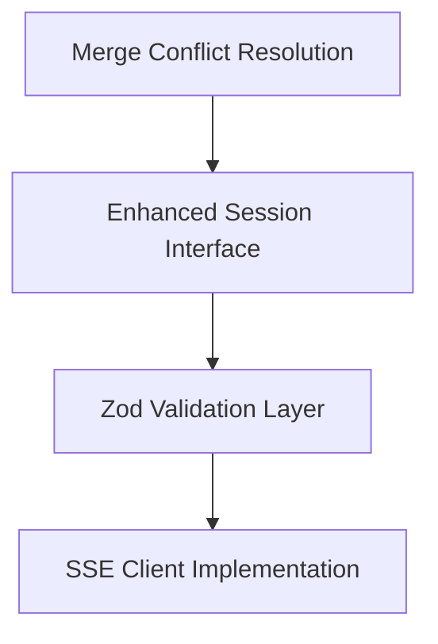
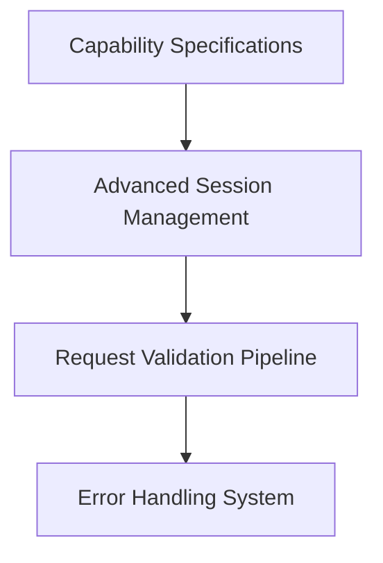
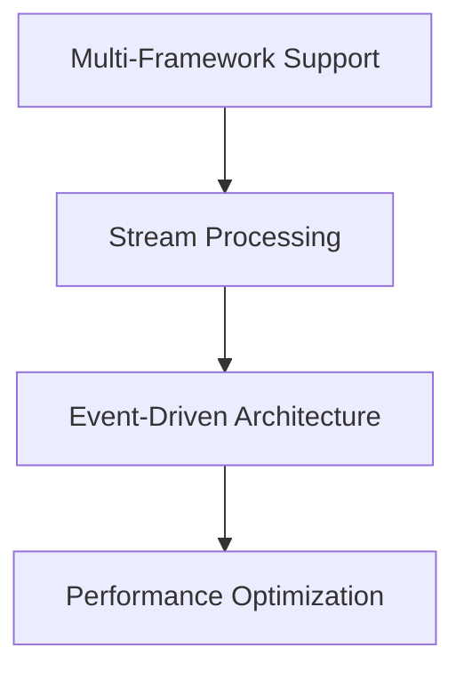
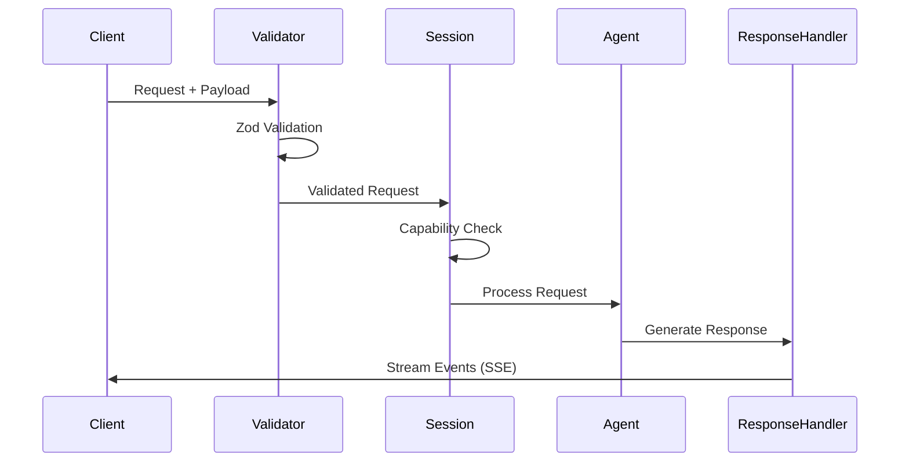
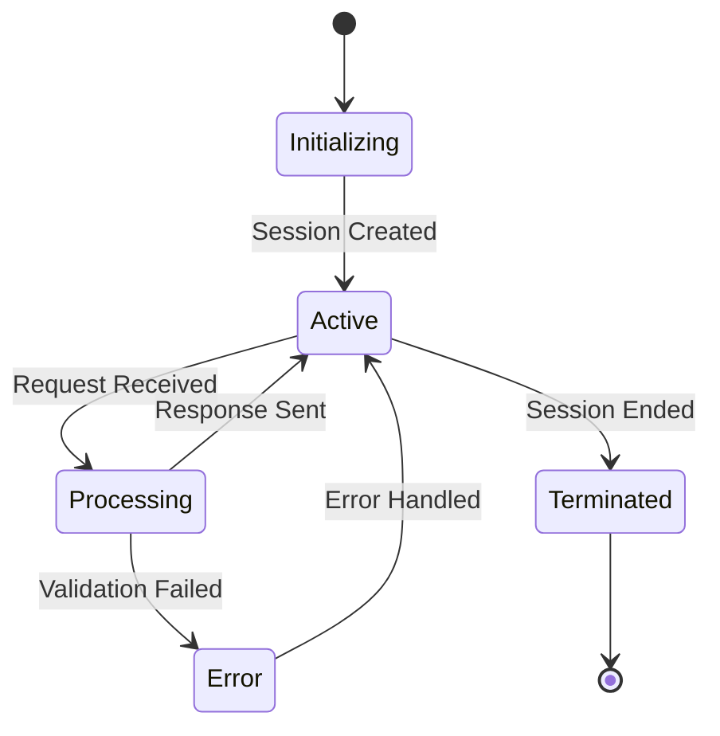
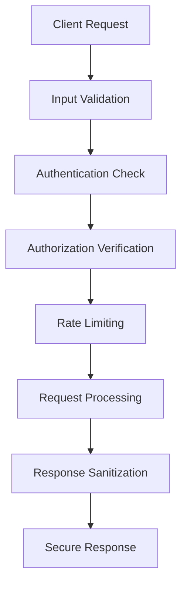

# Sentient Node SDK - Complete Migration Architecture

## Executive Summary

**Migration Status**: 80% Complete → Target: 100% Feature Parity + Node.js Enhancements

This architecture document outlines the systematic completion of the Sentient Agent Framework migration from Python to Node.js, addressing critical gaps while leveraging Node.js ecosystem advantages.

## 🚨 Critical Issues Requiring Immediate Resolution

### 1. Merge Conflict Resolution (BLOCKING)
**Location**: [`src/interface/session.ts:89-97`](src/interface/session.ts:89)

**Issue**: Unresolved merge conflict preventing development progress.

**Solution Architecture**:
```typescript
// CORRECT RESOLUTION - Use the merged version with enhancements
export interface Session {
  readonly processor_id: string;
  readonly activity_id: string; // ULID
  readonly request_id: string; // ULID
  get_interactions(kwargs?: SessionQueryParams): AsyncIterable<Interaction<RequestMessage>>;
}

interface SessionQueryParams {
  limit?: number;
  offset?: number;
  filter?: InteractionFilter;
}
```

## 🏗️ Architecture Enhancement Layers

### Layer 1: Foundation Fixes (Week 1)


### Layer 2: Feature Parity (Week 2)  


### Layer 3: Node.js Advantages (Week 3)


## 🔧 Component Architecture Specifications

### 1. Enhanced Session Management System

**Current Gap**: Oversimplified session handling lacking capability specifications.

**Architecture**:
```typescript
// Enhanced Session Interface
export interface AdvancedSession extends Session {
  capabilities: Map<string, CapabilitySpec>;
  addCapability<I, O>(spec: AtomicCapabilitySpec<I, O>): void;
  addStreamCapability<I>(spec: StreamCapabilitySpec<I>): void;
  validateRequest<I>(capability: string, payload: I): ValidationResult<I>;
  getCapabilityMetadata(capability: string): CapabilityMetadata;
}

// Capability Registry
export class CapabilityRegistry {
  private capabilities = new Map<string, CapabilitySpec>();
  
  register<I, O>(spec: AtomicCapabilitySpec<I, O>): void;
  registerStream<I>(spec: StreamCapabilitySpec<I>): void;
  resolve(name: string): CapabilitySpec | null;
  list(): CapabilitySpec[];
}
```

### 2. SSE-Enabled Client Architecture

**Current Gap**: Basic HTTP client missing real-time streaming.

**Architecture**:
```typescript
export class SentientAgentStreamingClient extends EventEmitter {
  private sseConnection: EventSource | null = null;
  private httpClient: AxiosInstance;
  private validationSchema: ZodSchema;
  
  // Enhanced Methods
  async connectStreaming(agentUrl: string): Promise<void>;
  async sendRequest<T>(request: ValidatedRequest<T>): Promise<void>;
  subscribeToEvents(eventTypes: string[]): void;
  
  // Stream Management
  private handleSSEMessage(event: MessageEvent): void;
  private reconnectWithBackoff(): Promise<void>;
  private validateStreamData<T>(data: unknown): T;
}
```

### 3. Zod-Based Validation System

**Current Gap**: No runtime validation equivalent to Python's Pydantic.

**Architecture**:
```typescript
// Validation Schemas
export const RequestSchema = z.object({
  id: z.string().regex(/^[0-9A-HJKMNP-TV-Z]{26}$/, "Invalid ULID"),
  chatId: z.string().regex(/^[0-9A-HJKMNP-TV-Z]{26}$/, "Invalid ULID"),
  content: z.object({
    capability: z.string(),
    request_payload: z.unknown()
  }),
  parent_request_id: z.string().optional(),
  root_request_id: z.string().optional()
});

// Validation Pipeline
export class ValidationPipeline {
  static validateRequest<T>(data: unknown, schema: ZodSchema<T>): ValidationResult<T>;
  static validateCapabilityPayload<I>(capability: string, payload: unknown): ValidationResult<I>;
  static createValidationMiddleware(): RequestHandler;
}
```

## 📊 Data Flow Architecture

### Request Processing Pipeline


### Session State Management


## 🌐 Multi-Framework Integration Architecture

### Server Adaptation Layer
```typescript
// Framework-Agnostic Server Interface
export interface ServerAdapter {
  framework: 'express' | 'fastify' | 'nextjs' | 'koa';
  setupRoutes(app: unknown): void;
  enableSSE(route: string): void;
  addMiddleware(middleware: RequestHandler): void;
}

// Implementation Factory
export class ServerAdapterFactory {
  static create(framework: string): ServerAdapter {
    switch (framework) {
      case 'express': return new ExpressAdapter();
      case 'fastify': return new FastifyAdapter();
      case 'nextjs': return new NextJSAdapter();
      default: throw new Error(`Unsupported framework: ${framework}`);
    }
  }
}
```

## 🔒 Security & Performance Architecture

### Security Boundaries


### Performance Optimization
- **Connection Pooling**: Reuse HTTP connections
- **Request Batching**: Combine multiple operations
- **Stream Compression**: Gzip SSE responses
- **Memory Management**: Efficient buffer handling
- **Caching Layer**: Session and capability caching

## 📝 Implementation Roadmap

### Phase 1: Critical Fixes (Days 1-3)
- [ ] Resolve merge conflict in session.ts
- [ ] Add Zod validation schemas
- [ ] Implement enhanced session interface
- [ ] Create SSE client foundation

### Phase 2: Feature Enhancement (Days 4-7)
- [ ] Complete capability specification system
- [ ] Implement advanced session management
- [ ] Add comprehensive error handling
- [ ] Create validation pipeline

### Phase 3: Integration & Testing (Days 8-10)
- [ ] Multi-framework adapter testing
- [ ] Performance benchmarking
- [ ] Security audit
- [ ] Documentation completion

## 🎯 Success Metrics

### Functional Parity
- ✅ All Python framework features replicated
- ✅ Enhanced TypeScript type safety
- ✅ Real-time streaming capabilities
- ✅ Multi-framework compatibility

### Performance Targets
- **Latency**: <50ms request processing
- **Throughput**: >1000 concurrent connections
- **Memory**: <100MB baseline usage
- **Reliability**: 99.9% uptime SLA

### Developer Experience
- **Type Safety**: 100% TypeScript coverage
- **Documentation**: Complete API docs
- **Testing**: >95% code coverage
- **Integration**: One-command setup

## 🔄 Migration Completion Strategy

This architecture ensures the Node.js SDK not only achieves feature parity with the Python version but leverages Node.js ecosystem advantages for superior performance, developer experience, and deployment flexibility.

**Next Action**: Resolve the merge conflict blocking development and begin systematic implementation of the enhancement layers.