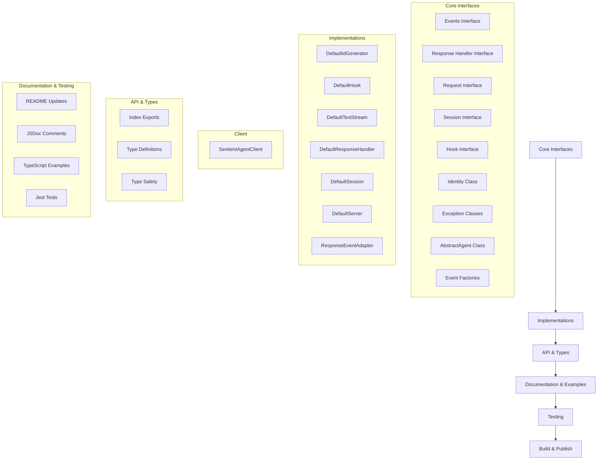

# Conversion Plan: Sentient Agent Framework - Python to TypeScript

This document outlines the step-by-step process for converting the Sentient Agent Framework from Python to TypeScript for use in Node.js and Next.js projects.

## 1. Set Up Node.js Package Structure

- [x] Create basic package.json structure
- [x] Set up TypeScript configuration (tsconfig.json)
- [x] Configure ESLint and Prettier
- [x] Set up Jest for testing
- [x] Create build scripts with rollup/esbuild/tsc
- [x] Directory structure:
  ```
  sentient-agent-framework/
  ├── src/
  │   ├── interface/       # TypeScript interfaces
  │   ├── implementation/  # Concrete implementations
  │   ├── client/          # Client implementation
  │   └── index.ts         # Main export file
  ├── dist/                # Compiled output
  ├── examples/            # Example implementations
  ├── tests/               # Test files
  ├── tsconfig.json        # TypeScript config
  ├── package.json         # Package definition
  └── README.md            # Updated documentation
  ```

## 2. Complete Core Interfaces

- [x] Complete Events Interface (src/interface/events.ts)
  - [x] Basic event types are defined
  - [x] Create factory functions for event creation
  - [x] Add validation for event properties

- [x] Complete Response Handler Interface (src/interface/response_handler.ts)
  - [x] Define full ResponseHandler interface beyond the placeholder
  - [x] Define methods for emitting different types of events
  - [x] Ensure proper typing for all methods

- [x] Complete Request/Query classes (interface/request.tsx → src/interface/request.ts)
  - [x] Finalize the Query and Request interfaces
  - [x] Add validation for request properties

- [x] Complete Session classes (interface/session.tsx → src/interface/session.ts)
  - [x] Complete the Session interface
  - [x] Properly define the Interaction type
  - [x] Use TypeScript Generics for the type parameters

- [x] Convert Hook interface (interface/hook.tsx → src/interface/hook.ts)
  - [x] Define TypeScript Protocol equivalent

- [x] Convert Identity class (interface/identity.tsx → src/interface/identity.ts)
  - [x] Convert Pydantic model to TypeScript class with validation

- [x] Convert Exception classes (interface/exceptions.tsx → src/interface/exceptions.ts)
  - [x] Define custom error classes extending Error

- [x] Convert AbstractAgent class (interface/agent.ts → src/interface/agent.ts)
  - [x] Convert to abstract TypeScript class
  - [x] Ensure proper typing for all methods

## 3. Complete Implementations

- [x] Convert DefaultIdGenerator (implementation/default_id_generator.py → src/implementation/default_id_generator.ts)
  - [x] Implement ULID handling in TypeScript
  - [x] Handle async locking mechanism with appropriate TypeScript patterns

- [x] Convert DefaultHook (implementation/default_hook.py → src/implementation/default_hook.ts)
  - [x] Convert async queue handling to TypeScript

- [x] Convert DefaultTextStream (implementation/default_text_stream.py → src/implementation/default_text_stream.ts)
  - [x] Implement StreamEventEmitter interface in TypeScript
  - [x] Fix the type casting issue with StreamEventEmitter

- [x] Convert DefaultResponseHandler (implementation/default_response_handler.py → src/implementation/default_response_handler.ts)
  - [x] Convert Python decorator patterns to TypeScript patterns
  - [x] Handle event emission in TypeScript

- [x] Convert DefaultSession (implementation/default_session.py → src/implementation/default_session.ts)
  - [x] Convert to TypeScript class implementing Session interface

- [x] Convert DefaultServer (implementation/default_server.py → src/implementation/default_server.ts)
  - [x] Replace FastAPI with Express.js or Next.js API routes
  - [x] Convert SSE implementation to Node.js patterns
  - [x] Use proper TypeScript async patterns
  - [x] Complete the Express.js implementation
  - [x] Add middleware for parsing requests

- [x] Create ResponseEventAdapter (src/implementation/response_event_adapter.ts)
  - [x] Implement validation for response events
  - [x] Convert JSON objects to response events

## 4. Client Implementation

- [x] Create SentientAgentClient (src/client/sentient_agent_client.ts)
  - [x] Implement client for interacting with agents
  - [x] Add methods for querying agents and processing events
  - [x] Use ResponseEventAdapter for validating events

## 5. Finalize API & Types

- [x] Create src/index.ts to export all public components
- [x] Define proper TypeScript exports for library consumers
- [x] Ensure type definitions are generated properly
- [x] Add type guards where necessary
- [x] Verify type compatibility with TypeScript standards

## 6. Update Documentation

- [x] Update README.md to reflect Node.js/TypeScript usage
  - [x] Change installation instructions from pip to npm
  - [x] Update code examples from Python to TypeScript
  - [x] Update architecture diagrams if necessary

- [x] Convert interface/README.md to TypeScript examples
- [x] Convert implementation/README.md to TypeScript examples
- [x] Add JSDoc comments throughout the codebase
- [x] Document public APIs thoroughly
- [x] Add usage examples in comments

## 7. Testing & Examples

- [x] Set up Jest testing framework
- [x] Write unit tests for core components
- [ ] Ensure high test coverage
- [ ] Convert Python examples to TypeScript
- [ ] Create a simple example Next.js application
- [ ] Provide examples for different use cases

## 8. Build & Publish

- [x] Set up build pipeline with proper bundling
- [x] Generate type definitions (.d.ts files)
- [x] Create npm package scripts
- [ ] Set up GitHub Actions for CI/CD
- [ ] Prepare package for npm registry
- [ ] Create release process
- [ ] Publish to npm registry

## 9. Additional Considerations

- [x] Handle Python-specific patterns that don't have direct TypeScript equivalents:
  - [x] Replace Pydantic with Zod or similar
  - [x] Use appropriate async patterns for Node.js
  - [x] Replace asyncio with Node.js Event Emitter or Promises
  - [x] Convert ULID implementation to a JavaScript library

- [x] Consider browser compatibility if needed
- [x] Evaluate performance optimizations for Node.js environment
- [x] Ensure compatibility with Node.js 18+

## Completion Checklist

Each task should be marked as complete when:
- [x] Code is fully converted to TypeScript
- [x] All TODOs in the code are addressed
- [x] Tests pass
- [x] Documentation is updated
- [ ] Example usage works as expected

## Project Architecture



## Next Steps

1. Complete the remaining test coverage
2. Create example applications
3. Set up CI/CD pipeline
4. Publish to npm registry