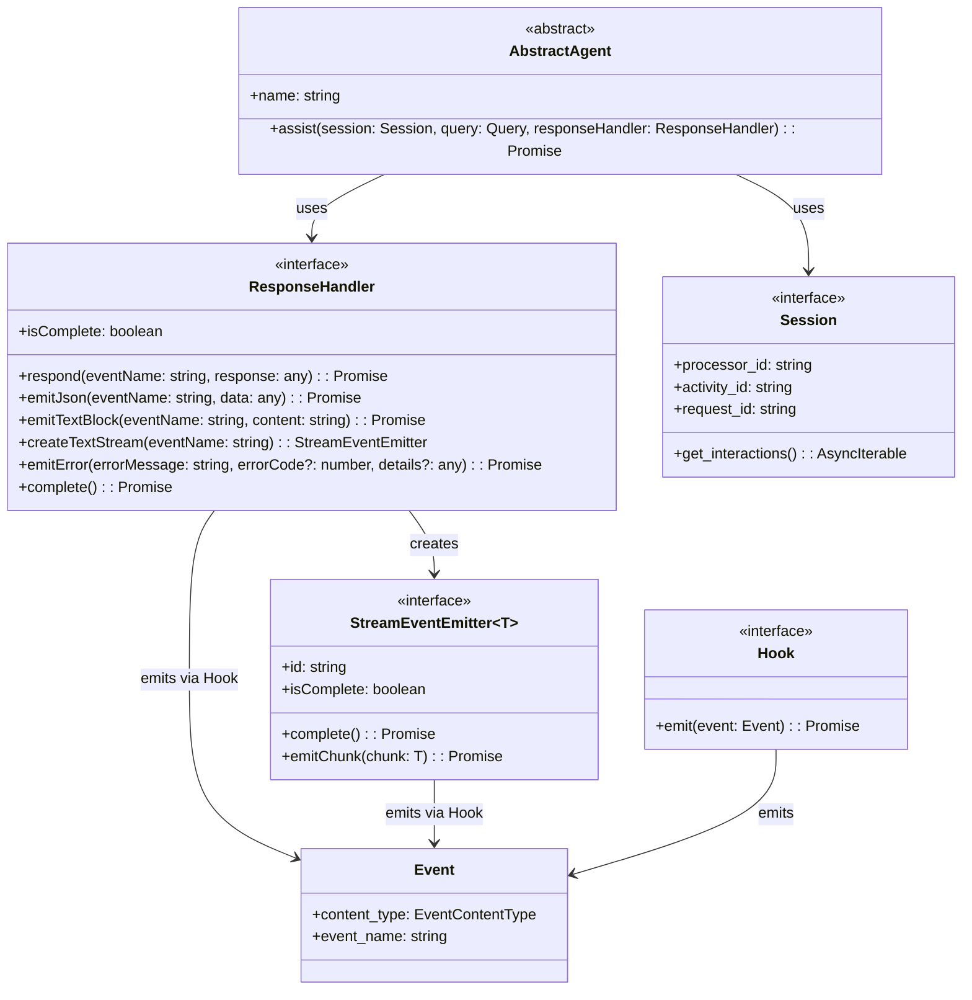

# Interface Directory – TypeScript/Node.js Port

This directory contains the canonical TypeScript interfaces for the Sentient Agent Framework, ported for npm/Node.js/Next.js environments. All new interface code is under `src/interface/`. The legacy Python files remain in `interface/` for reference only.

---

## Architecture

### AbstractAgent

The `AbstractAgent` abstract class defines the specification for an agent. It is subclassed by concrete agents that implement the `assist()` method. All interfaces it depends on are defined in this directory.

---

## Key TypeScript Interfaces

### agent.ts

- `AbstractAgent` (abstract class): Base agent with a name and an abstract `assist` method.

### events.ts

- `BaseEventType`, `EventContentType` (enums)
- `Event`, `BaseEvent`, `AtomicEvent`, `StreamEvent`, `DocumentEvent`, `TextBlockEvent`, `TextChunkEvent`, `ErrorEvent`, `DoneEvent` (interfaces)
- `ResponseEvent` (discriminated union type)

### event_factories.ts

- Factory functions for creating event objects: `createBaseEvent`, `createDocumentEvent`, `createTextBlockEvent`, `createTextChunkEvent`, `createErrorEvent`, `createDoneEvent`

### exceptions.ts

- Custom error classes: `ProcessorError`, `AgentError`, `ResponseStreamClosedError`, `TextStreamClosedError` (all extending Error)

### hook.ts

- `Hook` (interface): Defines the async `emit(event: Event): Promise<void>` method.

### identity.ts

- `Identity` (class): Uniquely identifies an entity by id and name.

### request.ts

- `Query` (interface): Query id and prompt.
- `Request` (interface): Contains `query` and optional `session`.

### response_handler.ts

- `ResponseHandler` (interface): Protocol for handling agent responses.
- `StreamEventEmitter<T>` (interface): Protocol for emitting chunks of data in a stream.

### session.ts

- `SessionObject` (interface): Canonical session state.
- `Session` (interface): Protocol for chat session.
- `Interaction` (interface): Placeholder for interaction between user and agent.

---

## Client Interface

The framework includes a client interface for interacting with agents:

### SentientAgentClient

- TypeScript client for querying agents and processing server-sent events.
- Uses the ResponseEventAdapter to validate and convert JSON objects to response events.

---

## Migration Notes

- All IDs (ULID) are strings.
- Python enums are TypeScript enums.
- Python Pydantic models are TypeScript interfaces/classes.
- Async methods use Promise and AsyncIterable.
- All TypeScript files are in `src/interface/` for npm builds.
- Legacy Python files remain in `interface/` for reference only.
- Factory functions are used instead of class constructors for event creation.

---

## Completed Tasks

- ✅ Ported all interfaces to TypeScript
- ✅ Added event factory functions
- ✅ Implemented ResponseHandler interface
- ✅ Added client interface

---

## TODO

- Refine placeholder interfaces for full type safety.
- Add JSDoc and TypeScript type guards as needed.
- Add more comprehensive examples.